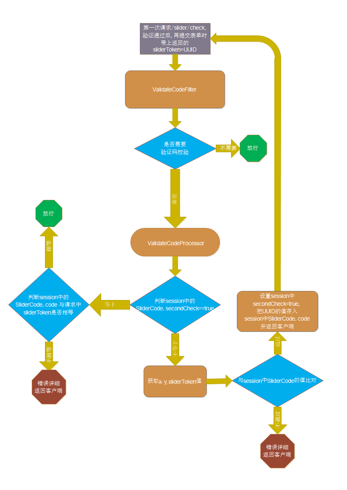

# UMS (user manage scaffolding) 用户管理脚手架: [github](https://github.com/ZeroOrInfinity/UMS) [gitee](https://gitee.com/pcore/UMS)


用户管理脚手架集成：验证码、手机登录、支持qq,weibo,weixin,gitee第三方登录(自动注册，绑定与解绑)、基于 RBAC 的 uri 访问权限控制功能、通过统一的回调地址入口实现多回调地址的路由功能、签到等功能。
通过配置与实现两三个 API 接口就可以实现上述功能，实现快速开发，只需要专注于业务逻辑。


## 一、`UMS 功能列表`：
  - 验证码（图片，短信）校验功能。
  - 手机登录功能，登录后自动注册。
  - 第三方登录功能(qq,weibo,weixin,gitee)，登录后自动注册，与用户账号绑定与解绑。
  - 登录路由功能
  - 统一回调地址路由功能。
  - 访问权限控制功能。
  - 简化 session、remember me、crsf 等配置。
  - 根据设置的响应方式（JSON 与 REDIRECT）返回 json 或 html 数据。
  - 签到功能。
  
### 模块功能 
  | **模块**   | **功能**                                                         |
  | ------ | ------------------------------------------------------------ |
  | [core](https://gitee.com/pcore/UMS/tree/master/core)   | 验证码/用户名密码登录/手机登录且自动注册/登录路由/访问权限控制/签到/简化HttpSecurity(session、remember me、crsf 等)配置/session redis 缓存/可配置的响应方式(JSON 与 REDIRECT)返回 json 或 html 数据 |
  | [social](https://gitee.com/pcore/UMS/tree/master/social) | 第三方登录功能(qq,weibo,weixin,gitee)/自动注册/绑定与解绑/统一回调地址路由 |
  | [demo](https://gitee.com/pcore/UMS/tree/master/demo)   | basic-example/basic-detail-example/permission-example/quickStart/session-detail-example/social-simple-example/social-detail-example/validate-codi-example |
### demo 演示功能  
  | **demo**                   | **演示功能**                                                     |
  | ---------------------- | ------------------------------------------------------------ |
  | [basic-example](https://gitee.com/pcore/UMS/tree/master/demo/basic-example)         | core 模块基本功能: 最简单的配置                              |
  | [basic-detail-example](https://gitee.com/pcore/UMS/tree/master/demo/basic-detail-example)   | core 模块基本功能详细的配置: 含anonymous/session简单配置/rememberMe/csrf/登录路由/签到,     不包含session详细配置/验证码/手机登录/权限. |
  | [permission-example](https://gitee.com/pcore/UMS/tree/master/demo/permission-example)     | core 模块: 基于 RBAC 的权限功能设置                          |
  | [quickStart](https://gitee.com/pcore/UMS/tree/master/demo/quickStart)             | 快速开始示例                                                 |
  | [session-detail-example](https://gitee.com/pcore/UMS/tree/master/demo/session-detail-example) | core 模块: session 与 session 缓存详细配置                   |
  | [social-simple-example](https://gitee.com/pcore/UMS/tree/master/demo/social-simple-example)  | social 模块基本功能: 简单的配置(第三方登录自动注册默认打开)  |
  | [social-detail-example](https://gitee.com/pcore/UMS/tree/master/demo/social-detail-example)  | social 模块功能详细配置: 第三方授权登录注册功能, 统一回调地址路由配置, 第三方登录绑定配置, 第三方授权登录用户信息表自定义与 redis 缓存设置 |
  | [validate-code-example](https://gitee.com/pcore/UMS/tree/master/demo/validate-code-example)  | core 模块基本功能: 验证码(含自定义滑块验证码), 手机登录配置  |
## 二、`maven`：
```xml
<!-- 验证码, 手机登录, 访问权限控制功能, 签到, 简化session/rememberMe/csrf/anonymous配置等功能 -->
<dependency>
    <groupId>top.dcenter</groupId>
    <artifactId>ums-core-spring-boot-starter</artifactId>
    <version>1.1.3-alpha</version>
</dependency>
<!-- 第三方登录(自动注册，绑定与解绑, redis cache), 通过统一的回调地址入口实现多回调地址的路由功能 -->
<!-- 包含 ums-core-spring-boot-starter 依赖 -->
<dependency>
    <groupId>top.dcenter</groupId>
    <artifactId>ums-social-spring-boot-starter</artifactId>
    <version>1.1.3-alpha</version>
</dependency>
```

## 三、`TODO List`:
- 完善 README
- 第三方登录功能添加 JustAuth 工具, 支持更多的第三方登录. 
- OAuth2 authenticate server

## 四、`快速开始`：
### 1. 添加依赖:
```xml
<!-- 包含 ums-core-spring-boot-starter 依赖 -->
<dependency>
    <groupId>top.dcenter</groupId>
    <artifactId>ums-social-spring-boot-starter</artifactId>
    <version>1.1.1-alpha</version>
</dependency>
```
### 2. config:  
```yaml
server:
  port: 9090

spring:
  profiles:
    active: dev
  # mysql
  datasource:
    driver-class-name: com.mysql.cj.jdbc.Driver
    url: jdbc:mysql://127.0.0.1:3306/ums?useSSL=false&useUnicode=true&characterEncoding=UTF-8&zeroDateTimeBehavior=convertToNull&serverTimezone=Asia/Shanghai
    username: root
    password: 123456

  # session 简单配置:
  session:
    # session 存储模式设置, 要导入相应的 spring-session 类的依赖, 默认为 none, 分布式服务应用把 session 放入 redis 等中间件
    store-type: none
    # session 过期时间
    timeout: PT300s
    
  # thymeleaf -> login.htm 用的是 thymeleaf 模板, 需要额外配置:
  thymeleaf:
    encoding: utf-8
    prefix: classpath:/templates/
    suffix: .htm
    servlet:
      content-type: text/html;charset=UTF-8

# ums core
security:
  client:
    # 设置登录后返回格式(REDIRECT 与 JSON): 默认 JSON
    login-process-type: redirect
    # 登录页
    login-page: /login
    # 登录失败页
    failure-url: /login
    # 登录成功页
    success-url: /
    # 设置登出 url, 默认为 /logout
    logout-url: /logout
    # 设置登出后跳转的 url, 默认为 /login
    logout-success-url: /login
    # 不需要认证的静态资源 urls, 例如: /resources/**, /static/**
    ignoring-urls:
      - /static/**
    # 不需要认证的 uri, 默认为 空 Set.
    permit-urls:
      - /hello

    # 设置登录时用户名的 request 参数名称, 默认为 username
    usernameParameter: username
    # 设置登录时用户密码的 request 参数名称, 默认为 password
    passwordParameter: password

  # 验证码配置
  codes:
    # 图片验证码
    image:
      # 设置需要图片验证码认证的 uri(必须是非 GET 请求)，多个 uri 用 “-” 或 ","号分开支持通配符，如：/hello,/user/*；默认为 /authentication/form
      auth-urls:
        - /authentication/form
      request-param-image-code-name: imageCode
    # 短信验证码
    sms:
      # 设置需要短信验证码认证的 uri(必须是非 GET 请求)，多个 uri 用 “，”号分开支持通配符，如：/hello,/user/*；默认为 /authentication/form
      auth-urls:
        - /authentication/mobile
      request-param-mobile-name: mobile
      request-param-sms-code-name: smsCode
  # ================ 手机登录配置 ================
  mobile:
    login:
      # 手机验证码登录是否开启, 默认 false，
      # 手机验证码登录开启后 必须配置 security.codes.sms.auth-urls=/authentication/mobile
      sms-code-login-is-open: true
      # 手机验证码登录请求处理url, 默认 /authentication/mobile
      login-processing-url-mobile: /authentication/mobile

  # =============== 第三方登录配置: social ===============
  social:
    # 第三方登录页面， 默认为 /signIn.html
    sign-in-url: /signIn
    # 第三方登录用户授权失败跳转页面， 默认为 /signIn.html
    failure-url: /signIn
    # 第三方登录回调处理 url ，也是 RedirectUrl 的前缀，默认为 /auth/callback
    # 如果更改此 url，更改后的必须要实现 SocialController#authCallbackRouter(HttpServletRequest) 的功能
    callback-url: /auth/callback
    # 第三方登录回调的域名, 默认: http://127.0.0.1
    domain: http://127.0.0.1

    # 从第三方服务商获取的信息
    # redirectUrl 默认直接由 domain/servletContextPath/callbackUrl/providerId(security.social.[qq/wechat/gitee/weibo])组成
    # 假设 servletcontextPath=/demo
    # redirect-url: http://127.0.0.1/demo/auth/callback/qq
    gitee:
      # 用户设置 true 时，{providerId}第三方登录自动开启，默认为 false
      enable: true
      app-id: your app id
      app-secret: your app secret

---
spring:
  profiles: dev
  mvc:
    throw-exception-if-no-handler-found: true
  thymeleaf:
    cache: false

debug: true

server:
  port: 80
```
### 3. 实现 AbstractUserDetailsService 接口等:
#### UserDetailsService.java
```java
package demo.service;

import com.fasterxml.jackson.databind.DeserializationFeature;
import com.fasterxml.jackson.databind.ObjectMapper;
import demo.entity.UserInfo;
import lombok.extern.slf4j.Slf4j;
import org.springframework.beans.factory.annotation.Autowired;
import org.springframework.jdbc.core.JdbcTemplate;
import org.springframework.security.core.authority.AuthorityUtils;
import org.springframework.security.core.userdetails.User;
import org.springframework.security.core.userdetails.UserDetails;
import org.springframework.security.core.userdetails.UsernameNotFoundException;
import org.springframework.security.crypto.password.PasswordEncoder;
import org.springframework.social.connect.Connection;
import org.springframework.social.connect.web.ProviderSignInUtils;
import org.springframework.social.security.SocialUser;
import org.springframework.social.security.SocialUserDetails;
import org.springframework.stereotype.Service;
import org.springframework.web.context.request.ServletWebRequest;
import top.dcenter.ums.security.core.enums.ErrorCodeEnum;
import top.dcenter.ums.security.core.exception.RegisterUserFailureException;
import top.dcenter.ums.security.core.exception.UserNotExistException;
import top.dcenter.ums.security.core.util.RequestUtil;
import top.dcenter.ums.security.social.api.service.AbstractSocialUserDetailsService;
import top.dcenter.ums.security.social.api.service.SocialUserCache;

import java.util.List;

/**
 *  用户密码与手机短信登录与注册服务：<br><br>
 *  1. 用于第三方登录与手机短信登录逻辑。<br><br>
 *  2. 用于用户密码登录逻辑。<br><br>
 *  3. 用户注册逻辑。<br><br>
 * @author zyw
 * @version V1.0  Created by 2020/9/20 11:06
 */
@Service
@Slf4j
public class UserDetailsService extends AbstractSocialUserDetailsService {

    /**
     * 用户名
     */
    public static final String PARAM_USERNAME = "username";

    /**
     * 密码
     */
    public static final String PARAM_PASSWORD = "password";

    private final ObjectMapper objectMapper;

    private final JdbcTemplate jdbcTemplate;

    @SuppressWarnings("SpringJavaAutowiredFieldsWarningInspection")
    @Autowired(required = false)
    private SocialUserCache userCache;
    /**
     * 用于密码加解密
     */
    @SuppressWarnings("SpringJavaAutowiredFieldsWarningInspection")
    @Autowired
    private PasswordEncoder passwordEncoder;

    public UserDetailsService(JdbcTemplate jdbcTemplate) {
        this.jdbcTemplate = jdbcTemplate;
        this.objectMapper = new ObjectMapper();
        objectMapper.configure(DeserializationFeature.FAIL_ON_UNKNOWN_PROPERTIES, false);
    }

    @SuppressWarnings("AlibabaUndefineMagicConstant")
    @Override
    public UserDetails loadUserByUsername(String username) throws UsernameNotFoundException {

        try
        {
            // 从缓存中查询用户信息:
            // 从缓存中查询用户信息
            if (this.userCache != null)
            {
                UserDetails userDetails = this.userCache.getUserFromCache(username);
                if (userDetails != null)
                {
                    return userDetails;
                }
            }
            // 根据用户名获取用户信息

            // 获取用户信息逻辑。。。
            // ...

            // 示例：只是从用户登录日志表中提取的信息，
            log.info("Demo ======>: 登录用户名：{}, 登录成功", username);
            return new User(username,
                            passwordEncoder.encode("admin"),
                            true,
                            true,
                            true,
                            true,
                            AuthorityUtils.commaSeparatedStringToAuthorityList("admin, ROLE_USER"));

        }
        catch (Exception e)
        {
            String msg = String.format("Demo ======>: 登录用户名：%s, 登录失败: %s", username, e.getMessage());
            log.error(msg, e);
            throw new UserNotExistException(ErrorCodeEnum.QUERY_USER_INFO_ERROR, e, username);
        }
    }


    @Override
    public UserDetails registerUser(String mobile) throws RegisterUserFailureException {

        if (mobile == null)
        {
            throw new RegisterUserFailureException(ErrorCodeEnum.MOBILE_NOT_EMPTY, null);
        }

        // 用户信息持久化逻辑。。。
        // ...

        log.info("Demo ======>: 手机短信登录用户 {}：注册成功", mobile);

        User user = new User(mobile,
                             passwordEncoder.encode("admin"),
                             true,
                             true,
                             true,
                             true,
                             AuthorityUtils.commaSeparatedStringToAuthorityList("admin, ROLE_USER")
        );

        // 把用户信息存入缓存
        if (userCache != null)
        {
            userCache.putUserInCache(user);
        }

        return user;
    }

    @Override
    public UserDetails registerUser(ServletWebRequest request) throws RegisterUserFailureException {

        String username = getValueOfRequest(request, PARAM_USERNAME, ErrorCodeEnum.USERNAME_NOT_EMPTY);
        String password = getValueOfRequest(request, PARAM_PASSWORD, ErrorCodeEnum.PASSWORD_NOT_EMPTY);
        // ...

        // UserInfo userInfo = getUserInfo(request)

        // 用户信息持久化逻辑。。。
        // ...

        String encodedPassword = passwordEncoder.encode(password);

        log.info("Demo ======>: 用户名：{}, 注册成功", username);
        User user = new User(username,
                             encodedPassword,
                             true,
                             true,
                             true,
                             true,
                             AuthorityUtils.commaSeparatedStringToAuthorityList("admin, ROLE_USER")
        );

        // 把用户信息存入缓存
        if (userCache != null)
        {
            userCache.putUserInCache(user);
        }

        return user;

    }

    private String getValueOfRequest(ServletWebRequest request, String paramName, ErrorCodeEnum usernameNotEmpty) throws RegisterUserFailureException {
        String result = request.getParameter(paramName);
        if (result == null)
        {
            throw new RegisterUserFailureException(usernameNotEmpty, request.getSessionId());
        }
        return result;
    }

    @Override
    public SocialUserDetails loadUserByUserId(String userId) throws UsernameNotFoundException {
        try
        {
            // 从缓存中查询用户信息
            if (this.userCache != null)
            {
                SocialUserDetails userDetails = this.userCache.getSocialUserFromCache(userId);
                if (userDetails != null)
                {
                    return null;
                }
            }

            // 根据用户名获取用户信息。

            // 获取用户信息逻辑。。。
            // ...

            // 示例：只是从 OAuth2 用户登录日志表中提取的信息，
            List<String> list = jdbcTemplate.queryForList("select userId from social_UserConnection " +
                                                                  "where userId = ?",
                                                          String.class, userId);
            if (list.contains(userId))
            {
                for (String username : list)
                {
                    if (username.equals(userId))
                    {
                        log.info("Demo ======>: 登录用户名：{}, 登录成功", userId);
                        return new SocialUser(username,
                                              "",
                                              true,
                                              true,
                                              true,
                                              true,
                                              AuthorityUtils.commaSeparatedStringToAuthorityList("admin, ROLE_USER"));

                    }

                }

            }
            log.info("Demo ======>: 登录用户名：{}, 登录失败", userId);
            return null;
        }
        catch (Exception e)
        {
            log.error(e.getMessage(), e);
            throw new UserNotExistException(ErrorCodeEnum.QUERY_USER_INFO_ERROR, e, userId);
        }
    }

    @Override
    public SocialUserDetails registerUser(ServletWebRequest request, ProviderSignInUtils providerSignInUtils) throws RegisterUserFailureException {
        UserInfo userInfo = RequestUtil.extractRequest2Object(request.getRequest(), objectMapper, UserInfo.class);
        String userId = null;
        String password = "";
        if (userInfo != null)
        {
            userId = userInfo.getUserId();
            password = userInfo.getPassword();
        }

        try
        {
            Connection<?> connectionFromSession = providerSignInUtils.getConnectionFromSession(request);
            log.info("Demo ======>: connectionFromSession = {}", connectionFromSession);

            // 用户信息持久化逻辑。。。
            // ...
            String encodedPassword = passwordEncoder.encode(password);
            // OAuth 信息存储
            providerSignInUtils.doPostSignUp(userId, request);
            log.info("Demo ======>: 第三方登录用户：{}, 注册成功", userId);
            //noinspection all
            SocialUser user = new SocialUser(userId,
                                             encodedPassword,
                                             true,
                                             true,
                                             true,
                                             true,
                                             AuthorityUtils.commaSeparatedStringToAuthorityList("admin, ROLE_USER")
            );

            // 把用户信息存入缓存
            if (userCache != null)
            {
                userCache.putUserInCache(user);
            }

            return user;
        }
        catch (Exception e)
        {
            log.error(e.getMessage(), e);

            throw new RegisterUserFailureException(ErrorCodeEnum.USER_REGISTER_FAILURE, e, userId);
        }
    }
}

```
#### UserInfo.java
```java
package demo.entity;

import com.fasterxml.jackson.annotation.JsonAlias;
import lombok.AllArgsConstructor;
import lombok.Getter;
import lombok.NoArgsConstructor;
import lombok.Setter;

/**
 * @author zyw
 * @version V1.0  Created by 2020/6/5 23:20
 */
@Getter
@Setter
@AllArgsConstructor
@NoArgsConstructor
public class UserInfo {

    @JsonAlias({"username"})
    private String userId;
    private String password;
    private String avatarUrl;
    private String providerId;
    private String providerUserId;
}
```
#### UserController.java
```java
 package demo.controller;
        
import lombok.extern.slf4j.Slf4j;
import org.springframework.security.core.Authentication;
import org.springframework.security.core.annotation.AuthenticationPrincipal;
import org.springframework.security.core.context.SecurityContextHolder;
import org.springframework.security.core.userdetails.UserDetails;
import org.springframework.stereotype.Controller;
import org.springframework.web.bind.annotation.GetMapping;
import org.springframework.web.bind.annotation.ResponseBody;

import java.util.HashMap;
import java.util.Map;

/**
 *
 * @author zyw
 * @version V1.0  Created by 2020/9/20 20:04
 */
@Controller
@Slf4j
@EnableUriAuthorize()
public class UserController {

    @GetMapping("/login")
    public String login() {
        return "login";
    }

    @GetMapping("/index")
    public String index() {
        return "index";
    }

    @GetMapping("/me")
    @ResponseBody
    public Object getCurrentUser(@AuthenticationPrincipal UserDetails userDetails, Authentication authentication) {

        Map<String, Object> map = new HashMap<>(16);
        map.put("authenticationHolder", SecurityContextHolder.getContext().getAuthentication());
        map.put("userDetails", userDetails);
        map.put("authentication", authentication);
        return map;
    }

}
```
  
### 4. 前端页面 :
#### login.htm: 放在 classpath:/templates/
```html
<!DOCTYPE html>
<html xmlns:th="http://www.w3.org/1999/xhtml">
<head>
    <meta charset="UTF-8">
    <title>登录</title>
    <script type="text/javascript" src="https://cdn.jsdelivr.net/npm/jquery@1.11.1/dist/jquery.min.js"></script>

</head>
<body>
<h2>登录页面</h2>
<h3>表单登录</h3>
<h5>如果短信验证码与图片验证码同时配置时，优先使用短信验证码，图片验证码失效</h5>
<!-- 通过 th:action 的方式支持 csrf 或者 添加隐藏域<input type="hidden" th:name="${_csrf.parameterName}" th:value="${_csrf.token}"/> -->
<form id="reg-form" th:action="@{/authentication/form}" method="post">
    <table>
        <tr>
            <td>用户名：</td>
            <td><input type="text" name="username" value="admin" ><p style="color: #ff0000"
                                                                     id="error-name"></p></td>
        </tr>
        <tr>
            <td>密码：</td>
            <td><input type="password" name="password" value="admin"></td>
        </tr>
        <tr>
            <td>图形验证码：</td>
            <td>
                <input type="text" name="imageCode">
                
            </td>
        </tr>
        <tr>
            <td ><input type="checkbox" name="rememberMe" checked="true">记住我</input></td>
            <td><p style="color: #ff0000" id="error-code"></p></td>
        </tr>
        <tr>
            <td ><button id="btn-reg" type="button">登录ajax</button></td>
            <!-- 通过 form submit 不能接收错误信息, 通过 ajax 可接收错误信息 -->
            <td ><button type="submit">登录</button></td>
        </tr>
    </table>
</form>
<h3>手机登录</h3>
<form id="mobile-form" th:action="@{/authentication/mobile}" method="post">
    <table>
        <tr>
            <td>手机号码：</td>
            <td>
                <input type="tel" name="mobile" value="13345678980"><p style="color: #ff0000"
                                                                       id="error-name-mobile"></p>
                <a th:href="@{/code/sms?mobile=13345678980}" >发送验证码</a>
            </td>
        </tr>
        <tr>
            <td>手机验证码：</td>
            <td>
                <input type="text" name="smsCode">
            </td>
        </tr>
        <tr>
            <td ><input type="checkbox" name="rememberMe" checked="true">记住我</input></td>
            <td><p style="color: #ff0000" id="error-code-mobile"></p></td>
        </tr>
        <tr>
            <td ><button id="btn-mobile" type="button">登录ajax</button></td>
            <!-- 通过 form submit 不能接收错误信息, 通过 ajax 可接收错误信息 -->
            <td ><button type="submit">登录</button></td>
        </tr>
    </table>
</form>
<br><br>
<h3>社交登录</h3>
<a th:href="@{/auth/callback/gitee}">gitee登录</a>

<dev id="basePath" th:basePath="@{/}" style="display: none"/>
</body>
<script>
    var basePath = $("#basePath").attr("basePath");
    $.fn.serializeObject = function()
    {
        let o = {};
        let a = this.serializeArray();
        $.each(a, function() {
            if (o[this.name]) {
                if (!o[this.name].push) {
                    o[this.name] = [o[this.name]];
                }
                o[this.name].push(this.value || '');
            } else {
                o[this.name] = this.value || '';
            }
        });
        return o;
    }

    $(".img").click(function(){
        let uri = this.getAttribute("src");
        console.log(uri)
        let end = uri.indexOf('?', 0);
        console.log(end)
        if (end === -1) {
            uri = uri + '?'+ Math.random();
        } else {
            uri = uri.substring(0, end) + '?'+ Math.random();
        }
        console.log(uri)
        this.setAttribute('src', uri);
    });


    function submitFormByAjax(url, formId, errorNameId, errorCodeId, imgId, refresh) {
        return function () {
            console.log(JSON.stringify($(formId).serializeObject()))
            $.ajax({
                // 如果用的是模板，则 url 可以使用注入的方式，会跟着配置动态改变
                url: url,
                data: JSON.stringify($(formId).serializeObject()),
                type: "POST",
                dataType: "json",
                success: function (data) {
                    $(errorNameId).text("")
                    $(errorCodeId).text("")
                    console.log("==========注册成功============")
                    // 注册成功
                    // ...
                    console.log(data)
                    let uri = data.data.url
                    if (uri === null) {
                        uri = basePath
                    }
                    window.location.href = uri;
                },
                error: function (data) {
                    // 注册失败
                    $(errorNameId).text("")
                    $(errorCodeId).text("")
                    console.log("********注册失败*********")
                    console.log(data)
                    data = data.responseJSON
                    if (undefined !== data) {
                        console.log(data);
                        // 错误代码看ErrorCodeEnum
                        if (data.code >= 900 && data.code < 1000) {
                            $(errorNameId).text(data.msg)
                        } else if (data.code >= 600 && data.code < 700) {
                            $(errorCodeId).text(data.msg)
                        }
                    }
                    if (refresh) {
                        $(imgId).trigger("click");
                    }
                }
            })
            return
        };
    }


    $("#btn-mobile").click(
        submitFormByAjax($("#mobile-form").attr("action"), "#mobile-form", "#error-name-mobile", "#error-code-mobile", ".img-mobile", true)
    )


    $("#btn-reg").click(
        submitFormByAjax($("#reg-form").attr("action"), "#reg-form", "#error-name", "#error-code", ".img", true)
    )

</script>
</html>
```
#### index.htm
```html
<!DOCTYPE html>
<html xmlns:th="http://www.w3.org/1999/xhtml">
<head>
    <meta charset="UTF-8">
    <title>index</title>
</head>
<body>
    hello world!
    <!-- 通过 th:action 的方式支持 csrf 或者 添加隐藏域<input type="hidden" th:name="${_csrf.parameterName}" th:value="${_csrf.token}"/> -->
    <form th:action="@{/logout?logout}" method="post">
        <input type="submit" value="退出登录post"/>
    </form>
</body>
</html>
```
### 5. 访问前端页面
- 浏览器访问 `http://127.0.0.1/login`, 至此集成了：登录校验，验证码、手机登录、gitee第三方登录(自动注册，绑定与解绑)、基于 RBAC 的 uri 访问权限控制功能、 通过统一的回调地址入口实现多回调地址的路由功能等功能; 实现快速开发。
- 此 `Quick Start` 代码在 `demo 模块` -> [quickStart](https://gitee.com/pcore/UMS/tree/master/demo/quickStart), 其他功能的详细配置说明参照: [Configurations](https://gitee.com/pcore/UMS/wikis/pages?sort_id=2926340&doc_id=984605)。

## 五、接口使用说明:

- 实现对应功能时需要实现的接口：    
    1. 用户服务: `必须实现`
        - 有 social 模块时: [AbstractSocialUserDetailsService](https://gitee.com/pcore/UMS/blob/master/social/src/main/java/top/dcenter/ums/security/social/api/service/AbstractSocialUserDetailsService.java)
        - 无 social 模块时: [AbstractUserDetailsService](https://gitee.com/pcore/UMS/blob/master/core/src/main/java/top/dcenter/ums/security/core/api/service/AbstractUserDetailsService.java)    
    2. 图片验证码: 如果不实现就会使用默认图片验证码, 实时产生验证码图片, 没有缓存功能
        - [ImageCodeFactory](https://gitee.com/pcore/UMS/blob/master/core/src/main/java/top/dcenter/ums/security/core/api/validate/code/image/ImageCodeFactory.java)
    3. 短信验证码: `默认空实现`
        - [SmsCodeSender](https://gitee.com/pcore/UMS/blob/master/core/src/main/java/top/dcenter/ums/security/core/api/validate/code/sms/SmsCodeSender.java)
    4. 滑块验证码: 如果不实现就会使用默认滑块验证码, 实时产生验证码图片, 没有缓存功能
        - [SimpleSliderCodeFactory](https://gitee.com/pcore/UMS/blob/master/core/src/main/java/top/dcenter/ums/security/core/api/validate/code/slider/SliderCodeFactory.java) 
    5. 自定义验证码:
        - [AbstractValidateCodeProcessor](https://gitee.com/pcore/UMS/blob/master/core/src/main/java/top/dcenter/ums/security/core/api/validate/code/AbstractValidateCodeProcessor.java)
        - [ValidateCodeGenerator](https://gitee.com/pcore/UMS/blob/master/core/src/main/java/top/dcenter/ums/security/core/api/validate/code/ValidateCodeGenerator.java)
    6. 访问权限控制功能: 基于 RBAC 的访问权限控制, 增加了更加细粒度的权限控制, 如: 对菜单与按钮的权限控制
        - [AbstractUriAuthorizeService](https://gitee.com/pcore/UMS/blob/master/core/src/main/java/top/dcenter/ums/security/core/api/permission/service/AbstractUriAuthorizeService.java):
            - `AbstractUriAuthorizeService` 类中的方法`getRolesAuthorities()`;
              `getRolesAuthorities()`返回值: Map<`role`, Map<`uri`, `UriResourcesDTO`>> 中`UriResourcesDTO`字段 `uri` 
              与 `permission` 必须有值. 
    7. 绑定与解绑视图: 用户绑定与解绑成功后会自动跳转到对应回显页面, 默认返回 json 信息
        - 绑定状态信息回显: [ShowConnectionStatusViewService](https://gitee.com/pcore/UMS/blob/master/social/src/main/java/top/dcenter/ums/security/social/api/banding/ShowConnectionStatusViewService.java)
        - 绑定与解绑信息回显: [ShowConnectViewService](https://gitee.com/pcore/UMS/blob/master/social/src/main/java/top/dcenter/ums/security/social/api/banding/ShowConnectViewService.java)
        
    8. 统一的回调地址的路由: 方便对于多个回调地址进行路由管理
       - 需要调用[BaseOAuth2ConnectionFactory](https://gitee.com/pcore/UMS/blob/master/social/src/main/java/top/dcenter/ums/security/social/api/callback/BaseOAuth2ConnectionFactory.java)`#generateState(realAuthCallbackPath)`
         方法去设置真实的回调地址: realAuthCallbackPath(格式为：`path=myAuthCallbackPath`).
       - 自定义路由算法: 
         1. 统一回调地址与真实回调地址的**转换逻辑**：
             - 构建统一的回调地址: 默认实现 [SocialOAuth2AuthenticationService](https://gitee.com/pcore/UMS/blob/master/social/src/main/java/top/dcenter/ums/security/social/callback/SocialOAuth2AuthenticationService.java)`#buildReturnToUrl(..)`,
               自定义请实现[BaseOAuth2ConnectionFactory](https://gitee.com/pcore/UMS/blob/master/social/src/main/java/top/dcenter/ums/security/social/api/callback/BaseOAuth2ConnectionFactory.java)`#buildReturnToUrl(..)`方法
             - 跳转到真实的回调地址: [SocialController](https://gitee.com/pcore/UMS/blob/master/social/src/main/java/top/dcenter/ums/security/social/controller/SocialController.java)`#authCallbackRouter(..)`
         2. 对 `state` 的**加解密逻辑**：
            - 把真实回调地址加入到`state`并进行加密: [BaseOAuth2ConnectionFactory](https://gitee.com/pcore/UMS/blob/master/social/src/main/java/top/dcenter/ums/security/social/api/callback/BaseOAuth2ConnectionFactory.java)`#generateState(..)`
            - 解密`state`并返回真实的回调地址: [RedirectUrlHelperService](https://gitee.com/pcore/UMS/blob/master/social/src/main/java/top/dcenter/ums/security/social/api/callback/RedirectUrlHelperService.java)`#decodeRedirectUrl(..)`


## 六、Configurations:
| **功能**                                                     | **模块**                                                 | **demo模块--简单配置**                                       | **demo模块--详细配置**                                       |
| ------------------------------------------------------------ | -------------------------------------------------------- | ------------------------------------------------------------ | ------------------------------------------------------------ |
| 1. [基本功能](https://gitee.com/pcore/UMS/wikis/pages?sort_id=2926340&doc_id=984605) | [core](https://gitee.com/pcore/UMS/tree/master/core)     | [basic-example](https://gitee.com/pcore/UMS/tree/master/demo/basic-example/src/main/resources/application.yml) |                                                              |
| 2. [登录路由功能](https://gitee.com/pcore/UMS/wikis/pages?sort_id=2926354&doc_id=984605) | [core](https://gitee.com/pcore/UMS/tree/master/core)     |                                                              | [basic-detail-example](https://gitee.com/pcore/UMS/tree/master/demo/basic-detail-example/src/main/resources/application.yml) |
| 3. [session](https://gitee.com/pcore/UMS/wikis/pages?sort_id=2926355&doc_id=984605) | [core](https://gitee.com/pcore/UMS/tree/master/core)     |                                                              | [session-detail-example](https://gitee.com/pcore/UMS/tree/master/demo/session-detail-example/src/main/resources/application.yml) |
| 4. [remember-me](https://gitee.com/pcore/UMS/wikis/pages?sort_id=2926356&doc_id=984605) | [core](https://gitee.com/pcore/UMS/tree/master/core)     |                                                              | [basic-detail-example](https://gitee.com/pcore/UMS/tree/master/demo/basic-detail-example/src/main/resources/application.yml) |
| 5. [csrf](https://gitee.com/pcore/UMS/wikis/pages?sort_id=2926357&doc_id=984605) | [core](https://gitee.com/pcore/UMS/tree/master/core)     |                                                              | [basic-detail-example](https://gitee.com/pcore/UMS/tree/master/demo/basic-detail-example/src/main/resources/application.yml) |
| 6. [anonymous](https://gitee.com/pcore/UMS/wikis/pages?sort_id=2926358&doc_id=984605) | [core](https://gitee.com/pcore/UMS/tree/master/core)     |                                                              | [basic-detail-example](https://gitee.com/pcore/UMS/tree/master/demo/basic-detail-example/src/main/resources/application.yml) |
| 7. [验证码](https://gitee.com/pcore/UMS/wikis/pages?sort_id=2926360&doc_id=984605) | [core](https://gitee.com/pcore/UMS/tree/master/core)     |                                                              | [validate-code-example](https://gitee.com/pcore/UMS/tree/master/demo/validate-code-example/src/main/resources/application.yml) |
| 8. [手机登录](https://gitee.com/pcore/UMS/wikis/pages?sort_id=2926419&doc_id=984605) | [core](https://gitee.com/pcore/UMS/tree/master/core)     |                                                              | [basic-detail-example](https://gitee.com/pcore/UMS/tree/master/demo/basic-detail-example/src/main/resources/application.yml) |
| 9. [第三方登录](https://gitee.com/pcore/UMS/wikis/pages?sort_id=2926435&doc_id=984605) | [social](https://gitee.com/pcore/UMS/tree/master/social) | [social-simple-example](https://gitee.com/pcore/UMS/tree/master/demo/social-simple-example/src/main/resources/application.yml) | [social-detail-example](https://gitee.com/pcore/UMS/tree/master/demo/social-detail-example/src/main/resources/application.yml) |
| 10. [给第三方登录时用的数据库表 social_UserConnection 添加 redis cache](https://gitee.com/pcore/UMS/wikis/pages?sort_id=2926436&doc_id=984605) | [social](https://gitee.com/pcore/UMS/tree/master/social) |                                                              | [social-detail-example](https://gitee.com/pcore/UMS/tree/master/demo/social-detail-example/src/main/resources/application.yml) |
| 11. [统一回调地址路由](https://gitee.com/pcore/UMS/wikis/pages?sort_id=2926440&doc_id=984605) | [social](https://gitee.com/pcore/UMS/tree/master/social) |                                                              | [social-detail-example](https://gitee.com/pcore/UMS/tree/master/demo/social-detail-example/src/main/resources/application.yml) |
| 12. [签到](https://gitee.com/pcore/UMS/wikis/pages?sort_id=2926437&doc_id=984605) | [core](https://gitee.com/pcore/UMS/tree/master/core)     |                                                              | [basic-detail-example](https://gitee.com/pcore/UMS/tree/master/demo/basic-detail-example/src/main/resources/application.yml) |
| 13. [基于 RBAC 的访问权限控制功能](https://gitee.com/pcore/UMS/wikis/pages?sort_id=2926442&doc_id=984605) | [core](https://gitee.com/pcore/UMS/tree/master/core)     |                                                              | [permission-example](https://gitee.com/pcore/UMS/tree/master/demo/permission-example/src/main/resources/application.yml) |


## 七、[注意事项](https://gitee.com/pcore/UMS/wikis/pages?sort_id=2926456&doc_id=984605): 
### 1. 基于 RBAC 的 uri 访问权限控制
- **更新角色权限时必须调用** [AbstractUriAuthorizeService](https://gitee.com/pcore/UMS/blob/master/core/src/main/java/top/dcenter/ums/security/core/api/permission/service/AbstractUriAuthorizeService.java)`#updateRolesAuthorities()` 方法来**刷新权限**, 即可实时刷新角色权限.

### 2. HttpSecurity 配置问题：UMS 中的 [HttpSecurityAware](https://gitee.com/pcore/UMS/blob/master/core/src/main/java/top/dcenter/ums/security/core/api/config/HttpSecurityAware.java) 配置与应用中的 HttpSecurity 配置冲突问题：

1. 如果是新建应用添加 HttpSecurity 配置, 通过下面的接口即可: 
    - `HttpSecurityAware`
2. 如果是已存在的应用：
    - 添加 HttpSecurity 配置, 通过下面的接口即可: `HttpSecurityAware`
    - 已有的 HttpSecurity 配置, 让原有的 HttpSecurity 配置实现此接口进行配置: `top.dcenter.security.core.api.config.HttpSecurityAware`

### 3. 在 ServletContext 中存储的属性: 
    - 属性名称: SecurityConstants.SERVLET_CONTEXT_AUTHORIZE_REQUESTS_MAP_KEY
    - 属性值: authorizeRequestMap<String, Set<String>>: key 为 PERMIT_ALL, DENY_ALL, ANONYMOUS, AUTHENTICATED
      , FULLY_AUTHENTICATED, REMEMBER_ME 的权限类型,  value 为 uri(不包含 servletContextPath)的 set.
      
### 4. servletContextPath 的值存储在 [MvcUtil](https://gitee.com/pcore/UMS/blob/master/core/src/main/java/top/dcenter/ums/security/core/util/MvcUtil.java)`.servletContextPath` : 
    - 通过静态方法获取 `MvcUtil.getServletContextPath()`
    - `MvcUtil.servletContextPath` 的值是通过: [SecurityAutoConfiguration](https://gitee.com/pcore/UMS/blob/master/core/src/main/java/top/dcenter/ums/security/core/config/SecurityAutoConfiguration.java)`#afterPropertiesSet()` 接口注入
    
### 5. 验证码优先级: 
    - 同一个 uri 由多种验证码同时配置, **优先级**如下:
      `SMS > CUSTOMIZE > SELECTION > TRACK > SLIDER > IMAGE`

## 八、[属性配置列表](https://gitee.com/pcore/UMS/wikis/pages?sort_id=2926468&doc_id=984605)
| **属性配置列表**                                             |
| ------------------------------------------------------------ |
| [基本属性](https://gitee.com/pcore/UMS/wikis/%E5%9F%BA%E6%9C%AC%E5%B1%9E%E6%80%A7?sort_id=2927088) |
| [签到属性](https://gitee.com/pcore/UMS/wikis/%E7%AD%BE%E5%88%B0%E5%B1%9E%E6%80%A7?sort_id=2927090) |
| [手机登录属性](https://gitee.com/pcore/UMS/wikis/%E6%89%8B%E6%9C%BA%E7%99%BB%E5%BD%95%E5%B1%9E%E6%80%A7?sort_id=2927091) |
| [验证码属性](https://gitee.com/pcore/UMS/wikis/%E9%AA%8C%E8%AF%81%E7%A0%81%E5%B1%9E%E6%80%A7?sort_id=2927092) |
| [social_userConnection redisCache属性](https://gitee.com/pcore/UMS/wikis/social_userConnection%20redisCache%E5%B1%9E%E6%80%A7?sort_id=2927093) |
| [social属性](https://gitee.com/pcore/UMS/wikis/social%E5%B1%9E%E6%80%A7?sort_id=2927094) |


## 九、参与贡献
1. Fork 本项目
2. 新建 Feat_xxx 分支
3. 提交代码
4. 新建 Pull Request

## 十、[流程图](https://gitee.com/pcore/UMS/wikis/pages?sort_id=2926470&doc_id=984605): 随着版本迭代会有出入
### 1. 滑块验证码(sliderValidateCode)



## 十一、[时序图](https://gitee.com/pcore/UMS/wikis/pages?sort_id=2926484&doc_id=984605): 随着版本迭代会有出入
| **时序图**                                                   |
| ------------------------------------------------------------ |
| [crsf](doc/SequenceDiagram/crsf.png)                         |
| [获取验证码逻辑](doc/SequenceDiagram/getValidateCode.png)    |
| [图片验证码逻辑](doc/SequenceDiagram/ImageValidateCodeLogin.png) |
| [logout](doc/SequenceDiagram/logout.png)                     |
| [第三方绑定与解绑](doc/SequenceDiagram/OAuth2Banding.png)    |
| [第三方授权登录](doc/SequenceDiagram/OAuth2Login.png)        |
| [第三方授权登录注册](doc/SequenceDiagram/OAuth2SignUp.png)   |
| [rememberMe](doc/SequenceDiagram/rememberMe.png)             |
| [核心配置逻辑](doc/SequenceDiagram/securityConfigurer.png)   |
| [登录路由](doc/SequenceDiagram/securityRouter.png)           |
| [session](doc/SequenceDiagram/session.png)                   |
| [手机登录](doc/SequenceDiagram/SmsCodeLogin.png)             |
| [权限控制](doc/SequenceDiagram/uriAuthorize.png)             |