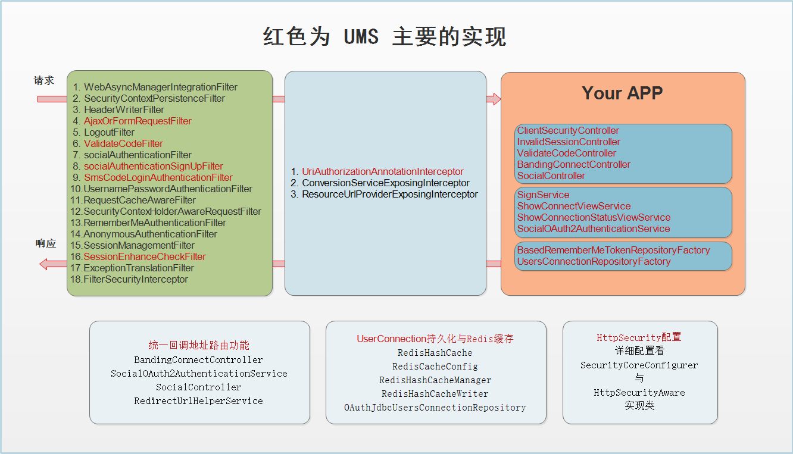
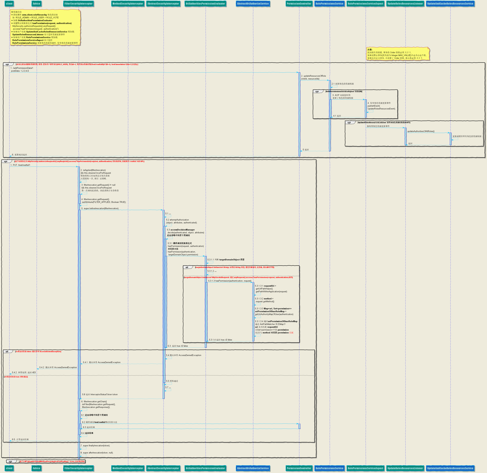
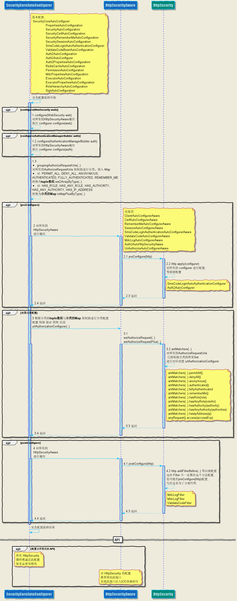
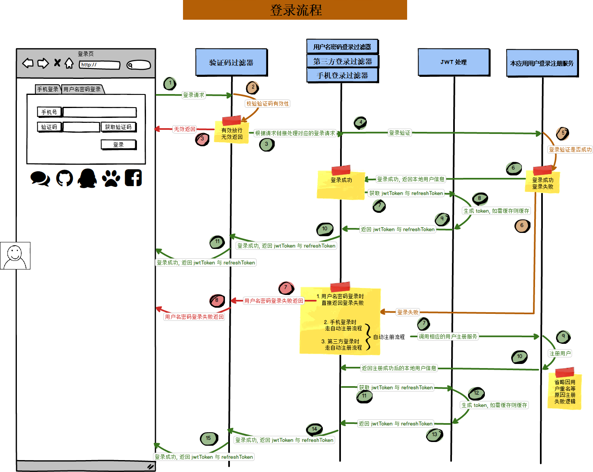
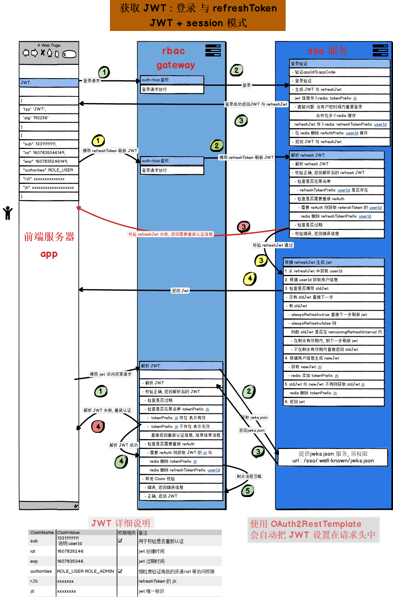
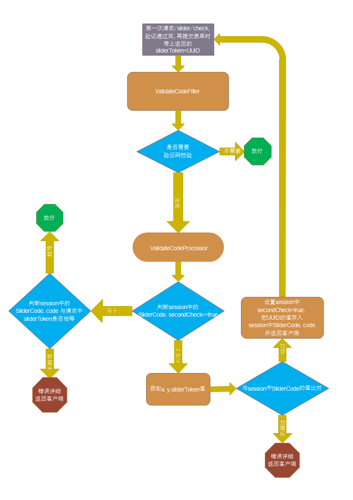

# 

<div align=center>


</div>


<p align="center" style="font-size: 32px">    
    <strong>User management scaffolding</strong>  
</p>

<p align="center">
	<a target="_blank" href="https://search.maven.org/search?q=g:top.dcenter%20AND%20a:ums-spring-boot-starter">
		
	</a>
	<a target="_blank" href="http://www.opensource.org/licenses/mit-license.php">
		
	</a>
	<a target="_blank" href="https://www.oracle.com/technetwork/java/javase/downloads/index.html">
		
	</a>
	<a target="_blank" href="https://github.com/ZeroOrInfinity/UMS/wiki" title="参考文档">
		
	</a>
	<a target="_blank" href='https://gitee.com/pcore/UMS/stargazers'>
	  
	</a>
	<a target="_blank" href='https://github.com/ZeroOrInfinity/UMS'>
		
	</a>
    
    
    
    
    

</p>

UMS is a non-intrusive, highly decoupled from business, customizable user management scaffolding.
User management scaffolding, integration: User password login, mobile login, OAuth2 login(Based on JustAuth), 
one click login, Support multi-tenancy, jwt , validate code(image, sms, sliderCode), RBAC, SLF4J-MDC, signed etc...


------
## 一、`UMS feature list`：

  - validate code(image, SMS, slider) verification function.
  - Mobile login function, automatic registration after login, Support multi-tenancy.
  - Support all third-party authorized logins supported by JustAuth, after login, automatically register or bind or create temporary users([TemporaryUser](https://github.com/ZeroOrInfinity/UMS/blob/master/src/main/java/top/dcenter/ums/security/core/oauth/userdetails/TemporaryUser.java)).
      - Support timing refresh accessToken, support distributed timing tasks.
      - Support the caching function of user table and token table by OAuth2 login.
      - Support third-party binding and unbinding and query interfaces.
  - one click login.
  - Access control function, support multi tenancy.
  - Simplify session、remember me、csrf cors etc configuration.
  - Return json or html data according to the set response method (JSON and REDIRECT).
  - signed function.
  - Support log link tracking function based on SLF4J MDC mechanism.
  - JWT creation, verification, refresh, concurrent access problems caused by jwt invalid, and blacklist functions.
  
### Module function 

  | **Module**   | **Function**                                                         |
  | ------ | ------------------------------------------------------------ |
  | [commons](https://github.com/ZeroOrInfinity/UMS/tree/master/commons)   | common component module |
  | [ums](https://github.com/ZeroOrInfinity/UMS/tree/master/ums-spring-boot-starter)   | Integrated commons/core/vc/mdc/oauth/rbac/jwt module |
  | [core](https://github.com/ZeroOrInfinity/UMS/tree/master/core)   | Username password login/Mobile login and automatic registration/signed/Simplify session、remember me、csrf cors etc configuration/session redis cache/Return json or html data according to the set response method (JSON and REDIRECT)/JWT/mdc model |
  | [vc](https://github.com/ZeroOrInfinity/UMS/tree/master/vc)   | validate code(image, SMS, slider) verification function, integrated mdc model |
  | [mdc](https://github.com/ZeroOrInfinity/UMS/tree/master/mdc)   | Support log link tracking function based on SLF4J MDC mechanism |
  | [oauth](https://github.com/ZeroOrInfinity/UMS/tree/master/oauth)   | OAuth2 login by JustAuth, one-click login, integrated jwt/mdc model |
  | [rbac](https://github.com/ZeroOrInfinity/UMS/tree/master/rbac)   | RBAC-based access control, supports multi-tenancy, integrated mdc model |
  | [jwt](https://github.com/ZeroOrInfinity/UMS/tree/master/jwt)   | JWT function, integrated mdc model |
  | [dependencies](https://github.com/ZeroOrInfinity/UMS/tree/master/ums-dependencies)   | UMS Dependencies |
  | [demo](https://github.com/ZeroOrInfinity/UMS/tree/master/demo)   | basic-example/basic-detail-example/permission-example/quickStart/session-detail-example/validate-codi-example/justAuth-security-oauth2-example/tenant-example/jwt-example |

### demo

  | **demo**                   | **demo function**                                                     |
  | ---------------------- | ------------------------------------------------------------ |
  | [basic-example](https://github.com/ZeroOrInfinity/UMS/tree/master/demo/basic-example)         | Basic function: the simplest configuration/one-click login                         |
  | [basic-detail-example](https://github.com/ZeroOrInfinity/UMS/tree/master/demo/basic-detail-example)   | Detailed configuration of basic functions: anonymous/session simple configuration/rememberMe/csrf/cors/login routing/signed |
  | [permission-example](https://github.com/ZeroOrInfinity/UMS/tree/master/demo/permission-example)     | RBAC-based permission function settings                          |
  | [quickStart](https://github.com/ZeroOrInfinity/UMS/tree/master/demo/quickStart)             | quick start example                                                 |
  | [multi-tenancy-example](https://github.com/ZeroOrInfinity/UMS/tree/master/demo/tenant-example)             | multi tenant registration and login example                                                 |  
  | [justAuth-security-oauth2-example](https://github.com/ZeroOrInfinity/UMS/tree/master/demo/justAuth-security-oauth2-example)             | Detailed example of third-party authorized login, MDC log link tracking configuration                                               |
  | [session-detail-example](https://github.com/ZeroOrInfinity/UMS/tree/master/demo/session-detail-example) | Session and session cache detailed configuration                |
  | [validate-code-example](https://github.com/ZeroOrInfinity/UMS/tree/master/demo/validate-code-example)  | Basic functions: verification code (including slider verification code), mobile login configuration  |
  | [jwt-example](https://github.com/ZeroOrInfinity/UMS/tree/master/demo/jwt-example)  | JWT function example  |


[](https://gitee.com/pcore/UMS/blob/master/UpdatedLog.md)
[](https://github.com/ZeroOrInfinity/UMS/blob/master/UpdatedLog.md)

[](https://gitee.com/pcore/UMS/wikis/pages)
[](https://github.com/ZeroOrInfinity/UMS/wiki)


### 微信群：UMS 添加微信(z56133)备注(UMS) 

------
## 二、`maven`：

```xml
<dependency>
    <groupId>top.dcenter</groupId>
    <artifactId>ums-spring-boot-starter</artifactId>
    <version>[2.2.0,)</version>
</dependency>
```
------
## 三、`TODO List`:

- 1\. microservices, OAuth2 authenticate server

------
## 四、`Quick Start`：

- example: [quickStart](https://github.com/ZeroOrInfinity/UMS/tree/master/demo/quickStart)
- [Gitee](https://gitee.com/pcore/UMS/wikis/pages?sort_id=2926257&doc_id=984605) | [Github](https://github.com/ZeroOrInfinity/UMS/wiki/%E5%9B%9B%E3%80%81%E5%BF%AB%E9%80%9F%E5%BC%80%E5%A7%8B(Quick-Start))
------

## 五、Interface instructions:

### The interface that needs to be implemented when the corresponding function is present:  
  
1. user service: `Must implemente`
   - [UmsUserDetailsService](https://github.com/ZeroOrInfinity/UMS/blob/master/commons/src/main/java/top/dcenter/ums/security/core/api/service/UmsUserDetailsService.java)    

2. RBAC-based access control: Support multi-tenancy
    - [UriAuthorizeService](https://github.com/ZeroOrInfinity/UMS/blob/master/rbac/src/main/java/top/dcenter/ums/security/core/api/permission/service/UriAuthorizeService.java): `推荐通过实现 AbstractUriAuthorizeService 来实现此接口`
    - [AbstractUriAuthorizeService](https://github.com/ZeroOrInfinity/UMS/blob/master/rbac/src/main/java/top/dcenter/ums/security/core/api/permission/service/AbstractUriAuthorizeService.java): `必须实现(Must implemente)`
        
        - uri(资源) 访问权限控制服务接口抽象类, 定义了基于(角色/多租户/SCOPE)的访问权限控制逻辑. 实现 AbstractUriAuthorizeService 抽象类并注入 IOC
         容器即可替换 DefaultUriAuthorizeService.  
        - 注意: 
        
          1\. 推荐实现 AbstractUriAuthorizeService 同时实现 UpdateCacheOfRolesResourcesService 更新与缓存权限服务, 有助于提高授权服务性能. 
          
          2\. 对传入的 Authentication 的 authorities 硬性要求: 
          ```java
           // 此 authorities 可以包含:  [ROLE_A, ROLE_B, ROLE_xxx TENANT_110110, SCOPE_read, SCOPE_write, SCOPE_xxx]
           // authorities 要求:
           //    1. 角色数量    >= 0
           //    2. SCOPE 数量 >= 0
           //    3. 多租户数量  1 或 0
           //    4. 角色数量 + SCOPE 数量  >= 1
           Collection<? extends GrantedAuthority> authorities = authentication.getAuthorities();
          ```          
          3\. 此框架默认实现 `hasPermission(Authentication, HttpServletRequest)` 
          方法访问权限控制, 通过 `UriAuthoritiesPermissionEvaluator` 实现, 使用此接口的前提条件是: 应用使用的是 restful 风格的 API; 
          如果不是 restful 风格的 API, 请使用 `hasPermission(Authentication, String, String)` 接口的访问权限控制, 
          此接口使用注解的方式 `@PerAuthorize("hasPermission('/users', 'list')")` 来实现, 使用注解需先开启 `@EnableGlobalMethodSecurity(prePostEnabled = true)` 注解.
          
    - [UpdateCacheOfRolesResourcesService](https://github.com/ZeroOrInfinity/UMS/blob/master/rbac/src/main/java/top/dcenter/ums/security/core/api/permission/service/UpdateCacheOfRolesResourcesService.java):    

        - 用于更新并缓存基于(角色/多租户/SCOPE)角色的权限的服务接口, 每次更新角色的 uri(资源)权限时,需要调用此接口, 推荐实现此 RolePermissionsService 接口, 会自动通过 AOP
         方式实现发布 UpdateRolesResourcesEvent 事件, 从而调用 UpdateCacheOfRolesResourcesService 对应的方法.
        - 建议:
         
            1\. 基于 角色 的权限控制: 实现所有角色 uri(资源) 的权限 Map(roleAuthority, map(uri, Set(permission))) 的更新与缓存本机内存. 
            
            2\. 基于 SCOPE 的权限控制: 情况复杂一点, 但 SCOPE 类型比较少, 也还可以像 1 的方式实现缓存本机内存与更新. 
            
            3\. 基于 多租户 的权限控制: 情况比较复杂, 租户很少的情况下, 也还可以全部缓存在本机内存, 通常情况下全部缓存内存不现实, 只能借助于类似 redis 等的内存缓存.
         
    - [RolePermissionsService](https://github.com/ZeroOrInfinity/UMS/blob/master/rbac/src/main/java/top/dcenter/ums/security/core/api/permission/service/RolePermissionsService.java):    

        - 更新与查询基于(角色/多租户/SCOPE)的角色资源服务接口. 主要用于给角色添加权限的操作. 
        - 注意: 
        
            1\. 在添加资源时, 通过PermissionType.getPermission() 来规范的权限格式, 因为要支持 restful 风格的 Api, 
                在授权时需要对 HttpMethod 与对应的权限进行匹配判断 
            
            2\. 如果实现了 UpdateCacheOfRolesResourcesService 接口, 未实现 RolePermissionsService 接口, 
                修改或添加基于"角色/多租户/SCOPE "的资源权限时一定要调用 UpdateCacheOfRolesResourcesService 对应的方法, 有两种方式: 一种发布事件, 另一种是直接调用对应服务; 
            ```java
            // 1. 推荐用发布事件(异步执行)
            applicationContext.publishEvent(new UpdateRolesResourcesEvent(true, UpdateRoleResourcesDto);
            // 2. 直接调用服务
            // 角色权限资源
            UpdateCacheOfRolesResourcesService.updateAuthoritiesByRoleId(roleId, resourceClass, resourceIds);
            // 多租户的角色权限资源
            UpdateCacheOfRolesResourcesService.updateAuthoritiesByRoleIdOfTenant(tenantId, roleId, resourceClass, resourceIds);
            // SCOPE 的角色权限资源
            UpdateCacheOfRolesResourcesService.updateAuthoritiesByScopeId(scopeId, roleId, resourceClass, resourceIds);
            // 角色组权限资源
            UpdateCacheOfRolesResourcesService.updateRolesByGroupId(groupId, roleIds);
            // 多租户的角色组权限资源
            UpdateCacheOfRolesResourcesService.updateRolesByGroupIdOfTenant(tenantId, groupId, roleIds);
            ```
             
            3\. 实现此 RolePermissionsService 接口, 不需要执行上两种方法的操作, 已通过 AOP 方式实现发布 UpdateRolesResourcesEvent 事件.
            
            4\. 注意: RolePermissionsServiceAspect 切面**生效前提**, 事务的 `Order` 的值**必须 大于 1**, 如果是默认事务(优先级为 Integer.MAX_VALUE
                )不必关心这个值, 如果是自定义事务, 且设置了 Order 的值, 那么值**必须 大于 1**.
                
    - 时序图
    
  

    - 权限更新及权限缓存实时更新时序图


3. 验证码(ValidateCode)
   
  - 短信验证码(SMS validate code): `默认空实现`
    - [SmsCodeSender](https://github.com/ZeroOrInfinity/UMS/blob/master/vc/src/main/java/top/dcenter/ums/security/core/api/validate/code/sms/SmsCodeSender.java)

  - 图片验证码(image validate code): 已实现缓存功能, 支持定时刷新缓存功能, 可以自定义缓存验证码图片的输出路径与缓存数量
    - [ImageCodeFactory](https://github.com/ZeroOrInfinity/UMS/blob/master/vc/src/main/java/top/dcenter/ums/security/core/api/validate/code/image/ImageCodeFactory.java)

  - 滑块验证码(Slider validate code): 已实现缓存功能, 支持定时刷新缓存功能, 可以自定义缓存验证码图片的输出路径与缓存数量, 支持自定义源图片路径与模板图片路径(源图片与模板图片参考
  [validate-code-example](https://github.com/ZeroOrInfinity/UMS/tree/master/demo/validate-code-example))
    - [SimpleSliderCodeFactory](https://github.com/ZeroOrInfinity/UMS/blob/master/vc/src/main/java/top/dcenter/ums/security/core/api/validate/code/slider/SliderCodeFactory.java) 

  - 自定义验证码(customize validate code):
    - [AbstractValidateCodeProcessor](https://github.com/ZeroOrInfinity/UMS/blob/master/vc/src/main/java/top/dcenter/ums/security/core/api/validate/code/AbstractValidateCodeProcessor.java)
    - [ValidateCodeGenerator](https://github.com/ZeroOrInfinity/UMS/blob/master/vc/src/main/java/top/dcenter/ums/security/core/api/validate/code/ValidateCodeGenerator.java)

4. OAuth2

  - 对 OAuth2 流程中的 state 进行自定义编解码. 可以传递必要的信息   
    - [Auth2StateCoder](https://github.com/ZeroOrInfinity/UMS/blob/master/core/src/main/java/top/dcenter/ums/security/core/api/oauth/state/service/Auth2StateCoder.java): `用户需要时实现`, 对第三方授权登录流程中的 state 进行自定义编解码. 可以传递必要的信息, 
         如: 第三方登录成功的跳转地址等 注意此接口的两个方法必须同时实现对应的编解码逻辑, 实现此接口后注入 IOC 容器即可, 如有前端向后端获取 authorizeUrl
         时向后端传递额外参数 且用作注册时的信息, 需配合 UmsUserDetailsService.registerUser(AuthUser, String, String, String) 方法实现.

  - 获取第三方用户信息的接口 
    - [Auth2UserService](https://github.com/ZeroOrInfinity/UMS/blob/master/oauth/src/main/java/top/dcenter/ums/security/core/api/oauth/service/Auth2UserService.java): 获取第三方用户信息的接口, 一般**不需要用户实现**, 除非想自定义获取第三方用户信息的逻辑, 实现此接口注入 IOC 容器即可替代.

  - 第三方授权登录用户的注册, 绑定, 更新第三方用户信息与 accessToken 信息的接口
    - [ConnectionService](https://github.com/ZeroOrInfinity/UMS/blob/master/oauth/src/main/java/top/dcenter/ums/security/core/api/oauth/signup/ConnectionService.java): 第三方授权登录用户的注册, 绑定, 更新第三方用户信息与 accessToken 信息的接口, 一般**不需要用户实现**.
    除非想自定义获取第三方用户信息的逻辑, 实现此接口注入 IOC 容器即可替代.

      - 注意:  要关闭应用启动时自动创建内置的 `auth_token` 与 `user_connection` 表设置属性 `ums.repository.enableStartUpInitializeTable = false` .

      -  [UsersConnectionRepository](https://github.com/ZeroOrInfinity/UMS/blob/master/oauth/src/main/java/top/dcenter/ums/security/core/api/oauth/repository/jdbc/UsersConnectionRepository.java): 第三方授权登录的第三方用户信息增删改查, 绑定与解绑及查询是否绑定与解绑接口, 一般**不需要用户实现**. 
         除非想自定义获取第三方用户信息的逻辑, 实现此接口注入 IOC 容器即可替代.

      -  [UsersConnectionTokenRepository](https://github.com/ZeroOrInfinity/UMS/blob/master/oauth/src/main/java/top/dcenter/ums/security/core/api/oauth/repository/jdbc/UsersConnectionTokenRepository.java): 第三方授权登录用户 accessToken 信息表增删改查接口, 一般**不需要用户实现**. 
          除非想自定义获取第三方用户信息的逻辑, 实现此接口注入 IOC 容器即可替代.

    > # 取消 OAuth2 的内置数据库说明
    >
    > ## 一. 同时取消第三方登录的 user_connection 与 auth_token 表
    > ### 1. 属性配置
    >
    > ```yaml
    > ums:
    >   oauth:
    >     # 是否支持内置的第三方登录用户表(user_connection) 和 auth_token 表. 默认: true.
    >     # 注意: 如果为 false, 则必须重新实现 ConnectionService 接口.
    >     enable-user-connection-and-auth-token-table: false
    > ```
    > ### 2. 必须重新实现 `top.dcenter.ums.security.core.api.oauth.signup.ConnectionService` 接口
    >
    > ## 二. 取消第三方登录 auth_token 表
    > ### 1. 属性配置
    >
    > ```yaml
    > ums:
    >   oauth:
    >     # 是否支持内置的第三方登录 token 表(auth_token). 默认: true.
    >     enable-auth-token-table: false
    > ```

  - 自定义 OAuth2 Login 扩展接口: 内置两个自定义 providerId(ums.oauth.customize 与 ums.oauth.gitlabPrivate)
    
    - [AuthGitlabPrivateSource](https://github.com/ZeroOrInfinity/UMS/blob/master/oauth/src/main/java/top/dcenter/ums/security/core/api/oauth/justauth/customize/AuthGitlabPrivateSource.java): 抽象类, 实现此自定义的 AuthGitlabPrivateSource 且注入 ioc 容器的同时, 必须实现 AuthCustomizeRequest , 会自动集成进 OAuth2 Login 逻辑流程中, 只需要像 JustAuth 默认实现的第三方登录一样, 配置相应的属性(ums.oauth.gitlabPrivate.[clientId|clientSecret]等属性)即可.
    
    - [AuthCustomizeSource](https://github.com/ZeroOrInfinity/UMS/blob/master/oauth/src/main/java/top/dcenter/ums/security/core/api/oauth/justauth/customize/AuthCustomizeSource.java): 抽象类, 实现此自定义的 AuthCustomizeSource 且注入 ioc 容器的同时, 必须实现 AuthCustomizeRequest , 会自动集成进 OAuth2 Login 逻辑流程中, 只需要像 JustAuth 默认实现的第三方登录一样, 配置相应的属性(ums.oauth.customize.[clientId|clientSecret]等属性)即可.
    
    - [AuthCustomizeRequest](https://github.com/ZeroOrInfinity/UMS/blob/master/oauth/src/main/java/top/dcenter/ums/security/core/api/oauth/justauth/customize/AuthCustomizeRequest.java): 抽象类, 实现此自定义的 AuthCustomizeRequest 同时, 必须实现 AuthCustomizeSource 或 AuthGitlabPrivateSource 且注入 ioc 容器, 会自动集成进 OAuth2 Login 逻辑流程中, 只需要像 JustAuth 默认实现的第三方登录一样, 配置相应的属性(ums.oauth.customize.[clientId|clientSecret]等属性)即可.

5. 自定义用户登录成功与失败处理器时, 请继承下面两个抽象类; 方便 ums 自动注入登录功能.

    - [BaseAuthenticationSuccessHandler](https://github.com/ZeroOrInfinity/UMS/blob/master/commons/src/main/java/top/dcenter/ums/security/core/api/authentication/handler/BaseAuthenticationSuccessHandler.java): 认证成功处理器
    
    - [BaseAuthenticationFailureHandler](https://github.com/ZeroOrInfinity/UMS/blob/master/commons/src/main/java/top/dcenter/ums/security/core/api/authentication/handler/BaseAuthenticationFailureHandler.java): 认证失败处理器

6. 多租户系统(Multi-tenant)

  - [TenantContextHolder](https://github.com/ZeroOrInfinity/UMS/blob/master/commons/src/main/java/top/dcenter/ums/security/core/api/tenant/handler/TenantContextHolder.java):
    - 多租户上下文存储器. 实现此接口并注入 IOC 容器后, 会自动注入 UMS 默认实现的注册/登录/授权组件, 要实现 ums 框架具有多租户功能, 必须实现此接口并注入 IOC 容器.
    
    - 功能: 
    
        1\. `tenantIdHandle(HttpServletRequest, String)`从注册用户入口或登录用户入口提取 `tenantId` 及进行必要的逻辑处理(如: `tenantId` 存入 `ThreadLocal`
        , 或存入 `session`, 或存入 `redis` 缓存等). 
        
        2\. `getTenantId()`方便后续用户注册、登录、授权的数据处理(如：`sql` 添加 `tenantId` 的条件，注册用户添加 `TENANT_tenantId` 权限，根据 `tenantId` 获取角色的权限数据).

        3\. `getTenantId(Authentication)` 默认实现方法, 用户已登录的情况下, 获取租户 ID, 直接从 `authority` 中解析获取.

    - 注意: 
        1\. 多租户系统中, 在未登录时需要用到 tenantId 的接口, 如: `UserCache.getUserFromCache(String)/UmsUserDetailsService` 等接口, 
        可通过 `getTenantId()` 来获取 `tenantId`. 登录用户可以通过 `Authentication` 来获取 `tenantId`.
        
        2\. UMS 默认的登录与注册逻辑中, 都内置了 `TenantContextHolder.tenantIdHandle(HttpServletRequest, String)` 逻辑, 
        用户在实现 `UserCache/UmsUserDetailsService` 等接口中需要 `tenantId` 时, 调用 `TenantContextHolder.getTenantId()` 方法即可.
        
        3\. 如果自定义的注册或登录逻辑, 需要自己先调用 `TenantContextHolder.tenantIdHandle(HttpServletRequest, String)` 逻辑, 再在
        实现 `UserCache/UmsUserDetailsService` 等接口中需要 `tenantId` 时, 调用 `TenantContextHolder.getTenantId()` 方法即可.

6. 任务处理器接口(job)

  - [JobHandler](https://github.com/ZeroOrInfinity/UMS/blob/master/commons/src/main/java/top/dcenter/ums/security/common/api/tasks/handler/JobHandler.java)
    - 任务处理器接口, 继承此接口并注入 IOC 容器, top.dcenter.ums.security.core.tasks.config.ScheduleAutoConfiguration 会自动注册到 ScheduledTaskRegistrar 中.
    
7. JWT 接口请看 [jwt-example](https://github.com/ZeroOrInfinity/UMS/tree/master/demo/jwt-example).

8. 一键登录(运营商)接口(one-click login)
  - [OneClickLoginService](https://github.com/ZeroOrInfinity/UMS/blob/master/src/main/java/top/dcenter/ums/security/core/api/oauth/oneclicklogin/service/OneClickLoginService.java): 一键登录`必须实现`此接口, 根据 accessToken 从服务商获取用户手机号.

------
## 六、Configurations:

| **功能(Features)**                                                     | **模块(model)**                                                 | **demo模块--简单配置(Simple Configuration)**                                       | **demo模块--详细配置(detail Configuration)**                                       |
| ------------------------------------------------------------ | -------------------------------------------------------- | ------------------------------------------------------------ | ------------------------------------------------------------ |
| 1. [基本功能](https://github.com/ZeroOrInfinity/UMS/wiki/%E5%85%AD-1%E3%80%81%E5%9F%BA%E6%9C%AC%E5%8A%9F%E8%83%BD%E9%85%8D%E7%BD%AE) | [core](https://github.com/ZeroOrInfinity/tree/master/core)     | [basic-example](https://github.com/ZeroOrInfinity/UMS/tree/master/demo/basic-example/src/main/resources/application.yml) |                                                              |
| 2. [登录路由功能](https://github.com/ZeroOrInfinity/UMS/wiki/%E5%85%AD-2%E3%80%81%E7%99%BB%E5%BD%95%E8%B7%AF%E7%94%B1%E5%8A%9F%E8%83%BD%E9%85%8D%E7%BD%AE) | [core](https://github.com/ZeroOrInfinity/tree/master/core)     |                                                              | [basic-detail-example](https://github.com/ZeroOrInfinity/UMS/tree/master/demo/basic-detail-example/src/main/resources/application.yml) |
| 3. [session](https://github.com/ZeroOrInfinity/UMS/wiki/%E5%85%AD-3%E3%80%81Session-%E9%85%8D%E7%BD%AE) | [core](https://github.com/ZeroOrInfinity/tree/master/core)     |                                                              | [session-detail-example](https://github.com/ZeroOrInfinity/UMS/tree/master/demo/session-detail-example/src/main/resources/application.yml) |
| 4. [remember-me](https://github.com/ZeroOrInfinity/UMS/wiki/%E5%85%AD-4%E3%80%81Remember-me-%E9%85%8D%E7%BD%AE) | [core](https://github.com/ZeroOrInfinity/tree/master/core)     |                                                              | [basic-detail-example](https://github.com/ZeroOrInfinity/UMS/tree/master/demo/basic-detail-example/src/main/resources/application.yml) |
| 5. [csrf](https://github.com/ZeroOrInfinity/UMS/wiki/%E5%85%AD-5%E3%80%81CSRF-%E9%85%8D%E7%BD%AE) | [core](https://github.com/ZeroOrInfinity/tree/master/core)     |                                                              | [basic-detail-example](https://github.com/ZeroOrInfinity/UMS/tree/master/demo/basic-detail-example/src/main/resources/application.yml) |
| 6. [anonymous](https://github.com/ZeroOrInfinity/UMS/wiki/%E5%85%AD-6%E3%80%81Anonymous-%E9%85%8D%E7%BD%AE) | [core](https://github.com/ZeroOrInfinity/tree/master/core)     |                                                              | [basic-detail-example](https://github.com/ZeroOrInfinity/UMS/tree/master/demo/basic-detail-example/src/main/resources/application.yml) |
| 7. [验证码](https://github.com/ZeroOrInfinity/UMS/wiki/%E5%85%AD-7%E3%80%81%E9%AA%8C%E8%AF%81%E7%A0%81%E5%8A%9F%E8%83%BD%E9%85%8D%E7%BD%AE) | [core](https://github.com/ZeroOrInfinity/tree/master/core)     |                                                              | [validate-code-example](https://github.com/ZeroOrInfinity/UMS/tree/master/demo/validate-code-example/src/main/resources/application.yml) |
| 8. [手机登录](https://github.com/ZeroOrInfinity/UMS/wiki/%E5%85%AD-8%E3%80%81%E6%89%8B%E6%9C%BA%E7%99%BB%E5%BD%95%E5%8A%9F%E8%83%BD%E9%85%8D%E7%BD%AE) | [core](https://github.com/ZeroOrInfinity/tree/master/core)     |                                                              | [basic-detail-example](https://github.com/ZeroOrInfinity/UMS/tree/master/demo/basic-detail-example/src/main/resources/application.yml) |
| 9. [第三方登录](https://github.com/ZeroOrInfinity/UMS/wiki/%E5%85%AD-9%E3%80%81%E7%AC%AC%E4%B8%89%E6%96%B9%E7%99%BB%E5%BD%95%E5%8A%9F%E8%83%BD%E9%85%8D%E7%BD%AE) | [core](https://github.com/ZeroOrInfinity/tree/master/core) |   | [basic-detail-example](https://github.com/ZeroOrInfinity/UMS/tree/master/demo/basic-detail-example/src/main/resources/application.yml) |
| 10. [给第三方登录时用的数据库表 user_connection 与 auth_token 添加 redis cache](https://github.com/ZeroOrInfinity/UMS/wiki/%E5%85%AD-10.-%E7%BB%99%E7%AC%AC%E4%B8%89%E6%96%B9%E7%99%BB%E5%BD%95%E6%97%B6%E7%94%A8%E7%9A%84%E6%95%B0%E6%8D%AE%E5%BA%93%E8%A1%A8-user_connection-%E4%B8%8E-auth_token-%E6%B7%BB%E5%8A%A0-redis-cache) | [core](https://github.com/ZeroOrInfinity/tree/master/core) |                                                              | [basic-detail-example](https://github.com/ZeroOrInfinity/UMS/tree/master/demo/basic-detail-example/src/main/resources/application.yml) |
| 11. [签到](https://github.com/ZeroOrInfinity/UMS/wiki/%E5%85%AD-11%E3%80%81%E7%AD%BE%E5%88%B0%E5%8A%9F%E8%83%BD%E9%85%8D%E7%BD%AE) | [core](https://github.com/ZeroOrInfinity/tree/master/core)     |                                                              | [basic-detail-example](https://github.com/ZeroOrInfinity/UMS/tree/master/demo/basic-detail-example/src/main/resources/application.yml) |
| 12. [基于 RBAC 的访问权限控制功能](https://github.com/ZeroOrInfinity/UMS/wiki/%E5%85%AD-13%E3%80%81%E5%9F%BA%E4%BA%8E-RBAC-%E7%9A%84%E8%AE%BF%E9%97%AE%E6%9D%83%E9%99%90%E6%8E%A7%E5%88%B6%E5%8A%9F%E8%83%BD%E5%8A%9F%E8%83%BD%E9%85%8D%E7%BD%AE) | [core](https://github.com/ZeroOrInfinity/tree/master/core)     |                                                              | [permission-example](https://github.com/ZeroOrInfinity/UMS/tree/master/demo/permission-example/src/main/resources/application.yml) |
| 13. [线程池配置](https://github.com/ZeroOrInfinity/UMS/wiki/%E5%85%AD-14%E3%80%81%E7%BA%BF%E7%A8%8B%E6%B1%A0%E9%85%8D%E7%BD%AE) | [core](https://gitee.com/pcore/UMS/tree/master/core)     |                                                              | [justAuth-security-oauth2-example](https://github.com/ZeroOrInfinity/UMS/tree/master/demo/justAuth-security-oauth2-example/src/main/resources/application.yml) |
| 14. [基于 SLF4J MDC 机制的日志链路追踪配置](https://github.com/ZeroOrInfinity/UMS/wiki/%E5%85%AD-15%E3%80%81%E5%9F%BA%E4%BA%8E-SLF4J-MDC-%E6%9C%BA%E5%88%B6%E7%9A%84%E6%97%A5%E5%BF%97%E9%93%BE%E8%B7%AF%E8%BF%BD%E8%B8%AA%E9%85%8D%E7%BD%AE%E5%B1%9E%E6%80%A7) | [core](https://gitee.com/pcore/UMS/tree/master/core)     |                                                              | [justAuth-security-oauth2-example](https://github.com/ZeroOrInfinity/UMS/tree/master/demo/justAuth-security-oauth2-example/src/main/resources/application.yml) |


------
## 七、[`注意事项(NOTE)`](https://github.com/ZeroOrInfinity/UMS/wiki/%E4%B8%83%E3%80%81%E6%B3%A8%E6%84%8F%E4%BA%8B%E9%A1%B9): 

### 1\. HttpSecurity 配置问题：UMS 中的 [HttpSecurityAware](https://github.com/ZeroOrInfinity/blob/master/commons/src/main/java/top/dcenter/ums/security/common/api/config/HttpSecurityAware.java) 配置与应用中的 HttpSecurity 配置冲突问题：

1. 如果是新建应用添加 HttpSecurity 配置, 通过下面的接口即可: 
    - [HttpSecurityAware](https://github.com/ZeroOrInfinity/UMS/blob/master/commons/src/main/java/top/dcenter/ums/security/common/api/config/HttpSecurityAware.java)
2. 如果是已存在的应用：
    - 添加 HttpSecurity 配置, 通过下面的接口即可: `HttpSecurityAware`
    - 已有的 HttpSecurity 配置, 让原有的 HttpSecurity 配置实现此接口进行配置: `top.dcenter.security.core.api.config.HttpSecurityAware`

3. 与 spring cloud: 2020.0.0 和 spring 2.4.x 集成时, 因配置文件的加载方式发送变化, 当使用 spring.factories 加载此类时, 
   会有如下错误提示: Found WebSecurityConfigurerAdapter as well as SecurityFilterChain. Please select just one . 
   - 解决方案:
    
```java
   // 第一种方案: 使用 spring.factories 加载此类, 再添加下面空的 WebSecurityConfigurerAdapter 配置类,
   // 阻止 spring 自动加载方式默认的 WebSecurityConfigurerAdapter 配置.
   // 适合引入了  top.dcenter:ums-core-spring-boot-starter 或  top.dcenter:ums-spring-boot-starter 模块
   @Configuration
   public class WebSecurityAutoConfigurer extends WebSecurityConfigurerAdapter { }

   // 第二种方案: 不使用 spring.factories 加载此类, 直接注册此类到 IOC 容器.
   // 适合所有模块.
   @Configuration
   public class WebSecurityAutoConfigurer {
       @Bean
       public SecurityCoreAutoConfigurer securityCoreAutoConfigurer() {
           return new SecurityCoreAutoConfigurer();
       }
   }
```


 

### 2\. 在 ServletContext 中存储的属性: 

- 属性名称: SecurityConstants.SERVLET_CONTEXT_PERMIT_ALL_SET_KEY
- 属性值: Set<UriHttpMethodTuple>, 把权限类型为 PERMIT_ALL 的 Set 存储在 servletContext .
      
### 4\. 验证码优先级(Verification code Priority): 

- 同一个 uri 由多种验证码同时配置, **优先级**如下:
  `SMS > CUSTOMIZE > SELECTION > TRACK > SLIDER > IMAGE`
  
### 5\. Jackson 序列化与反序列化

- 添加一些 Authentication 与 UserDetails 子类的反序列化器, 以解决 redis 缓存不能反序列化此类型的问题,
具体配置 redis 反序列器的配置请看 [RedisCacheAutoConfiguration.getJackson2JsonRedisSerializer()](https://github.com/ZeroOrInfinity/UMS/blob/master/ums-spring-boot-starter/src/main/java/top/dcenter/ums/security/core/redis/config/RedisCacheAutoConfiguration.java) 方法.

```java
// 示例
Jackson2JsonRedisSerializer jackson2JsonRedisSerializer = new Jackson2JsonRedisSerializer(Object.class);
ObjectMapper objectMapper = new ObjectMapper();
// Auth2Jackson2Module 为此项目实现的反序列化配置     
objectMapper.registerModules(new CoreJackson2Module(), new WebJackson2Module(), new Auth2Jackson2Module());
jackson2JsonRedisSerializer.setObjectMapper(om);
```
- 注意: [UmsUserDetailsService](https://github.com/ZeroOrInfinity/UMS/blob/master/commons/src/main/java/top/dcenter/ums/security/core/api/service/UmsUserDetailsService.java)
的注册用户方法返回的 `UserDetails` 的默认实现 `User` 已实现反序列化器, 如果是开发者**自定义的子类**, **需开发者自己实现反序列化器**.

------
## 八、[Properties Configurations](https://github.com/ZeroOrInfinity/UMS/wiki/%E5%85%AB%E3%80%81%E5%B1%9E%E6%80%A7%E9%85%8D%E7%BD%AE%E5%88%97%E8%A1%A8)

| **属性配置列表(Properties Configurations)**                                             |
| ------------------------------------------------------------ |
| [基本属性(Basic Properties)](https://github.com/ZeroOrInfinity/UMS/wiki/%E5%85%AB%E3%80%81%E5%B1%9E%E6%80%A7%E9%85%8D%E7%BD%AE%E5%88%97%E8%A1%A8) |
| [签到属性(Sign Properties)](https://github.com/ZeroOrInfinity/UMS/wiki/%E5%85%AB%E3%80%81%E5%B1%9E%E6%80%A7%E9%85%8D%E7%BD%AE%E5%88%97%E8%A1%A8) |
| [手机登录属性(Mobile login Properties)](https://github.com/ZeroOrInfinity/UMS/wiki/%E5%85%AB%E3%80%81%E5%B1%9E%E6%80%A7%E9%85%8D%E7%BD%AE%E5%88%97%E8%A1%A8) |
| [验证码属性(Validate Code Properties)](https://github.com/ZeroOrInfinity/UMS/wiki/%E5%85%AB%E3%80%81%E5%B1%9E%E6%80%A7%E9%85%8D%E7%BD%AE%E5%88%97%E8%A1%A8) |
| [第三方授权登录(OAuth2 JustAuth)](https://github.com/ZeroOrInfinity/UMS/wiki/%E5%85%AB%E3%80%81%E5%B1%9E%E6%80%A7%E9%85%8D%E7%BD%AE%E5%88%97%E8%A1%A8) |
| [线程池属性(ThreadPool Properties)](https://github.com/ZeroOrInfinity/UMS/wiki/%E5%85%AB%E3%80%81%E5%B1%9E%E6%80%A7%E9%85%8D%E7%BD%AE%E5%88%97%E8%A1%A8) |
| [基于 SLF4J MDC 机制的日志链路追踪属性](https://github.com/ZeroOrInfinity/UMS/wiki/%E5%85%AB%E3%80%81%E5%B1%9E%E6%80%A7%E9%85%8D%E7%BD%AE%E5%88%97%E8%A1%A8) |
| [第三方授权登录用户信息数据 redis 缓存配置(UserConnection Redis cache Properties)](https://github.com/ZeroOrInfinity/UMS/wiki/%E5%85%AB%E3%80%81%E5%B1%9E%E6%80%A7%E9%85%8D%E7%BD%AE%E5%88%97%E8%A1%A8) |
| [第三方授权登录用户信息表 user_connection sql 配置(UserConnection sql Properties)](https://github.com/ZeroOrInfinity/UMS/wiki/%E5%85%AB%E3%80%81%E5%B1%9E%E6%80%A7%E9%85%8D%E7%BD%AE%E5%88%97%E8%A1%A8) |
------
## 九、参与贡献(Participate in contribution)

1. Fork 本项目
2. 新建 Feat_xxx 分支
3. 提交代码
4. 新建 Pull Request
------
## 十、[Flow chart](https://github.com/ZeroOrInfinity/UMS/wiki/%E5%8D%81%E3%80%81%E6%B5%81%E7%A8%8B%E5%9B%BE:-%E9%9A%8F%E7%9D%80%E7%89%88%E6%9C%AC%E8%BF%AD%E4%BB%A3%E4%BC%9A%E6%9C%89%E5%87%BA%E5%85%A5): 随着版本迭代会有出入

### Login Flow chart


### JWT Flow chart



### Slider verification code Flow chart



------
## 十一、[时序图(Sequence Diagram)](https://github.com/ZeroOrInfinity/UMS/wiki/%E5%8D%81%E4%B8%80%E3%80%81%E6%97%B6%E5%BA%8F%E5%9B%BE:-%E9%9A%8F%E7%9D%80%E7%89%88%E6%9C%AC%E8%BF%AD%E4%BB%A3%E4%BC%9A%E6%9C%89%E5%87%BA%E5%85%A5): 随着版本迭代会有出入

| **时序图**                                                   |
| ------------------------------------------------------------ |
| [csrf](doc/SequenceDiagram/crsf.png)                         |
| [获取验证码逻辑](doc/SequenceDiagram/getValidateCode.png)    |
| [图片验证码逻辑](doc/SequenceDiagram/ImageValidateCodeLogin.png) |
| [logout](doc/SequenceDiagram/logout.png)                     |
| [第三方授权登录](doc/SequenceDiagram/OAuth2Login-justAuth.png)        |
| [rememberMe](doc/SequenceDiagram/rememberMe.png)             |
| [核心配置逻辑](doc/SequenceDiagram/securityConfigurer.png)   |
| [登录路由](doc/SequenceDiagram/securityRouter.png)           |
| [session](doc/SequenceDiagram/session.png)                   |
| [手机登录](doc/SequenceDiagram/SmsCodeLogin.png)             |
| [授权逻辑时序图](doc/SequenceDiagram/permission.png)             |
| [过时:第三方绑定与解绑](doc/SequenceDiagram/OAuth2Banding.png)    |
| [过时:第三方授权登录](doc/SequenceDiagram/OAuth2Login.png)        |
| [过时:第三方授权登录注册](doc/SequenceDiagram/OAuth2SignUp.png)   |


## 十二、基于 SLF4J MDC 机制的日志链路追踪功能

- 使用此功能在日志配置文件中的 `pattern` 中添加 `%X{MDC_TRACE_ID}` 即可.
```xml
<!-- 控制台 -->
<appender name="STDOUT" class="ch.qos.logback.core.ConsoleAppender">
    <!-- 日志格式 -->
    <encoder>
        <pattern>%d{yyyy-MM-dd HH:mm:ss.SSS} %-5level ${PID:- } --- [%thread] %X{MDC_TRACE_ID} %logger[%L] - %msg%n</pattern>
        <charset>utf-8</charset>
    </encoder>
    <!--此日志appender是为开发使用，只配置最底级别，控制台输出的日志级别是大于或等于此级别的日志信息-->
    <filter class="ch.qos.logback.classic.filter.ThresholdFilter">
        <!-- 只有这个日志权限才能看，sql语句 -->
        <level>DEBUG</level>
    </filter>
</appender>
```
- 自定义 `SLF4J MDC` 机制实现日志链路追踪 id 的类型: 可通过属性 ums.mdc.type 定义:
```yaml
# 基于 SLF4J MDC 机制实现日志链路追踪 id 的类型, 默认为 uuid. 当需要自定义 id 时, type = MdcIdType.CUSTOMIZE_ID, 再实现 MdcIdGenerator.getMdcId() 方法, 注入 IOC 容器即可.
ums:
  mdc:
    type: UUID/THREAD_ID/SESSION_ID/CUSTOMIZE_ID
```
当 ums.mdc.type = CUSTOMIZE_ID 时 需要实现接口 MdcIdGenerator[MdcIdGenerator](https://github.com/ZeroOrInfinity/UMS/blob/master/mdc/src/main/java/top/dcenter/ums/security/core/api/mdc/MdcIdGenerator.java) 并注入 IOC 容器.


- 多线程使用问题: 父线程新建子线程之前调用 `MDC.getCopyOfContextMap()` 方法获取 `MDC context`, 子线程在执行操作前先调用 
`MDC.setContextMap(context)` 方法将父线程的 `MDC context` 设置到子线程中. ThreadPoolTaskExecutor 的配置请参考 [ScheduleAutoConfiguration](https://github.com/ZeroOrInfinity/UMS/blob/master/core/src/main/java/top/dcenter/ums/security/core/tasks/config/ScheduleAutoConfiguration.java).
- 多线程传递 MDC context 简单示例:  
```java
final Logger log = LoggerFactory.getLogger(this.getClass());
// 获取父线程 MDC 中的内容
final Map<String, String> context = MDC.getCopyOfContextMap();
final Runnable r = () -> {
    log.info("testMDC");
    System.out.println("...");
};
new Thread(() -> {
    // 将父线程的 MDC context 设置到子线程中
    MDC.setContextMap(context);
    r.run();
}, "testMDC").start();
```
- 支持微服务之间传递日志链路追踪 ID, 请求微服务时在请求头添加: headerKey=MDC_KEY, headerValue=MDC 日志链路追踪 ID.

## 友情链接

- [一个 Spring security 集成 JustAuth 实现第三方授权登录脚手架](https://github.com/justauth/justauth-spring-boot-security-starter)

- [一个基于aws s3快速集成多storage client的启动器](https://github.com/opcooc/opcooc-storage-spring-boot-starter)

- [justAuth](https://github.com/justauth)

## 鸣谢
##### 感谢 JetBrains 提供的免费 IntelliJ IDEA Ultimate：
