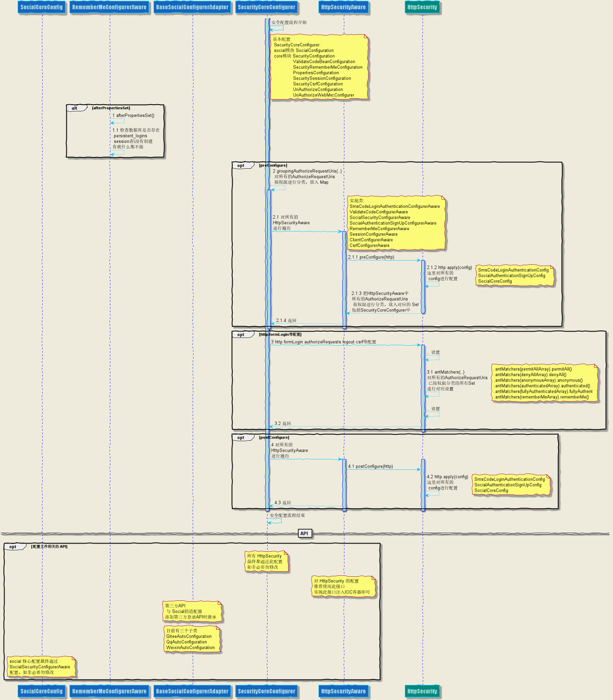

# UMS (user manage scaffold) 用户管理脚手架


## UMS 介绍：
> 集成: 
  - 验证码（图片，短信）校验功能。
  - 手机登录功能，登录后自动注册。
  - 第三方登录功能(qq,微博,微信,gitee,github)，登录后自动注册，与用户账号绑定与解绑。
  - 统一回调地址路由功能。
  - 基于 RBAC 的 uri 访问权限控制功能。
  - 简化 session、rememberme 配置。
  - 根据配置的登录模式（JSON 与 REDIRECT）返回 json 或 html 数据。
  - 签到功能（TODO）。
  
## 打包项目：
-  mvn clean package -Dmaven.test.skip=true -Pdev
-  mvn clean package -Dmaven.test.skip=true -Pprod

## TODO List:
- 签到功能
- demo 待完善

## 使用方式：
1. 引入模块依赖：
2. 通过 application.yml 或 application.properties 配置: 查看下方的 application.properties 或 application.yml 配置
3. 实现对应功能时实现的接口：    
    1. 用户服务(`必须实现`): 
        - 有 social 模块时: `top.dcenter.security.social.api.service.AbstractSocialUserDetailsService`
        - 无 social 模块时: `top.dcenter.security.core.api.service.AbstractUserDetailsService`    
    2. 发送自定义图片验证码, 如果不实现就会使用默认图片验证码, 实时生产验证码图片, 没有缓存功能:
        - `top.dcenter.security.core.api.validate.code.ImageCodeFactory`
    3. 发送短信验证码(`必须实现`):
        - `top.dcenter.security.core.api.validate.code.SmsCodeSender`
    4. 使用自定义验证码:
        - `top.dcenter.security.core.api.validate.code.AbstractValidateCodeProcessor`
        - `top.dcenter.security.core.api.validate.code.ValidateCodeGenerator`
    5. 基于 RBAC 的 uri 访问权限控制(`必须实现`): 相比于 RBAC 更加细粒度的权限控制, 如: 对菜单与按钮的权限控制.
        - `top.dcenter.security.core.api.permission.service.AbstractUriAuthorizeService` 类中的方法`getRolesAuthorities()`;
          `getRolesAuthorities()`返回值: Map<`role`, Map<`uri`, `UriResources`>>, `UriResources` 中字段 `uri` 与 `permission
          ` 必须有值. 
        - 在方法上添加注释 `@UriAuthorize("/test/permission:add")`即可实现权限控制. 示例:
        ```java
        @Component
        @Slf4j
        public class DemoUriAuthorizeService extends AbstractUriAuthorizeService {
        
            private AntPathMatcher matcher = new AntPathMatcher();
        
            @Override
            public Optional<Map<String, Map<String, UriResources>>> getRolesAuthorities() {
        
                // 生产环境: 从 session 中或数据源获取 RolesAuthorities
        
                // 示例代码
                Map<String, Map<String, UriResources>> rolesAuthorities = new HashMap<>(10);
                Map<String, UriResources> uriAuthority = new HashMap<>();
                UriResources uriResources = new UriResources();
                uriResources.setUrl("/test/permission/**");
                uriResources.setPermission("/test/permission:add");        
        
                uriAuthority.put("/test/permission/**", uriResources);
        
                rolesAuthorities.put("ROLE_USER", uriAuthority);
                rolesAuthorities.put("ROLE_ANONYMOUS", uriAuthority);
                return Optional.of(rolesAuthorities);
            }
        
            @Override
            public void handlerError(int status, HttpServletResponse response) {
                response.setContentType(MediaType.APPLICATION_JSON_VALUE);
                response.setCharacterEncoding("UTF-8");
                response.setStatus(status);
                try (PrintWriter writer = response.getWriter())
                {
                    writer.write("{\"msg\":\"您没有访问权限或未登录\"}");
                    writer.flush();
                }
                catch (IOException e)
                {
                    log.error(e.getMessage(), e);
                }
            }
        
        }
        ```
        ```java
        @Configuration
        public class UriAuthorizeConfigurerAware implements HttpSecurityAware {
        
            @Override
            public void postConfigure(HttpSecurity http) throws Exception {
                // dto nothing
            }
        
            @Override
            public void preConfigure(HttpSecurity http) throws Exception {
                // dto nothing
            }
        
            @Override
            public Map<String, Map<String, Set<String>>> getAuthorizeRequestMap() {
        
                final Map<String, Set<String>> permitAllMap = new HashMap<>(16);
        
                // 放行要测试 permission 的链接, 以免干扰 permission 测试.
                permitAllMap.put("/test/permission/**", null);
                permitAllMap.put("/test/deny/**", null);
                permitAllMap.put("/test/pass/**", null);
        
                Map<String, Map<String, Set<String>>> resultMap = new HashMap<>(1);
        
                resultMap.put(HttpSecurityAware.permitAll, permitAllMap);
        
                return resultMap;
            }
        
        }
        ```
        ```java
        @RestController
        @Slf4j
        public class PermissionController {
            /**
             * 测试有 /test/permission:add 权限, 放行
             */
            @UriAuthorize("/test/permission:add")
            @GetMapping("/test/permission/{id}")
            public String testPermission(@PathVariable("id") String id) {
                return "test permission: " + id;
            }
        
        
            /**
             * 测试不匹配 /test/deny:add 权限, 禁止访问
             */
            @UriAuthorize("/test/deny:add")
            @GetMapping("/test/deny/{id}")
            public String testDeny(@PathVariable("id") String id) {
                return "test deny: " + id;
            }
        
            /**
             * 没有注释 @UriAuthorize 直接放行
             */
            @GetMapping("/test/pass/{id}")
            public String testPass(@PathVariable("id") String id) {
                return "test pass: " + id;
            }
        
        }
        ```
    6. 绑定与解绑视图:
        - 绑定状态信息回显: `top.dcenter.security.social.api.banding.ShowConnectionStatusViewService`
        - 绑定与解绑信息回显: `top.dcenter.security.social.api.banding.ShowConnectViewService`
        
    7. 统一的回调地址的路由功能，方便对于多个回调地址进行路由管理:
        1. 统一回调地址与真实回调地址的转换逻辑：
            - 构建统一的回调地址: `top.dcenter.security.social.api.callback.BaseOAuth2ConnectionFactory#buildReturnToUrl(..)`
            - 跳转到真实的回调地址: `top.dcenter.security.social.controller.SocialController#authCallbackRouter(..)`
        2. 对 `state` 的加解密逻辑：
            - 构建真实回调地址到`state`并进行加密: `top.dcenter.security.social.api.callback.BaseOAuth2ConnectionFactory#generateState(..)`
            - 解密`state`并返回真实的回调地址: `top.dcenter.security.social.api.callback.RedirectUrlHelper#decodeRedirectUrl(..)`


# application.properties 或 application.yml 配置:
## 验证码功能
- 基本功能：在 core 包中；
    ```properties
      # 表单登录页
      security.client.login-page=/login.html
      # 登录失败跳转页面
      security.client.failure-url=/login.html
      # 两种登录模式：JSON 与 REDIRECT
      security.client.login-process-type=REDIRECT
      
      # 数据库名称
      security.client.database-name=sso-demo
      
      # Map 类型：必须配置；设置 uri 的特定后缀对应的跳转登录页, 例如：key=/**: value=/security/login.html。 默认为空
      # 支持通配符，匹配规则： /user/aa/bb/cc.html 匹配 pattern：/us?r/**/*.html, /user/**, /user/*/bb/c?.html, /user/**/*.*
      security.client.auth-redirect-suffix-condition["/*.html"]=/login.html
      security.client.auth-redirect-suffix-condition["/hello"]=/login.html
      security.client.auth-redirect-suffix-condition["/user/**"]=/login.html
      security.client.auth-redirect-suffix-condition["/order/**"]=/login.html
      security.client.auth-redirect-suffix-condition["/file/**"]=/login.html
      # /authentication/form 为用户名密码方式注册,/authentication/social 为第三方登录方式注册,/authentication/mobile 为手机登录注册
      # List 类型：设置需要短信验证码认证的 uri，多个 uri 用 “，”号分开，支持通配符，如：/hello,/user/*；默认为空
      #security.codes.sms.auth-urls=/authentication/form,/authentication/social,/authentication/mobile
      security.codes.sms.request-param-sms-code-name=smsCode
      security.codes.sms.request-param-mobile-name=mobile
      security.codes.sms.expire=120
      security.codes.sms.length=6
      # 设置记住我功能的 session 的缓存时长，默认 7 天. If a duration suffix is not specified, seconds will be used.
      security.client.remember-me-timeout=60
      # List 类型：设置需要图片验证码认证的 uri，多个 uri 用 “，”号分开，支持通配符，如：/hello,/user/*；默认为 /authentication/form
      security.codes.image.auth-urls=/authentication/form,/authentication/mobile
      security.codes.image.expire=1200
      security.codes.image.length=4
      security.codes.image.height=60
      security.codes.image.width=270
      security.codes.image.request-para-height-name=height
      security.codes.image.request-para-width-name=width
      security.codes.image.request-param-image-code-name=imageCode
    ```
## 手机登录
- 在 core 模块
    ```properties
      # 手机验证码登录是否开启, 默认 false，
      # 手机验证码登录开启后 必须配置 security.codes.sms.auth-urls=/authentication/mobile
      security.smsCodeLogin.sms-code-login-is-open=true
      # 手机验证码登录请求处理url, 默认 /authentication/mobile
      security.smsCodeLogin.login-processing-url-mobile=/authentication/mobile
      # 提交短信验证码请求时，请求中带的手机号变量名，默认 mobile
      security.smsCodeLogin.request-param-mobile-name=/mobile
    ```
## 第三方登录 OAuth2
- 在 social 模块
    ```properties
      # social 第三方登录注册功能是否开启，默认为 false
      security.social.social-sign-in-is-open=true
      # 第三方登录时是否自动注册：当为 true 且实现 ConnectionSignUp 接口，则开启自动注册，此时 signUpUrl 失效，否则不会开始自动注册，默认为 true
      security.social.auto-sign-in=false
      # 第三方登录时是否自动注册：当为 true 且实现 ConnectionSignUp 接口，则开启自动注册，此时 signUpUrl 失效，否则不会开始自动注册
      # autoSignIn=true 且实现 ConnectionSignUp 接口则自动注册，此时 signUpUrl 会失效
      # 第三方登录用户授权成功跳转页面，默认为 /signUp.html， 用户必需设置
      security.social.sign-up-url=/signUp.html
      # 第三方登录页面， 默认为 /signIn.html
      security.social.sign-in-url=/signIn.html
      # 第三方登录用户从 signUpUrl 提交的用户信息表单，默认由 /authentication/social 进行处理，由 Social 处理，不需要用户实现
      # security.social.social-user-register-url=/authentication/social
      # 第三方登录用户授权成功且未注册，则跳转的注册页面时，需要获取的 SocialUserInfo 信息， 默认从 /social/user 获取。
      # 注意：此 url 是 permitAll 权限, 同时修改 signUpUrl 的 ajax 请求 url
      security.social.social-user-info=/social/user
      # 第三方登录用户授权失败跳转页面， 默认为 /signIn.html， 用户必需设置
      security.social.failure-url=/signIn.html
      
      # redirectUrl 直接由 domain/callbackUrl/(security.social.providerId 中的 providerId 组成：如 qq、wechat)组成
      # 第三方登录回调的域名
      security.social.domain=http://www.dcenter.top 
      # 第三方登录回调处理 url ，也是 RedirectUrl 的前缀，默认为 /auth/callback
      # 如果更改此 url，更改后的必须要实现 SocialController#authCallbackRouter(HttpServletRequest) 的功能
      security.social.callback-url=/auth/callback
      
      # ================= 第三方登录 key 与 secret 加密相关 =================
      # 第三方登录用户数据库表的字段 key 与 secret 加密专用密码
      # security.social.textEncryptorPassword = "7ca5d913a17b4942942d16a974e3fecc";
      # 第三方登录用户数据库表的字段 key 与 secret 加密专用密码
      # security.social.textEncryptorSalt = "cd538b1b077542aca5f86942b6507fe2";
    
      # 自定义 social 表字段
      security.social.table-name=social_UserConnection
      security.social.userIdColumnName=userId
      security.social.providerIdColumnName=providerId
      security.social.providerUserIdColumnName=providerUserId
      security.social.rankColumnName=`rank`
      security.social.displayNameColumnName=displayName
      security.social.profileUrlColumnName=profileUrl
      security.social.imageUrlColumnName=imageUrl
      security.social.accessTokenColumnName=accessToken
      security.social.secretColumnName=secret
      security.social.refreshTokenColumnName=refreshToken
      security.social.expireTimeColumnName=expireTime
      # 修改第三方登录用户数据库用户表创建语句时，要注意：修改字段名称可以直接修改上面的字段名称即可，不用修改建表语句，不可以减少字段，但可以另外增加字段。
      # 用户需要对第三方登录的用户表与 curd 的 sql 语句结构进行更改时（curd 语句暂时没开放自定义），
      # 请实现 UsersConnectionRepositoryFactory，可以参考 OAuth2UsersConnectionRepositoryFactory
      # 但 sql 语句中的 %s 必须写上，且 %s 的顺序必须与后面的字段名称所对应的含义对应 : tableName、  userIdColumnName、 providerIdColumnName、
      # providerUserIdColumnName、  rankColumnName、  displayNameColumnName、  profileUrlColumnName、  imageUrlColumnName、  accessTokenColumnName、  secretColumnName、  refreshTokenColumnName、  expireTimeColumnName、  userIdColumnName、  providerIdColumnName、  providerUserIdColumnName、  userIdColumnName、  providerIdColumnName、  rankColumnName
      security.social.creatUserConnectionTableSql=create table %s (%s varchar(255) not null, %s varchar(255) not null, %s varchar(255), %s int not null, %s varchar(255), %s varchar(512), %s varchar(512), %s varchar(512) not null, %s varchar(512), %s varchar(512), %s bigint, primary key (%s, %s, %s), unique index UserConnectionRank(%s, %s, %s));
      
      # autoSignIn=true 且实现 ConnectionSignUp 接口则自动注册，此时 signUpUrl 会失效
      # QQ 登录时是否自动注册，当为 true 且实现 ConnectionSignUp 接口，则开启自动注册。
      # QQ 登录时是否自动注册：当为 true 且实现 ConnectionSignUp 接口，则开启自动注册，此时 signUpUrl 失效，否则不会开始自动注册
      security.social.qq.auto-sign-in=false
      # ConnectionSignUp 非常有用的扩展接口, 调用时机：在第三方服务商回调 redirectUrl 接口时，
      # 在确认数据库用户表(security.social.table-name)中没有用户记录调用且 autoSignIn 为 true时，调用此接口。
      
      
      # 用户设置 appId 后，也是第三方登录的开关，不同 providerId（如qq） 中的 appId 只有在设置值时才开启，默认都关闭
      security.social.qq.app-id=103450626
      security.social.qq.app-secret=dfd68509dfdf580531df64f8dfd
      # 用户设置 appId 后，也是第三方登录的开关，不同 providerId（如qq） 中的 appId 只有在设置值时才开启，默认都关闭
      security.social.wechat.app-id=wxa84cacfdfdff3fdfb
      security.social.wechat.app-secret=45fdffd933acfdbdf71ea5dfdf
    ```


## 基于 RBAC 的 uri 访问权限控制
- 必须实现 top.dcenter.security.core.api.permission.service.AbstractUriAuthorizeService 类中的方法getRolesAuthorities(),即可实现权限控制.
- 相比于 RBAC 更加细粒度的权限控制, 如: 对菜单与按钮的权限控制, 权限控制的数据库模型:
```sql
CREATE TABLE `sys_resources` (
  `id` bigint(20) unsigned NOT NULL AUTO_INCREMENT,
  `name` varchar(100) CHARACTER SET utf8 COLLATE utf8_general_ci DEFAULT NULL,
  `type` varchar(50) CHARACTER SET utf8 COLLATE utf8_general_ci DEFAULT NULL,
  `url` varchar(200) CHARACTER SET utf8 COLLATE utf8_general_ci DEFAULT NULL,
  `permission` varchar(100) CHARACTER SET utf8 COLLATE utf8_general_ci DEFAULT NULL,
  `parent_id` bigint(20) unsigned DEFAULT '0',
  `sort` int(10) unsigned DEFAULT NULL,
  `external` tinyint(3) unsigned DEFAULT NULL COMMENT '是否外部链接',
  `available` tinyint(3) unsigned DEFAULT '0',
  `icon` varchar(100) CHARACTER SET utf8 COLLATE utf8_general_ci DEFAULT NULL COMMENT '菜单图标',
  `create_time` datetime DEFAULT CURRENT_TIMESTAMP COMMENT '添加时间',
  `update_time` datetime DEFAULT CURRENT_TIMESTAMP COMMENT '更新时间',
  PRIMARY KEY (`id`) USING BTREE,
  KEY `idx_sys_resource_parent_id` (`parent_id`) USING BTREE
) ENGINE=InnoDB AUTO_INCREMENT=81 DEFAULT CHARSET=utf8;

CREATE TABLE `sys_role` (
  `id` bigint(20) unsigned NOT NULL AUTO_INCREMENT,
  `name` varchar(100) CHARACTER SET utf8 COLLATE utf8_general_ci DEFAULT NULL COMMENT '角色名',
  `description` varchar(100) CHARACTER SET utf8 COLLATE utf8_general_ci DEFAULT NULL,
  `available` tinyint(1) DEFAULT '0',
  `create_time` datetime DEFAULT CURRENT_TIMESTAMP COMMENT '添加时间',
  `update_time` datetime DEFAULT CURRENT_TIMESTAMP COMMENT '更新时间',
  PRIMARY KEY (`id`) USING BTREE
) ENGINE=InnoDB AUTO_INCREMENT=4 DEFAULT CHARSET=utf8;

CREATE TABLE `sys_role_resources` (
  `id` bigint(20) unsigned NOT NULL AUTO_INCREMENT,
  `role_id` bigint(20) unsigned NOT NULL,
  `resources_id` bigint(20) unsigned NOT NULL,
  `create_time` datetime DEFAULT CURRENT_TIMESTAMP COMMENT '添加时间',
  `update_time` datetime DEFAULT CURRENT_TIMESTAMP COMMENT '更新时间',
  PRIMARY KEY (`id`) USING BTREE
) ENGINE=InnoDB AUTO_INCREMENT=611 DEFAULT CHARSET=utf8;

CREATE TABLE `sys_user` (
  `id` BIGINT(20) UNSIGNED NOT NULL AUTO_INCREMENT,
  `username` VARCHAR(100) CHARACTER SET utf8 COLLATE utf8_general_ci DEFAULT NULL,
  `password` VARCHAR(100) CHARACTER SET utf8 COLLATE utf8_general_ci DEFAULT NULL COMMENT '登录密码',
  `nickname` VARCHAR(30) CHARACTER SET utf8 COLLATE utf8_general_ci DEFAULT '' COMMENT '昵称',
  `mobile` VARCHAR(30) CHARACTER SET utf8 COLLATE utf8_general_ci DEFAULT NULL COMMENT '手机号',
  `email` VARCHAR(100) CHARACTER SET utf8 COLLATE utf8_general_ci DEFAULT NULL COMMENT '邮箱地址',
  `qq` VARCHAR(20) CHARACTER SET utf8 COLLATE utf8_general_ci DEFAULT NULL COMMENT 'QQ',
  `birthday` DATE DEFAULT NULL COMMENT '生日',
  `gender` SMALLINT(6) DEFAULT NULL COMMENT '性别',
  `avatar` VARCHAR(255) CHARACTER SET utf8 COLLATE utf8_general_ci DEFAULT NULL COMMENT '头像地址',
  `user_type` ENUM('ROOT','ADMIN','USER') CHARACTER SET utf8 COLLATE utf8_general_ci DEFAULT 'ADMIN' COMMENT '超级管理员、管理员、普通用户',
  `company` VARCHAR(100) CHARACTER SET utf8 COLLATE utf8_general_ci DEFAULT NULL COMMENT '公司',
  `blog` VARCHAR(255) CHARACTER SET utf8 COLLATE utf8_general_ci DEFAULT NULL COMMENT '个人博客地址',
  `location` VARCHAR(255) CHARACTER SET utf8 COLLATE utf8_general_ci DEFAULT NULL COMMENT '地址',
  `source` ENUM('GITHUB','GITEE','WEIBO','DINGTALK','BAIDU','CSDN','CODING','OSCHINA','TENCENT_CLOUD','ALIPAY','TAOBAO','QQ','WECHAT','GOOGLE','FACEBOOK') CHARACTER SET utf8 COLLATE utf8_general_ci DEFAULT NULL COMMENT '用户来源',
  `uuid` VARCHAR(50) DEFAULT NULL COMMENT '用户唯一表示(第三方网站)',
  `privacy` TINYINT(4) DEFAULT NULL COMMENT '隐私（1：公开，0：不公开）',
  `notification` TINYINT(3) UNSIGNED DEFAULT NULL COMMENT '通知：(1：通知显示消息详情，2：通知不显示详情)',
  `score` INT(10) UNSIGNED DEFAULT '0' COMMENT '金币值',
  `experience` INT(10) UNSIGNED DEFAULT '0' COMMENT '经验值',
  `reg_ip` VARCHAR(30) CHARACTER SET utf8 COLLATE utf8_general_ci DEFAULT NULL COMMENT '注册IP',
  `last_login_ip` VARCHAR(30) CHARACTER SET utf8 COLLATE utf8_general_ci DEFAULT NULL COMMENT '最近登录IP',
  `last_login_time` DATETIME DEFAULT NULL COMMENT '最近登录时间',
  `login_count` INT(10) UNSIGNED DEFAULT '0' COMMENT '登录次数',
  `remark` VARCHAR(100) CHARACTER SET utf8 COLLATE utf8_general_ci DEFAULT NULL COMMENT '用户备注',
  `status` INT(10) UNSIGNED DEFAULT NULL COMMENT '用户状态',
  `create_time` DATETIME DEFAULT CURRENT_TIMESTAMP COMMENT '注册时间',
  `update_time` DATETIME DEFAULT CURRENT_TIMESTAMP COMMENT '更新时间',
  PRIMARY KEY (`id`) USING BTREE,
  UNIQUE KEY `idx_mobile` (`mobile`)
) ENGINE=INNODB AUTO_INCREMENT=19 DEFAULT CHARSET=utf8;

CREATE TABLE `sys_user_role` (
  `id` BIGINT(20) UNSIGNED NOT NULL AUTO_INCREMENT,
  `user_id` BIGINT(20) UNSIGNED NOT NULL,
  `role_id` BIGINT(20) UNSIGNED NOT NULL,
  `create_time` DATETIME DEFAULT CURRENT_TIMESTAMP COMMENT '添加时间',
  `update_time` DATETIME DEFAULT CURRENT_TIMESTAMP COMMENT '更新时间',
  PRIMARY KEY (`id`) USING BTREE
) ENGINE=INNODB AUTO_INCREMENT=13 DEFAULT CHARSET=utf8;
```
- 当然以上数据库模型只是参考, 只要能够获取到 Map<role, Map<uri, permission>> 即可.


# session 存储模式设置
- session 存储模式设置
    ```properties
      # 要导入相应的 spring-session 类的依赖, 默认为 InMemory, 分布式服务器应用把 session 放入 redis 等中间件
      spring.session.store-type=redis
    ```
  
    ```xml
      <!-- SpringSession Redis依赖 -->
      <dependency>
          <groupId>org.springframework.session</groupId>
          <artifactId>spring-session-data-redis</artifactId>
      </dependency>
      <dependency>
          <groupId>org.springframework.boot</groupId>
          <artifactId>spring-boot-starter-data-redis</artifactId>
      </dependency>
    ```

# 给第三方登录时用的数据库表 social_UserConnection 添加 redis 缓存配置

-
    ```yml
    redis:
      # 默认 redis 缓存是 false，
      is-open: true
      host: 192.168.88.88
      port: 6379
      password:
      # 连接超时的时间
      timeout: 100000
      cache:
        database-index: 1
        default-expire-time: PT200S
        entry-ttl: PT180S
        cache-names:
          - cacheName
      lettuce:
        shutdown-timeout: PT500S
        pool:
          max-active: 8
          max-wait: 100000
          max-idle: 4
          min-idle: 1
    ```
-
    ```xml
    <dependency>
      <groupId>org.springframework.boot</groupId>
      <artifactId>spring-boot-starter-data-redis</artifactId>
    </dependency>
    
    ```

# HttpSecurity 配置问题：UMS 中的 HttpSecurity 配置与应用中的 HttpSecurity 配置冲突问题：

1. 如果是新建应用添加 HttpSecurity 配置, 通过下面的接口即可:
    - `top.dcenter.security.core.api.config.HttpSecurityAware`
2. 如果是已存在的应用：
    - 添加 HttpSecurity 配置, 通过下面的接口即可: `top.dcenter.security.core.api.config.HttpSecurityAware`
    - 已有的 HttpSecurity 配置, 让原有的 HttpSecurity 配置实现此接口进行配置: `top.dcenter.security.core.api.config
    .HttpSecurityAware`


# 时序图
## crsf

## getValidateCode

## ImageValidateCodeLogin

## logout

## OAuth2Banding

## OAuth2Login

## OAuth2SignUp

## rememberMe

## scurityConfigurer

## securityRouter

## session

## SmsCodeLogin

## uriAuthorize
