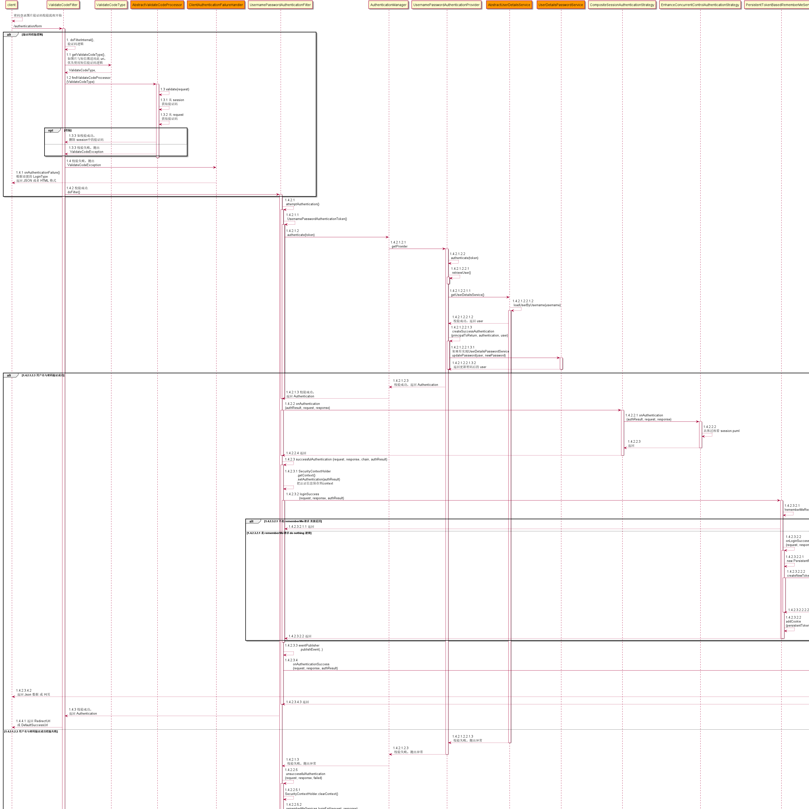
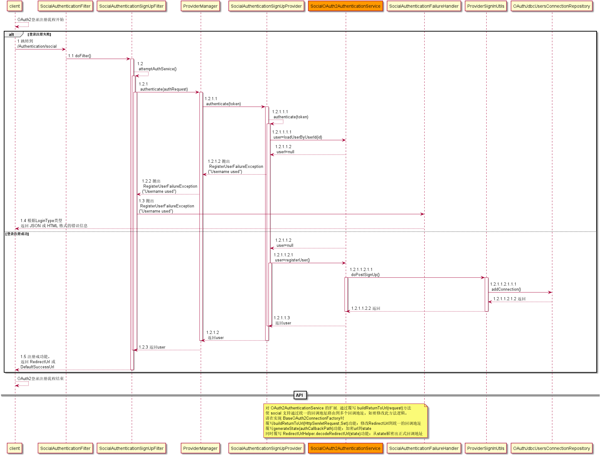
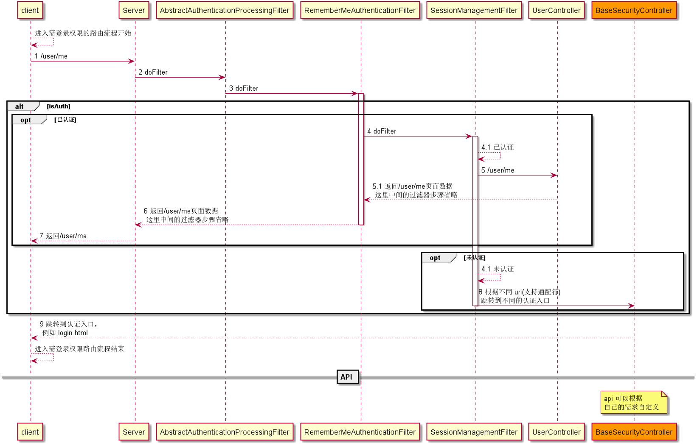
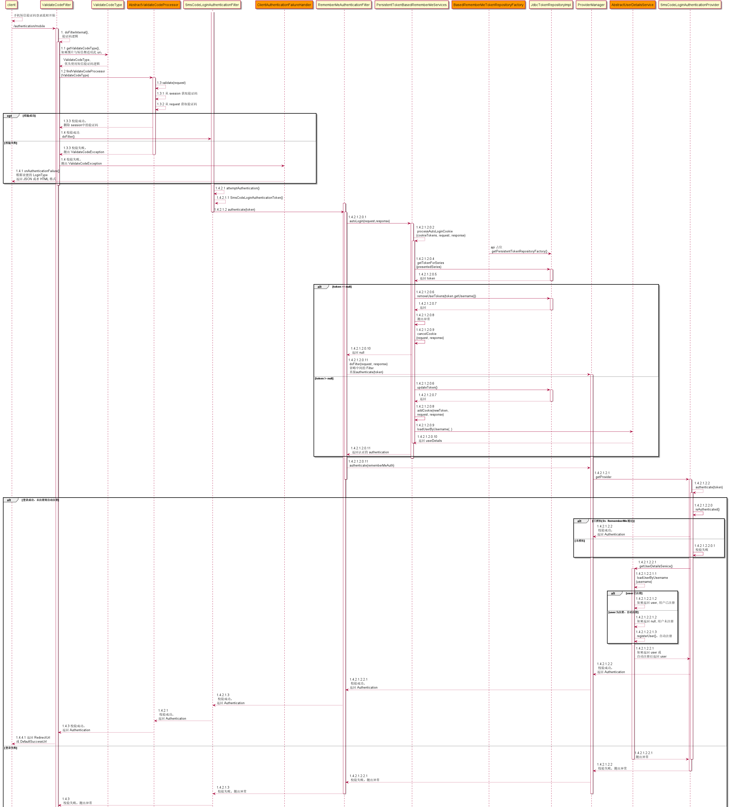

# UMS (user manage scaffold) 用户管理脚手架: [github](https://github.com/ZeroOrInfinity/UMS) [gitee](https://gitee.com/pcore/UMS)


用户管理脚手架集成：验证码、手机登录、支持qq,微博,微信,gitee第三方登录（自动注册，绑定与解绑）、基于 RBAC 的 uri 访问权限控制功能、通过统一的回调地址入口实现多回调地址的路由功能、签到等功能。通过实现几个 API 接口就可以实现上述功能，实现快速开发，只需要专注于业务逻辑。


## 一、`UMS 特性`：
  - 验证码（图片，短信）校验功能。
  - 手机登录功能，登录后自动注册。
  - 第三方登录功能(qq,微博,微信,gitee)，登录后自动注册，与用户账号绑定与解绑。
  - 登录路由功能
  - 统一回调地址路由功能(OAuth2)。
  - 基于 RBAC 的 uri 访问权限控制功能。
  - 简化 session、rememberme 配置。
  - 根据设置的返回方式（JSON 与 REDIRECT）返回 json 或 html 数据。
  - 签到功能。
  
## 二、`打包项目`：
-  mvn clean package -Dmaven.test.skip=true -Pdev
-  mvn clean package -Dmaven.test.skip=true -Pprod

## 三、`TODO List`:
- demo 待完善

## 四、`使用方式`：

- 引入模块依赖：
- 通过 application.yml 或 application.properties 配置: 查看下方的 application.properties 或 application.yml 配置.
- 实现对应功能时需要实现的接口：    
    1. 用户服务(`必须实现`): 
        - 有 social 模块时: `top.dcenter.security.social.api.service.AbstractSocialUserDetailsService`
        - 无 social 模块时: `top.dcenter.security.core.api.service.AbstractUserDetailsService`    
    2. 发送自定义图片验证码, 如果不实现就会使用默认图片验证码, 实时生产验证码图片, 没有缓存功能:
        - `top.dcenter.security.core.api.validate.code.ImageCodeFactory`
    3. 发送短信验证码(`必须实现`):
        - `top.dcenter.security.core.api.validate.code.SmsCodeSender`
    4. 使用自定义验证码:
        - `top.dcenter.security.core.api.validate.code.AbstractValidateCodeProcessor`
        - `top.dcenter.security.core.api.validate.code.ValidateCodeGenerator`
    5. 基于 RBAC 的 uri 访问权限控制(`必须实现`): 相比于 RBAC 更加细粒度的权限控制, 如: 对菜单与按钮的权限控制.
        - `top.dcenter.security.core.api.permission.service.AbstractUriAuthorizeService` 类中的方法`getRolesAuthorities()`;
          `getRolesAuthorities()`返回值: Map<`role`, Map<`uri`, `UriResources`>>, `UriResources` 中字段 `uri` 与 `permission
          ` 必须有值. 
        - 在方法上添加注释 `@UriAuthorize("/test/permission:add")`即可实现权限控制. 示例:
        ```java
        @Component
        @Slf4j
        public class DemoUriAuthorizeService extends AbstractUriAuthorizeService {
        
            private AntPathMatcher matcher = new AntPathMatcher();
        
            @Override
            public Optional<Map<String, Map<String, UriResources>>> getRolesAuthorities() {
        
                // 生产环境: 从数据源获取 RolesAuthorities
        
                // 示例代码
                Map<String, Map<String, UriResources>> rolesAuthorities = new HashMap<>(10);
                Map<String, UriResources> uriAuthority = new HashMap<>();
                UriResources uriResources = new UriResources();
                uriResources.setUrl("/test/permission/**");
                uriResources.setPermission("/test/permission:add");        
        
                uriAuthority.put("/test/permission/**", uriResources);
        
                rolesAuthorities.put("ROLE_USER", uriAuthority);
                rolesAuthorities.put("ROLE_ANONYMOUS", uriAuthority);
                return Optional.of(rolesAuthorities);
            }
        
            @Override
            public void handlerError(int status, HttpServletResponse response) {
                response.setContentType(MediaType.APPLICATION_JSON_VALUE);
                response.setCharacterEncoding("UTF-8");
                response.setStatus(status);
                try (PrintWriter writer = response.getWriter())
                {
                    writer.write("{\"msg\":\"您没有访问权限或未登录\"}");
                    writer.flush();
                }
                catch (IOException e)
                {
                    log.error(e.getMessage(), e);
                }
            }
        
        }
        ```
        ```java
        @Configuration
        public class UriAuthorizeConfigurerAware implements HttpSecurityAware {
        
            @Override
            public void postConfigure(HttpSecurity http) throws Exception {
                // dto nothing
            }
        
            @Override
            public void preConfigure(HttpSecurity http) throws Exception {
                // dto nothing
            }
        
            @Override
            public Map<String, Map<String, Set<String>>> getAuthorizeRequestMap() {
        
                final Map<String, Set<String>> permitAllMap = new HashMap<>(16);
        
                // 放行要测试 permission 的链接, 以免干扰 permission 测试.
                permitAllMap.put("/test/permission/**", null);
                permitAllMap.put("/test/deny/**", null);
                permitAllMap.put("/test/pass/**", null);
        
                Map<String, Map<String, Set<String>>> resultMap = new HashMap<>(1);
        
                resultMap.put(HttpSecurityAware.permitAll, permitAllMap);
        
                return resultMap;
            }
        
        }
        ```
        ```java
        @RestController
        @Slf4j
        public class PermissionController {
            /**
             * 测试有 /test/permission:add 权限, 放行
             */
            @UriAuthorize("/test/permission:add")
            @GetMapping("/test/permission/{id}")
            public String testPermission(@PathVariable("id") String id) {
                return "test permission: " + id;
            }
        
        
            /**
             * 测试不匹配 /test/deny:add 权限, 禁止访问
             */
            @UriAuthorize("/test/deny:add")
            @GetMapping("/test/deny/{id}")
            public String testDeny(@PathVariable("id") String id) {
                return "test deny: " + id;
            }
        
            /**
             * 没有注释 @UriAuthorize 直接放行
             */
            @GetMapping("/test/pass/{id}")
            public String testPass(@PathVariable("id") String id) {
                return "test pass: " + id;
            }
        
        }
        ```
    6. 绑定与解绑视图(`必须实现`): 用户绑定与解绑成功后会自动跳转到对应回显页面, 默认返回 json 信息
        - 绑定状态信息回显: `top.dcenter.security.social.api.banding.ShowConnectionStatusViewService`
        - 绑定与解绑信息回显: `top.dcenter.security.social.api.banding.ShowConnectViewService`
        
    7. 统一的回调地址的路由功能，方便对于多个回调地址进行路由管理: 
       - 需要调用`top.dcenter.security.social.api.callback.BaseOAuth2ConnectionFactory#generateState(realAuthCallbackPath)`
         方法去设置真实的回调地址: realAuthCallbackPath(格式为：`path=myAuthCallbackPath`).
        1. 统一回调地址与真实回调地址的转换逻辑：
            - 构建统一的回调地址: `top.dcenter.security.social.api.callback.BaseOAuth2ConnectionFactory#buildReturnToUrl(..)`
            - 跳转到真实的回调地址: `top.dcenter.security.social.controller.SocialController#authCallbackRouter(..)`
        2. 对 `state` 的加解密逻辑：
            - 构建真实回调地址到`state`并进行加密: `top.dcenter.security.social.api.callback.BaseOAuth2ConnectionFactory#generateState(..)`
            - 解密`state`并返回真实的回调地址: `top.dcenter.security.social.api.callback.RedirectUrlHelperService#decodeRedirectUrl(..)`


## 五、`application.properties 或 application.yml 配置`:
### 1. 基本功能
- 在 core 包中；
  - 简单配置:
    ```yaml
    security:
      client:
        login-page: /login
        failure-url: /login        
        # 设置登出 url, 默认为 /logout
        logout-url: /logout
        # 设置登出后跳转的 url, 默认为 /login
        logout-success-url: /login
        # 不需要认证的静态资源 urls, 例如: /resources/**, /static/**
        ignoring-urls:
          - /static/**
    ```
  - 详细配置:
    ```yaml
    security:
      client:
        login-page: /login
        failure-url: /login
        # 设置登录后返回格式(REDIRECT 与 JSON): 默认 JSON
        login-process-type: redirect
        # 设置处理登录表单的 uri，不需要用户实现此 uri，由 Spring security 自动实现， 默认为 /authentication/form
        login-processing-url: /authentication/form
        success-url: /
        # 设置登出 url, 默认为 /logout
        logout-url: /logout
        # 设置登出后跳转的 url, 默认为 /login
        logout-success-url: /login
        # 设置登录时用户名的 request 参数名称, 默认为 username
        usernameParameter: username
        # 设置登录时用户密码的 request 参数名称, 默认为 password
        passwordParameter: password
        # 登录后是否利用 Referer 进行跳转, 默认为: false
        useReferer: true
        # 设置由客户端决定认证成功要跳转的 url 的 request 参数名称, 默认为 redirectTargetUrl
        targetUrlParameter: redirectTargetUrl
        # 是否开启登录路由功能, 根据不同的uri跳转到相对应的登录页, 默认为: false, 当为 true 时还需要配置 loginUnAuthenticationUrl 和 authRedirectSuffixCondition
        open-authentication-redirect: true
        # 当请求需要身份认证时，默认跳转的url 会根据 authJumpSuffixCondition 条件判断的认证处理类型的 url，默认实现 /authentication/require,
        # 当 openAuthenticationRedirect = true 时生效. 注意: 如果修改此 uri, 需要重新实现修改后的 uri
        login-un-authentication-url: /authentication/require
        # 设置 uri 相对应的跳转登录页, 例如：key=/**: value=/login.html, 用等号隔开key与value, 如: /**=/login.html, 默认为空. 
        # 当 openAuthenticationRedirect = true 时生效.
        # 支持通配符, 匹配规则： /user/aa/bb/cc.html 匹配 pattern：/us?r/**/*.html, /user/**, /user/*/bb/c?.html, /user/**/*.*.
        # 规则具体看 AntPathMatcher.match(pattern, path)
        auth-redirect-suffix-condition: 
          - '/hello=/login'
          - '/user/**=/login'
          - '/order/**=/login'
          - '/file/**=/login'
          - '/social/**=/signIn.html'
        # 不需要认证的静态资源 urls, 例如: /resources/**, /static/**
        ignoring-urls:
          - /static/**
        # 不需要认证的 uri, 默认为 空 Set.
        permit-urls:
          - /**/*.html
    ```
### 2. 登录路由功能 配置
- 在 core 包中；
  - 详细配置:
    ```yaml
    security:
      client:
        # 是否开启登录路由功能, 根据不同的uri跳转到相对应的登录页, 默认为: false, 当为 true 时还需要配置 loginUnAuthenticationUrl 和 authRedirectSuffixCondition
        open-authentication-redirect: true
        # 当请求需要身份认证时，默认跳转的url 会根据 authJumpSuffixCondition 条件判断的认证处理类型的 url，默认实现 /authentication/require,
        # 当 openAuthenticationRedirect = true 时生效. 注意: 如果修改此 uri, 需要重新实现修改后的 uri
        login-un-authentication-url: /authentication/require
        # 设置 uri 相对应的跳转登录页, 例如：key=/**: value=/login.html, 用等号隔开key与value, 如: /**=/login.html, 默认为空. 
        # 当 openAuthenticationRedirect = true 时生效.
        # 支持通配符, 匹配规则： /user/aa/bb/cc.html 匹配 pattern：/us?r/**/*.html, /user/**, /user/*/bb/c?.html, /user/**/*.*.
        # 规则具体看 AntPathMatcher.match(pattern, path)
        auth-redirect-suffix-condition: 
          - '/hello=/login'
          - '/user/**=/login'
          - '/order/**=/login'
          - '/file/**=/login'
          - '/social/**=/signIn.html'
    ```
### 3. session 配置
- 在 core 包中；
  - 简单配置:
    ```yaml
    spring:
      session:
        # session 存储模式设置, 要导入相应的 spring-session 类的依赖, 默认为 InMemory, 分布式服务器应用把 session 放入 redis 等中间件
        store-type: InMemory
    ```
      
  - 详细配置:
    ```yaml
    spring:
      session:
        # session 存储模式设置, 要导入相应的 spring-session 类的依赖, 默认为 InMemory, 分布式服务器应用把 session 放入 redis 等中间件
        store-type: redis
        timeout: PT600S
        redis:
          # redis 刷新模式
          flush-mode: on_save
          # redis 命名空间
          namespace: spring:session
          # Cron expression for expired session cleanup job
          cleanup-cron: 5 * * * * *
      # redis
      redis:
        host: 192.168.88.88
        port: 6379
        password:
        database: 0
        # 连接超时的时间
        timeout: 10000
        # redis-lettuce-pool
        lettuce:
          shutdown-timeout: PT500S
          pool:
            max-active: 8
            max-wait: PT10S
            max-idle: 8
            min-idle: 1
    server:
      servlet:
        # tomcat session 设置
        session:
          timeout: PT600S
          cookie:
            max-age: PT600S
            # session 的 cookie name, 默认为: JSESSIONID
            name: SID
    security:
      client:
        # session 设置
        session:
          session-creation-policy: always
          # 当为 false 时允许单个用户拥有任意数量的 session（不同设备或不同浏览器），默认为 false。 当设置 true 时，同时请设置一下选项：maximumSessions 和 maxSessionsPreventsLogin
          session-number-control: false
          # 当设置为 1 时，maxSessionsPreventsLogin 为 false 时，同个用户登录会自动踢掉上一次的登录状态。 当设置为 1 时，maxSessionsPreventsLogin 为 true 时，同个用户登录会自动自动拒绝用户再登录。 默认为 1。 如要此选项生效，sessionNumberControl 必须为 true
          maximum-sessions: 1
          # 同个用户达到最大 maximumSession 后，当为 true 时自动拒绝用户再登录，当为 false 时自动踢掉上一次的登录状态, 默认为 false。 如要此选项生效，sessionNumberControl 必须为 true
          max-sessions-prevents-login: false
          # 如果设置为true，则允许HTTP会话在网址中使用HttpServletResponse.encodeRedirectURL（String）或HttpServletResponse.encodeURL（字符串）时被改写，被包含在URL，
          # 否则不允许HTTP会话。 这可以防止信息泄漏到外部域, 默认为: false
          enable-session-url-rewriting: false
          # concurrent session 失效后跳转地址, login-process-type=redirect 时有效. 默认: /security/concurrentSession.html
          invalid-session-of-concurrent-url: /concurrentSession.html
          # session 失效后跳转地址, login-process-type=redirect 时有效. 默认: /session/invalid, 注意: 如果修改此 uri, 需要重新实现修改后的 uri
          invalid-session-url: /session/invalid
          # session 的 cookie name, 默认为: JSESSIONID, 需要与 server.servlet.session.cookie.name 同时设置
          session-cookie-name: SID
    ```
  
    ```xml
      <!-- SpringSession Redis依赖 -->
      <dependency>
          <groupId>org.springframework.session</groupId>
          <artifactId>spring-session-data-redis</artifactId>
      </dependency>
      <dependency>
          <groupId>org.springframework.boot</groupId>
          <artifactId>spring-boot-starter-data-redis</artifactId>
      </dependency>
    ```
### 4. remember-me 配置
- 在 core 包中；
  - 简单配置: 不对 remember-me 进行任何配置, 会使用默认值.
  - 详细配置:
    ```yaml
    security:
      client:
        # 设置记住我功能的 session 的缓存时长，默认 14 天. If a duration suffix is not specified, seconds will be used.
        remember-me:
          remember-me-timeout: P14D
          remember-me-cookie-name: rememberMe
          remember-me-parameter: rememberMe
          # 当为 true 时 rememberMe 只能用于 https, 默认为 false
          use-secure-cookie: false
    ```
### 5. csrf 配置
- 在 core 包中；
  - 简单配置: 不对 csrf 进行任何配置, 默认关闭 csrf 功能.
  - 详细配置:
    ```yaml
    security:
      client:
        csrf:
          # csrf 是否开启, 默认为 false;
          csrf-is-open: false
          # 忽略指定请求的 CSRF 防护, 默认为 空 Set
          ignoring-ant-matcher-urls:
    #        - /authentication/form
    #        - /authentication/mobile
    #        - /authentication/social
    #        - /logout
            - /user/**
            - /file/**
          # csrf tokenRepository 的存储类型, 默认为 session. 集群选择 redis, 也可以自己自定义
          token-repository-type: redis
    ```

### 6. 验证码功能
- 在 core 包中；
  - 简单配置:
    ```yaml
    security:
      # 验证码配置
      codes:
        # 图片验证码
        image:
          # 设置需要图片验证码认证的 uri，多个 uri 用 “-” 或 ","号分开支持通配符，如：/hello,/user/*；默认为 /authentication/form
          auth-urls:
            - /authentication/form
            - /authentication/social          
        # 短信验证码
        sms:
          # 设置需要短信验证码认证的 uri，多个 uri 用 “，”号分开支持通配符，如：/hello,/user/*；默认为 /authentication/form
          auth-urls:
            - /authentication/mobile
    ```
  - 详细配置:
    ```yaml
    security:
      # 验证码配置
      codes:
        # 图片验证码
        image:
          # 设置需要图片验证码认证的 uri，多个 uri 用 “-” 或 ","号分开支持通配符，如：/hello,/user/*；默认为 /authentication/form
          auth-urls:
            - /authentication/form
            - /authentication/social
          # 验证码长度
          length: 4
          height: 60
          width: 270
          expire: 180
          request-para-height-name: height
          request-para-width-name: width
          request-param-image-code-name: imageCode
        # 短信验证码
        sms:
          # 设置需要短信验证码认证的 uri，多个 uri 用 “，”号分开支持通配符，如：/hello,/user/*；默认为 /authentication/form
          auth-urls:
            - /authentication/mobile
          length: 6
          expire: 120
          request-param-mobile-name: mobile
          request-param-sms-code-name: smsCode
    ```
  
### 7. 手机登录
- 在 core 模块
    ```yaml
    security:
      # 手机登录配置
      mobile:
        login:
          # 手机验证码登录是否开启, 默认 false，
          # 手机验证码登录开启后 必须配置 security.codes.sms.auth-urls=/authentication/mobile
          sms-code-login-is-open: true
          # 手机验证码登录请求处理url, 默认 /authentication/mobile
          login-processing-url-mobile: /authentication/mobile
    ```

### 8. 第三方登录 OAuth2
- 在 social 模块
  - 简单配置:
    ```yaml
    security:
      # 第三方登录配置: social
      social:
        # 第三方登录用户数据库表的字段 key 与 secret 加密专用密码
        text-encryptor-password: 7ca5d913a17b4942942d16a974e3fecc
        # 第三方登录用户数据库表的字段 key 与 secret 加密专用 salt
        text-encryptor-salt: cd538b1b077542aca5f86942b6507fe2
        # 第三方登录页面， 默认为 /signIn.html
        sign-in-url: /signIn.html
        # 第三方登录用户授权失败跳转页面， 默认为 /signIn.html
        failure-url: /signIn.html
        # redirectUrl 直接由 domain/callbackUrl/providerId(security.social.[qq/wechat/gitee/weibo])组成
        # 第三方登录回调的域名
        domain: http://www.dcenter.top
        ####### 第三方登录绑定相关
        # 第三方登录绑定页面， 默认为 /banding.html
        banding-url: /banding
        
        # 从第三方服务商获取的信息
        # 用户设置 appId 时，{providerId}第三方登录自动开启，不同 providerId（如qq） 中的 appId 只有在设置值时才开启，默认都关闭
        qq:
          app-id: 
          app-secret: 
        gitee:
          app-id: 
          app-secret: 
        weixin:
          app-id: 
          app-secret: 
        weibo:
          app-id: 
          app-secret: 
    ```
  - 详细配置:
    ```yaml
    security:
      # 第三方登录配置: social
      social:
        # 第三方登录用户数据库表的字段 key 与 secret 加密专用密码
        text-encryptor-password: 7ca5d913a17b4942942d16a974e3fecc
        # 第三方登录用户数据库表的字段 key 与 secret 加密专用 salt
        text-encryptor-salt: cd538b1b077542aca5f86942b6507fe2
    
        # ConnectionSignUp 非常有用的扩展接口, 调用时机：在第三方服务商回调 redirectUrl 接口时，
        # 在确认数据库用户表(security.social.table-name)中没有用户记录调用且 autoSignIn 为 true 时，调用此接口。
        # 第三方登录时是否自动注册：当为 true 且实现 ConnectionSignUp 接口，则开启自动注册，此时 signUpUrl 失效，否则不会开始自动注册，默认为 true
        auto-sign-in: false
    
        # social 第三方登录注册功能是否开启，默认为 false
        social-sign-in-is-open: true
    
        # ============== 以下配置依赖 social-sign-in-is-open=true 时才有效 ==============
    
        # autoSignIn=true 且实现 ConnectionSignUp 接口则自动登录，而且 signUpUrl 会失效
        # 第三方登录用户授权成功跳转页面，默认为 /signUp.html， 用户必需设置
        sign-up-url: /signUp
        # 第三方登录用户从 signUpUrl 提交的用户信息表单，默认由 /authentication/social 进行处理，由 Social 处理，不需要用户实现
        social-user-register-url: /authentication/social
    
        # ============== 以上配置依赖 social-sign-in-is-open=true 时才有效 ==============
    
        # 第三方登录页面， 默认为 /signIn.html
        sign-in-url: /signIn.html
        # 第三方登录用户授权失败跳转页面， 默认为 /signIn.html
        failure-url: /signIn.html
        # 第三方登录回调处理 url ，也是 RedirectUrl 的前缀，默认为 /auth/callback
        # 如果更改此 url，更改后的必须要实现 SocialController#authCallbackRouter(HttpServletRequest) 的功能
        callback-url: /auth/callback
        # redirectUrl 直接由 domain/callbackUrl/providerId(security.social.[qq/wechat/gitee/weibo])组成
        # 第三方登录回调的域名
        domain: http://www.dcenter.top
        # 第三方登录用户注册时: 用户唯一 ID 字段名称， 默认为 userId
        user-id-param-name: userId
        # 第三方登录用户注册时 密码 字段名称， 默认为 password
        password-param-name: password
        # 第三方服务商 providerId 字段名称， 默认为 providerId
        provider-id-param-name: providerId
        # 第三方登录用户在服务商用户唯一ID providerUserId 字段名称， 默认为 providerUserId
        provider-user-id-param-name: providerUserId
        # 第三方登录用户头像 avatarUrl 字段名称， 默认为 avatarUrl
        avatar-url-param-name: avatarUrl
        ####### 第三方登录绑定相关
        # 第三方登录绑定页面， 默认为 /banding.html
        banding-url: /banding
        # 用户绑定第三方账号的 List 的参数名称, 默认: connections
        banding-provider-connection-list-name: connections
        # 用户绑定第三方账号后返回状态信息的视图前缀, 默认: connect/
        # 对 AbstractView 子类定义 bean 时, beanName 的前缀必须与此属性值一样
        view-path: connect/
    
        # 第三方授权登录用户信息表
        table-name: social_UserConnection
        user-id-column-name: userId
        provider-id-column-name: providerId
        provider-user-id-column-name: providerUserId
        rank-column-name: '`rank`'
        display-name-column-name: displayName
        profile-url-column-name: profileUrl
        image-url-column-name: imageUrl
        access-token-column-name: accessToken
        secret-column-name: secret
        refresh-token-column-name: refreshToken
        expire-time-column-name: expireTime
        # 第三方登录用户数据库用户表创建语句。 修改第三方登录用户数据库用户表创建语句时，
        # 要注意：修改字段名称可以直接修改上面的字段名称即可，不用修改建表语句; 不可以减少字段，但可以另外增加字段。
        # 主键必须是 userIdColumnName，唯一索引必须是（userIdColumnName、  providerIdColumnName、  rankColumnName）。
        # sql 语句中的 %s 必须写上，且 %s 的顺序必须与后面的字段名称所对应的含义对应 : tableName、  userIdColumnName、 providerIdColumnName、
        # providerUserIdColumnName、  rankColumnName、  displayNameColumnName、  profileUrlColumnName、  imageUrlColumnName、  accessTokenColumnName、  secretColumnName、  refreshTokenColumnName、  expireTimeColumnName、  userIdColumnName、  providerIdColumnName、  providerUserIdColumnName、  userIdColumnName、  providerIdColumnName、  rankColumnName
        creat-user-connection-table-sql: create table %s (%s varchar(255) not null, %s varchar(255) not null, %s varchar(255), %s int not null, %s varchar(255), %s varchar(512), %s varchar(512), %s varchar(512) not null, %s varchar(512), %s varchar(512), %s bigint, primary key (%s, %s, %s), unique index UserConnectionRank(%s, %s, %s));
        # 用户需要对第三方登录的用户表与 curd 的 sql 语句结构进行更改时（curd 语句通过配置文件修改暂时未实现），
        # 请实现 UsersConnectionRepositoryFactory，可以参考 OAuth2UsersConnectionRepositoryFactory、OAuthJdbcUsersConnectionRepository、JdbcConnectionRepository
    
        # 从第三方服务商获取的信息
        # 用户设置 appId 时，{providerId}第三方登录自动开启，不同 providerId（如qq） 中的 appId 只有在设置值时才开启，默认都关闭
        qq:
          app-id: 
          app-secret: 
        gitee:
          app-id: 
          app-secret: 
        weixin:
          app-id: 
          app-secret: 
        weibo:
          app-id: 
          app-secret: 
    ```

### 9. 给第三方登录时用的数据库表 social_UserConnection 添加 redis 缓存配置
- 在 social 模块
    ```yaml
    redis:
      # 是否开启缓存, 默认 false
      open: true
      # 是否使用 spring IOC 容器中的 RedisConnectionFactory， 默认： false
      # 如果使用 spring IOC 容器中的 RedisConnectionFactory，则要注意 cache.database-index 要与 spring.redis.database 一样。
      use-ioc-redis-connection-factory: true
      cache:
        database-index: 1
        default-expire-time: PT200S
        entry-ttl: PT180S
        cache-names:
          - cacheName
    ```
    ```xml
    <dependency>
      <groupId>org.springframework.boot</groupId>
      <artifactId>spring-boot-starter-data-redis</artifactId>
    </dependency>
    
    ```
### 10. 签到功能
- 在 core 模块
  - 详细配置:
    ```yaml
    security:
      # 签到功能 设置
      sign:
        # 获取最近几天的签到情况, 不能大于 28 天, 默认为 7 天
        last-few-days: 7
        # 用于 redis 签到 key 前缀，默认为： u:sign:
        sign-key-prefix: 'u:sign:'
        # redis key(String) 转 byte[] 转换时所用的 charset
        charset: UTF-8
    ```
  - 使用说明:
    ```java
        /**
         * 通过 Autowired 注入 SignService 即可
         * 详细使用方式可以查看 demo 模块: top.dcenter.security.sign.DemoSignController
         * 要自定义签到功能, 实现 {@link SignService}, 注入 IOC 即可替换 {@link UserSignServiceImpl} 默认实现
         */
        @Autowired
        private SignService signService;
    ```
    


## 六、`其他注意事项`: 
### 1. 基于 RBAC 的 uri 访问权限控制
- 必须实现 top.dcenter.security.core.api.permission.service.AbstractUriAuthorizeService 类中的方法getRolesAuthorities(),即可实现权限控制.
- 相比于 RBAC 更加细粒度的权限控制, 如: 对菜单与按钮的权限控制, 权限控制的数据库模型:
```sql
CREATE TABLE `sys_resources` (
  `id` bigint(20) unsigned NOT NULL AUTO_INCREMENT,
  `name` varchar(100) CHARACTER SET utf8 COLLATE utf8_general_ci DEFAULT NULL,
  `type` varchar(50) CHARACTER SET utf8 COLLATE utf8_general_ci DEFAULT NULL,
  `url` varchar(200) CHARACTER SET utf8 COLLATE utf8_general_ci DEFAULT NULL,
  `permission` varchar(100) CHARACTER SET utf8 COLLATE utf8_general_ci DEFAULT NULL,
  `parent_id` bigint(20) unsigned DEFAULT '0',
  `sort` int(10) unsigned DEFAULT NULL,
  `external` tinyint(3) unsigned DEFAULT NULL COMMENT '是否外部链接',
  `available` tinyint(3) unsigned DEFAULT '0',
  `icon` varchar(100) CHARACTER SET utf8 COLLATE utf8_general_ci DEFAULT NULL COMMENT '菜单图标',
  `create_time` datetime DEFAULT CURRENT_TIMESTAMP COMMENT '添加时间',
  `update_time` datetime DEFAULT CURRENT_TIMESTAMP COMMENT '更新时间',
  PRIMARY KEY (`id`) USING BTREE,
  KEY `idx_sys_resource_parent_id` (`parent_id`) USING BTREE
) ENGINE=InnoDB AUTO_INCREMENT=81 DEFAULT CHARSET=utf8;

CREATE TABLE `sys_role` (
  `id` bigint(20) unsigned NOT NULL AUTO_INCREMENT,
  `name` varchar(100) CHARACTER SET utf8 COLLATE utf8_general_ci DEFAULT NULL COMMENT '角色名',
  `description` varchar(100) CHARACTER SET utf8 COLLATE utf8_general_ci DEFAULT NULL,
  `available` tinyint(1) DEFAULT '0',
  `create_time` datetime DEFAULT CURRENT_TIMESTAMP COMMENT '添加时间',
  `update_time` datetime DEFAULT CURRENT_TIMESTAMP COMMENT '更新时间',
  PRIMARY KEY (`id`) USING BTREE
) ENGINE=InnoDB AUTO_INCREMENT=4 DEFAULT CHARSET=utf8;

CREATE TABLE `sys_role_resources` (
  `id` bigint(20) unsigned NOT NULL AUTO_INCREMENT,
  `role_id` bigint(20) unsigned NOT NULL,
  `resources_id` bigint(20) unsigned NOT NULL,
  `create_time` datetime DEFAULT CURRENT_TIMESTAMP COMMENT '添加时间',
  `update_time` datetime DEFAULT CURRENT_TIMESTAMP COMMENT '更新时间',
  PRIMARY KEY (`id`) USING BTREE
) ENGINE=InnoDB AUTO_INCREMENT=611 DEFAULT CHARSET=utf8;

CREATE TABLE `sys_user` (
  `id` BIGINT(20) UNSIGNED NOT NULL AUTO_INCREMENT,
  `username` VARCHAR(100) CHARACTER SET utf8 COLLATE utf8_general_ci DEFAULT NULL,
  `password` VARCHAR(100) CHARACTER SET utf8 COLLATE utf8_general_ci DEFAULT NULL COMMENT '登录密码',
  `nickname` VARCHAR(30) CHARACTER SET utf8 COLLATE utf8_general_ci DEFAULT '' COMMENT '昵称',
  `mobile` VARCHAR(30) CHARACTER SET utf8 COLLATE utf8_general_ci DEFAULT NULL COMMENT '手机号',
  `email` VARCHAR(100) CHARACTER SET utf8 COLLATE utf8_general_ci DEFAULT NULL COMMENT '邮箱地址',
  `qq` VARCHAR(20) CHARACTER SET utf8 COLLATE utf8_general_ci DEFAULT NULL COMMENT 'QQ',
  `birthday` DATE DEFAULT NULL COMMENT '生日',
  `gender` SMALLINT(6) DEFAULT NULL COMMENT '性别',
  `avatar` VARCHAR(255) CHARACTER SET utf8 COLLATE utf8_general_ci DEFAULT NULL COMMENT '头像地址',
  `user_type` ENUM('ROOT','ADMIN','USER') CHARACTER SET utf8 COLLATE utf8_general_ci DEFAULT 'ADMIN' COMMENT '超级管理员、管理员、普通用户',
  `company` VARCHAR(100) CHARACTER SET utf8 COLLATE utf8_general_ci DEFAULT NULL COMMENT '公司',
  `blog` VARCHAR(255) CHARACTER SET utf8 COLLATE utf8_general_ci DEFAULT NULL COMMENT '个人博客地址',
  `location` VARCHAR(255) CHARACTER SET utf8 COLLATE utf8_general_ci DEFAULT NULL COMMENT '地址',
  `source` ENUM('GITHUB','GITEE','WEIBO','DINGTALK','BAIDU','CSDN','CODING','OSCHINA','TENCENT_CLOUD','ALIPAY','TAOBAO','QQ','WECHAT','GOOGLE','FACEBOOK') CHARACTER SET utf8 COLLATE utf8_general_ci DEFAULT NULL COMMENT '用户来源',
  `uuid` VARCHAR(50) DEFAULT NULL COMMENT '用户唯一表示(第三方网站)',
  `privacy` TINYINT(4) DEFAULT NULL COMMENT '隐私（1：公开，0：不公开）',
  `notification` TINYINT(3) UNSIGNED DEFAULT NULL COMMENT '通知：(1：通知显示消息详情，2：通知不显示详情)',
  `score` INT(10) UNSIGNED DEFAULT '0' COMMENT '金币值',
  `experience` INT(10) UNSIGNED DEFAULT '0' COMMENT '经验值',
  `reg_ip` VARCHAR(30) CHARACTER SET utf8 COLLATE utf8_general_ci DEFAULT NULL COMMENT '注册IP',
  `last_login_ip` VARCHAR(30) CHARACTER SET utf8 COLLATE utf8_general_ci DEFAULT NULL COMMENT '最近登录IP',
  `last_login_time` DATETIME DEFAULT NULL COMMENT '最近登录时间',
  `login_count` INT(10) UNSIGNED DEFAULT '0' COMMENT '登录次数',
  `remark` VARCHAR(100) CHARACTER SET utf8 COLLATE utf8_general_ci DEFAULT NULL COMMENT '用户备注',
  `status` INT(10) UNSIGNED DEFAULT NULL COMMENT '用户状态',
  `create_time` DATETIME DEFAULT CURRENT_TIMESTAMP COMMENT '注册时间',
  `update_time` DATETIME DEFAULT CURRENT_TIMESTAMP COMMENT '更新时间',
  PRIMARY KEY (`id`) USING BTREE,
  UNIQUE KEY `idx_mobile` (`mobile`)
) ENGINE=INNODB AUTO_INCREMENT=19 DEFAULT CHARSET=utf8;

CREATE TABLE `sys_user_role` (
  `id` BIGINT(20) UNSIGNED NOT NULL AUTO_INCREMENT,
  `user_id` BIGINT(20) UNSIGNED NOT NULL,
  `role_id` BIGINT(20) UNSIGNED NOT NULL,
  `create_time` DATETIME DEFAULT CURRENT_TIMESTAMP COMMENT '添加时间',
  `update_time` DATETIME DEFAULT CURRENT_TIMESTAMP COMMENT '更新时间',
  PRIMARY KEY (`id`) USING BTREE
) ENGINE=INNODB AUTO_INCREMENT=13 DEFAULT CHARSET=utf8;
```
- 当然以上数据库模型只是参考, 只要能够获取到 Map<role, Map<uri, permission>> 即可.


### 2. HttpSecurity 配置问题：UMS 中的 HttpSecurity 配置与应用中的 HttpSecurity 配置冲突问题：

1. 如果是新建应用添加 HttpSecurity 配置, 通过下面的接口即可:
    - `top.dcenter.security.core.api.config.HttpSecurityAware`
2. 如果是已存在的应用：
    - 添加 HttpSecurity 配置, 通过下面的接口即可: `top.dcenter.security.core.api.config.HttpSecurityAware`
    - 已有的 HttpSecurity 配置, 让原有的 HttpSecurity 配置实现此接口进行配置: `top.dcenter.security.core.api.config
    .HttpSecurityAware`


## 七、`时序图`
### 1. crsf

### 2. getValidateCode

### 3. ImageValidateCodeLogin

### 4. logout

### 5. OAuth2Banding

### 6. OAuth2Login

### 7. OAuth2SignUp

### 8. rememberMe

### 9. securityConfigurer

### 10. securityRouter

### 11. session

### 12. SmsCodeLogin

### 13. uriAuthorize
