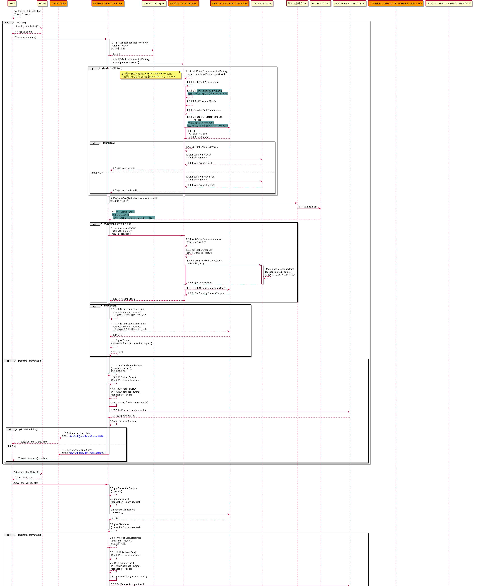
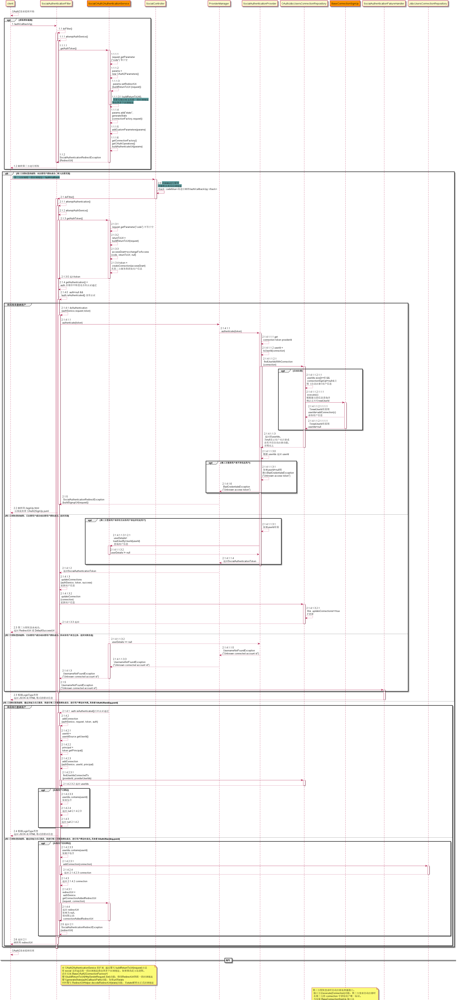
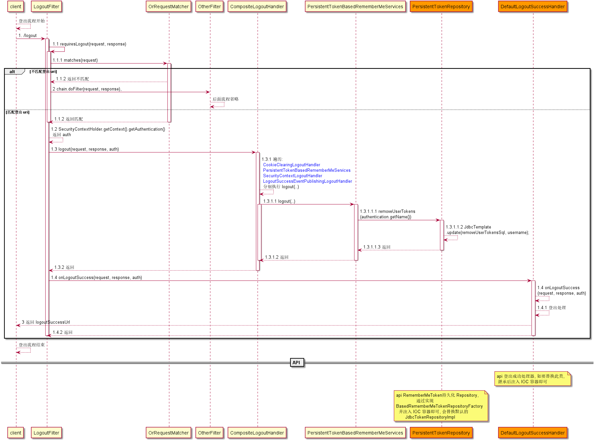
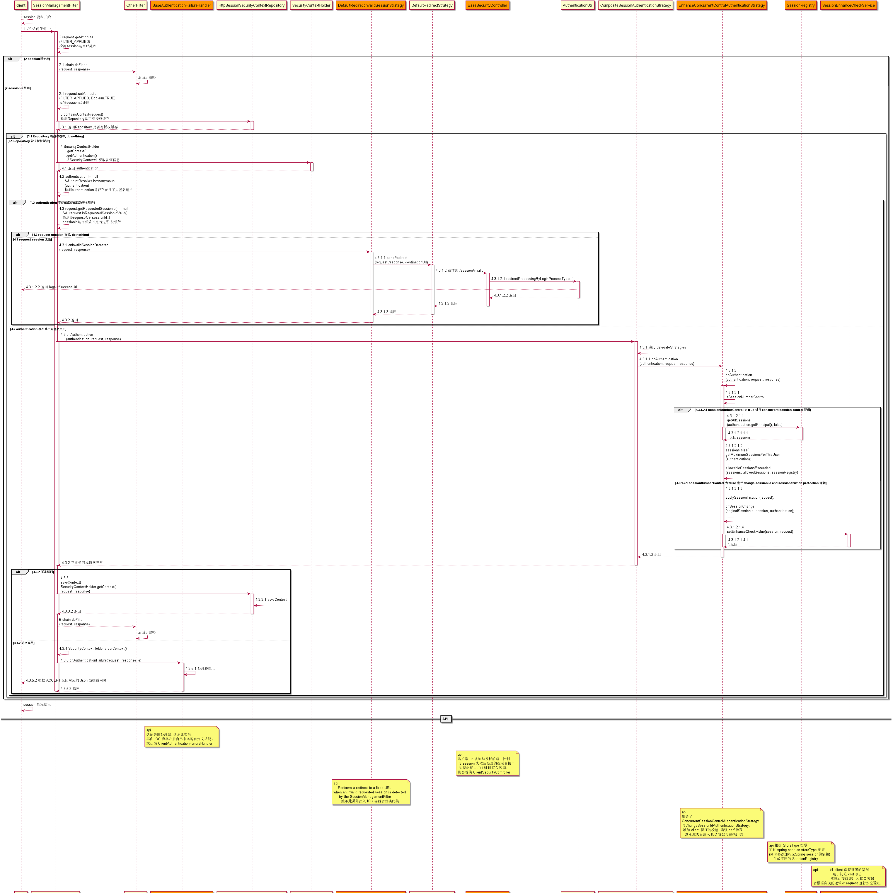

# UMS (user manage scaffolding) 用户管理脚手架: [github](https://github.com/ZeroOrInfinity/UMS) [gitee](https://gitee.com/pcore/UMS)


用户管理脚手架集成：验证码、手机登录、支持qq,weibo,weixin,gitee第三方登录(自动注册，绑定与解绑)、基于 RBAC 的 uri
 访问权限控制功能、通过统一的回调地址入口实现多回调地址的路由功能、签到等功能。
 通过配置与实现几个 API 接口就可以实现上述功能，实现快速开发，只需要专注于业务逻辑。

User management scaffolding, integration: validate code, mobile login, OAuth2(automatic registration, binding and unbinding), RBAC-based uri access control function, routing function of multiple callback addresses through a unified callback address entry, and sign etc... 


## 一、`UMS 功能列表(UMS feature list)`：
  - 验证码（图片，短信）校验功能(validate code (image, SMS) verification function)。
  - 手机登录功能，登录后自动注册(Mobile login function, automatic registration after login)。
  - 第三方登录功能(qq,weibo,weixin,gitee)，登录后自动注册(auto signUp)，与用户账号绑定与解绑(binding and unbinding)。
  - 登录路由功能 (login routing)
  - 统一回调地址路由功能(Unified callback address routing function)。
  - 访问权限控制功能(Access control function)。
  - 简化 session、remember me、crsf 等配置(Simplify session、remember me、srsf etc configuration)。
  - 根据设置的返回方式（JSON 与 REDIRECT）返回 json 或 html 数据。
  - 签到功能(sign)。
  
## 二、`maven`：
```xml
<!-- 验证码, 手机登录, 访问权限控制功能, 签到, 简化session/rememberMe/csrf/anonymous配置等功能 -->
<dependency>
    <groupId>top.dcenter</groupId>
    <artifactId>ums-core-spring-boot-starter</artifactId>
    <version>1.1.1-alpha</version>
</dependency>
<!-- 第三方登录(自动注册，绑定与解绑, redis cache), 通过统一的回调地址入口实现多回调地址的路由功能 -->
<!-- 包含 ums-core-spring-boot-starter 依赖 -->
<dependency>
    <groupId>top.dcenter</groupId>
    <artifactId>ums-social-spring-boot-starter</artifactId>
    <version>1.1.1-alpha</version>
</dependency>
```

## 三、`TODO List`:
- 完善 README
- 第三方登录功能添加 JustAuth 工具, 支持更多的第三方登录. 
- OAuth2 authenticate server

## 四、`快速开始(Quick Start)`：
- 1. 添加依赖(Add Dependency):
    ```xml
    <!-- 包含 ums-core-spring-boot-starter 依赖 -->
    <dependency>
        <groupId>top.dcenter</groupId>
        <artifactId>ums-social-spring-boot-starter</artifactId>
        <version>1.1.1-alpha</version>
    </dependency>
    ```
- 2. config:  
    ```yaml
    server:
      port: 9090
    
    spring:
      profiles:
        active: dev
      # mysql
      datasource:
        driver-class-name: com.mysql.cj.jdbc.Driver
        url: jdbc:mysql://127.0.0.1:3306/ums?useSSL=false&useUnicode=true&characterEncoding=UTF-8&zeroDateTimeBehavior=convertToNull&serverTimezone=Asia/Shanghai
        username: root
        password: 123456
    
      # session 简单配置
      session:
        # session 存储模式设置, 要导入相应的 spring-session 类的依赖, 默认为 none, 分布式服务应用把 session 放入 redis 等中间件
        store-type: none
        # session 过期时间
        timeout: PT300s
    
      # thymeleaf
      thymeleaf:
        encoding: utf-8
        prefix: classpath:/templates/
        suffix: .htm
        servlet:
          content-type: text/html;charset=UTF-8
    
    # ums core
    security:
      client:
        # 设置登录后返回格式(REDIRECT 与 JSON): 默认 JSON
        login-process-type: redirect
        # 登录页
        login-page: /login
        # 登录失败页
        failure-url: /login
        # 登录成功页
        success-url: /
        # 设置登出 url, 默认为 /logout
        logout-url: /logout
        # 设置登出后跳转的 url, 默认为 /login
        logout-success-url: /login
        # 不需要认证的静态资源 urls, 例如: /resources/**, /static/**
        ignoring-urls:
          - /static/**
        # 不需要认证的 uri, 默认为 空 Set.
        permit-urls:
          - /hello
    
        # 设置登录时用户名的 request 参数名称, 默认为 username
        usernameParameter: username
        # 设置登录时用户密码的 request 参数名称, 默认为 password
        passwordParameter: password
    
      # 验证码配置
      codes:
        # 图片验证码
        image:
          # 设置需要图片验证码认证的 uri(必须是非 GET 请求)，多个 uri 用 “-” 或 ","号分开支持通配符，如：/hello,/user/*；默认为 /authentication/form
          auth-urls:
            - /authentication/form
          request-param-image-code-name: imageCode
        # 短信验证码
        sms:
          # 设置需要短信验证码认证的 uri(必须是非 GET 请求)，多个 uri 用 “，”号分开支持通配符，如：/hello,/user/*；默认为 /authentication/form
          auth-urls:
            - /authentication/mobile
          request-param-mobile-name: mobile
          request-param-sms-code-name: smsCode
      # ================ 手机登录配置 ================
      mobile:
        login:
          # 手机验证码登录是否开启, 默认 false，
          # 手机验证码登录开启后 必须配置 security.codes.sms.auth-urls=/authentication/mobile
          sms-code-login-is-open: true
          # 手机验证码登录请求处理url, 默认 /authentication/mobile
          login-processing-url-mobile: /authentication/mobile
    
      # =============== 第三方登录配置: social ===============
      social:
        # 第三方登录页面， 默认为 /signIn.html
        sign-in-url: /signIn
        # 第三方登录用户授权失败跳转页面， 默认为 /signIn.html
        failure-url: /signIn
        # 第三方登录回调处理 url ，也是 RedirectUrl 的前缀，默认为 /auth/callback
        # 如果更改此 url，更改后的必须要实现 SocialController#authCallbackRouter(HttpServletRequest) 的功能
        callback-url: /auth/callback
        # 第三方登录回调的域名, 默认: http://127.0.0.1
        domain: http://127.0.0.1
    
        # 从第三方服务商获取的信息
        # redirectUrl 默认直接由 domain/servletContextPath/callbackUrl/providerId(security.social.[qq/wechat/gitee/weibo])组成
        # 假设 servletcontextPath=/demo
        # redirect-url: http://127.0.0.1/demo/auth/callback/qq
        gitee:
          # 用户设置 true 时，{providerId}第三方登录自动开启，默认为 false
          enable: true
          app-id: your app id
          app-secret: your app secret
    
    ---
    spring:
      profiles: dev
      mvc:
        throw-exception-if-no-handler-found: true
      thymeleaf:
        cache: false
    
    debug: true
    
    server:
      port: 80
    ```
- 3. 实现(implement) AbstractUserDetailsService:
    ```java
    package demo.service;
    
    import com.fasterxml.jackson.databind.DeserializationFeature;
    import com.fasterxml.jackson.databind.ObjectMapper;
    import demo.entity.UserInfo;
    import lombok.extern.slf4j.Slf4j;
    import org.springframework.beans.factory.annotation.Autowired;
    import org.springframework.jdbc.core.JdbcTemplate;
    import org.springframework.security.core.authority.AuthorityUtils;
    import org.springframework.security.core.userdetails.User;
    import org.springframework.security.core.userdetails.UserDetails;
    import org.springframework.security.core.userdetails.UsernameNotFoundException;
    import org.springframework.security.crypto.password.PasswordEncoder;
    import org.springframework.social.connect.Connection;
    import org.springframework.social.connect.web.ProviderSignInUtils;
    import org.springframework.social.security.SocialUser;
    import org.springframework.social.security.SocialUserDetails;
    import org.springframework.stereotype.Service;
    import org.springframework.web.context.request.ServletWebRequest;
    import top.dcenter.ums.security.core.enums.ErrorCodeEnum;
    import top.dcenter.ums.security.core.exception.RegisterUserFailureException;
    import top.dcenter.ums.security.core.exception.UserNotExistException;
    import top.dcenter.ums.security.core.util.RequestUtil;
    import top.dcenter.ums.security.social.api.service.AbstractSocialUserDetailsService;
    import top.dcenter.ums.security.social.api.service.SocialUserCache;
    
    import java.util.List;
    
    /**
     *  用户密码与手机短信登录与注册服务：<br><br>
     *  1. 用于第三方登录与手机短信登录逻辑。<br><br>
     *  2. 用于用户密码登录逻辑。<br><br>
     *  3. 用户注册逻辑。<br><br>
     * @author zyw
     * @version V1.0  Created by 2020/9/20 11:06
     */
    @Service
    @Slf4j
    public class UserDetailsService extends AbstractSocialUserDetailsService {
    
        /**
         * 用户名
         */
        public static final String PARAM_USERNAME = "username";
    
        /**
         * 密码
         */
        public static final String PARAM_PASSWORD = "password";
    
        private final ObjectMapper objectMapper;
    
        private final JdbcTemplate jdbcTemplate;
    
        @SuppressWarnings("SpringJavaAutowiredFieldsWarningInspection")
        @Autowired(required = false)
        private SocialUserCache userCache;
        /**
         * 用于密码加解密
         */
        @SuppressWarnings("SpringJavaAutowiredFieldsWarningInspection")
        @Autowired
        private PasswordEncoder passwordEncoder;
    
        public UserDetailsService(JdbcTemplate jdbcTemplate) {
            this.jdbcTemplate = jdbcTemplate;
            this.objectMapper = new ObjectMapper();
            objectMapper.configure(DeserializationFeature.FAIL_ON_UNKNOWN_PROPERTIES, false);
        }
    
        @SuppressWarnings("AlibabaUndefineMagicConstant")
        @Override
        public UserDetails loadUserByUsername(String username) throws UsernameNotFoundException {
    
            try
            {
                // 从缓存中查询用户信息:
                // 从缓存中查询用户信息
                if (this.userCache != null)
                {
                    UserDetails userDetails = this.userCache.getUserFromCache(username);
                    if (userDetails != null)
                    {
                        return userDetails;
                    }
                }
                // 根据用户名获取用户信息
    
                // 获取用户信息逻辑。。。
                // ...
    
                // 示例：只是从用户登录日志表中提取的信息，
                log.info("Demo ======>: 登录用户名：{}, 登录成功", username);
                return new User(username,
                                passwordEncoder.encode("admin"),
                                true,
                                true,
                                true,
                                true,
                                AuthorityUtils.commaSeparatedStringToAuthorityList("admin, ROLE_USER"));
    
            }
            catch (Exception e)
            {
                String msg = String.format("Demo ======>: 登录用户名：%s, 登录失败: %s", username, e.getMessage());
                log.error(msg, e);
                throw new UserNotExistException(ErrorCodeEnum.QUERY_USER_INFO_ERROR, e, username);
            }
        }
    
    
        @Override
        public UserDetails registerUser(String mobile) throws RegisterUserFailureException {
    
            if (mobile == null)
            {
                throw new RegisterUserFailureException(ErrorCodeEnum.MOBILE_NOT_EMPTY, null);
            }
    
            // 用户信息持久化逻辑。。。
            // ...
    
            log.info("Demo ======>: 手机短信登录用户 {}：注册成功", mobile);
    
            User user = new User(mobile,
                                 passwordEncoder.encode("admin"),
                                 true,
                                 true,
                                 true,
                                 true,
                                 AuthorityUtils.commaSeparatedStringToAuthorityList("admin, ROLE_USER")
            );
    
            // 把用户信息存入缓存
            if (userCache != null)
            {
                userCache.putUserInCache(user);
            }
    
            return user;
        }
    
        @Override
        public UserDetails registerUser(ServletWebRequest request) throws RegisterUserFailureException {
    
            String username = getValueOfRequest(request, PARAM_USERNAME, ErrorCodeEnum.USERNAME_NOT_EMPTY);
            String password = getValueOfRequest(request, PARAM_PASSWORD, ErrorCodeEnum.PASSWORD_NOT_EMPTY);
            // ...
    
            // UserInfo userInfo = getUserInfo(request)
    
            // 用户信息持久化逻辑。。。
            // ...
    
            String encodedPassword = passwordEncoder.encode(password);
    
            log.info("Demo ======>: 用户名：{}, 注册成功", username);
            User user = new User(username,
                                 encodedPassword,
                                 true,
                                 true,
                                 true,
                                 true,
                                 AuthorityUtils.commaSeparatedStringToAuthorityList("admin, ROLE_USER")
            );
    
            // 把用户信息存入缓存
            if (userCache != null)
            {
                userCache.putUserInCache(user);
            }
    
            return user;
    
        }
    
        private String getValueOfRequest(ServletWebRequest request, String paramName, ErrorCodeEnum usernameNotEmpty) throws RegisterUserFailureException {
            String result = request.getParameter(paramName);
            if (result == null)
            {
                throw new RegisterUserFailureException(usernameNotEmpty, request.getSessionId());
            }
            return result;
        }
    
        @Override
        public SocialUserDetails loadUserByUserId(String userId) throws UsernameNotFoundException {
            try
            {
                // 从缓存中查询用户信息
                if (this.userCache != null)
                {
                    SocialUserDetails userDetails = this.userCache.getSocialUserFromCache(userId);
                    if (userDetails != null)
                    {
                        return null;
                    }
                }
    
                // 根据用户名获取用户信息。
    
                // 获取用户信息逻辑。。。
                // ...
    
                // 示例：只是从 OAuth2 用户登录日志表中提取的信息，
                List<String> list = jdbcTemplate.queryForList("select userId from social_UserConnection " +
                                                                      "where userId = ?",
                                                              String.class, userId);
                if (list.contains(userId))
                {
                    for (String username : list)
                    {
                        if (username.equals(userId))
                        {
                            log.info("Demo ======>: 登录用户名：{}, 登录成功", userId);
                            return new SocialUser(username,
                                                  "",
                                                  true,
                                                  true,
                                                  true,
                                                  true,
                                                  AuthorityUtils.commaSeparatedStringToAuthorityList("admin, ROLE_USER"));
    
                        }
    
                    }
    
                }
                log.info("Demo ======>: 登录用户名：{}, 登录失败", userId);
                return null;
            }
            catch (Exception e)
            {
                log.error(e.getMessage(), e);
                throw new UserNotExistException(ErrorCodeEnum.QUERY_USER_INFO_ERROR, e, userId);
            }
        }
    
        @Override
        public SocialUserDetails registerUser(ServletWebRequest request, ProviderSignInUtils providerSignInUtils) throws RegisterUserFailureException {
            UserInfo userInfo = RequestUtil.extractRequest2Object(request.getRequest(), objectMapper, UserInfo.class);
            String userId = null;
            String password = "";
            if (userInfo != null)
            {
                userId = userInfo.getUserId();
                password = userInfo.getPassword();
            }
    
            try
            {
                Connection<?> connectionFromSession = providerSignInUtils.getConnectionFromSession(request);
                log.info("Demo ======>: connectionFromSession = {}", connectionFromSession);
    
                // 用户信息持久化逻辑。。。
                // ...
                String encodedPassword = passwordEncoder.encode(password);
                // OAuth 信息存储
                providerSignInUtils.doPostSignUp(userId, request);
                log.info("Demo ======>: 第三方登录用户：{}, 注册成功", userId);
                //noinspection all
                SocialUser user = new SocialUser(userId,
                                                 encodedPassword,
                                                 true,
                                                 true,
                                                 true,
                                                 true,
                                                 AuthorityUtils.commaSeparatedStringToAuthorityList("admin, ROLE_USER")
                );
    
                // 把用户信息存入缓存
                if (userCache != null)
                {
                    userCache.putUserInCache(user);
                }
    
                return user;
            }
            catch (Exception e)
            {
                log.error(e.getMessage(), e);
    
                throw new RegisterUserFailureException(ErrorCodeEnum.USER_REGISTER_FAILURE, e, userId);
            }
        }
    }

    ```
    ```java
    package demo.entity;
    
    import com.fasterxml.jackson.annotation.JsonAlias;
    import lombok.AllArgsConstructor;
    import lombok.Getter;
    import lombok.NoArgsConstructor;
    import lombok.Setter;
    
    /**
     * @author zyw
     * @version V1.0  Created by 2020/6/5 23:20
     */
    @Getter
    @Setter
    @AllArgsConstructor
    @NoArgsConstructor
    public class UserInfo {
    
        @JsonAlias({"username"})
        private String userId;
        private String password;
        private String avatarUrl;
        private String providerId;
        private String providerUserId;
    }
    ```
- 4. html/htm/jsp etc :
    - login.htm 用的是 thymeleaf 模板, 需要额外配置:
    ```yaml
    spring:
      # thymeleaf
      thymeleaf:
        encoding: utf-8
        prefix: classpath:/templates/
        suffix: .htm
        servlet:
          content-type: text/html;charset=UTF-8
    ```
    ```java
    package demo.controller;
            
    import lombok.extern.slf4j.Slf4j;
    import org.springframework.security.core.Authentication;
    import org.springframework.security.core.annotation.AuthenticationPrincipal;
    import org.springframework.security.core.context.SecurityContextHolder;
    import org.springframework.security.core.userdetails.UserDetails;
    import org.springframework.stereotype.Controller;
    import org.springframework.web.bind.annotation.GetMapping;
    import org.springframework.web.bind.annotation.ResponseBody;
    
    import java.util.HashMap;
    import java.util.Map;
    
    /**
     *
     * @author zyw
     * @version V1.0  Created by 2020/9/20 20:04
     */
    @Controller
    @Slf4j
    @EnableUriAuthorize()
    public class UserController {
    
        @GetMapping("/login")
        public String login() {
            return "login";
        }
    
        @GetMapping("/index")
        public String index() {
            return "index";
        }
    
        @GetMapping("/me")
        @ResponseBody
        public Object getCurrentUser(@AuthenticationPrincipal UserDetails userDetails, Authentication authentication) {
    
            Map<String, Object> map = new HashMap<>(16);
            map.put("authenticationHolder", SecurityContextHolder.getContext().getAuthentication());
            map.put("userDetails", userDetails);
            map.put("authentication", authentication);
            return map;
        }
    
    }
    ```
    ```html
    <!DOCTYPE html>
    <html xmlns:th="http://www.w3.org/1999/xhtml">
    <head>
        <meta charset="UTF-8">
        <title>登录</title>
        <script type="text/javascript" src="https://cdn.jsdelivr.net/npm/jquery@1.11.1/dist/jquery.min.js"></script>
    
    </head>
    <body>
    <h2>登录页面</h2>
    <h3>表单登录</h3>
    <h5>如果短信验证码与图片验证码同时配置时，优先使用短信验证码，图片验证码失效</h5>
    <!-- 通过 th:action 的方式支持 csrf 或者 添加隐藏域<input type="hidden" th:name="${_csrf.parameterName}" th:value="${_csrf.token}"/> -->
    <form id="reg-form" th:action="@{/authentication/form}" method="post">
        <table>
            <tr>
                <td>用户名：</td>
                <td><input type="text" name="username" value="admin" ><p style="color: #ff0000"
                                                                         id="error-name"></p></td>
            </tr>
            <tr>
                <td>密码：</td>
                <td><input type="password" name="password" value="admin"></td>
            </tr>
            <tr>
                <td>图形验证码：</td>
                <td>
                    <input type="text" name="imageCode">
                    
                </td>
            </tr>
            <tr>
                <td ><input type="checkbox" name="rememberMe" checked="true">记住我</input></td>
                <td><p style="color: #ff0000" id="error-code"></p></td>
            </tr>
            <tr>
                <td ><button id="btn-reg" type="button">登录ajax</button></td>
                <!-- 通过 form submit 不能接收错误信息, 通过 ajax 可接收错误信息 -->
                <td ><button type="submit">登录</button></td>
            </tr>
        </table>
    </form>
    <h3>手机登录</h3>
    <form id="mobile-form" th:action="@{/authentication/mobile}" method="post">
        <table>
            <tr>
                <td>手机号码：</td>
                <td>
                    <input type="tel" name="mobile" value="13345678980"><p style="color: #ff0000"
                                                                           id="error-name-mobile"></p>
                    <a th:href="@{/code/sms?mobile=13345678980}" >发送验证码</a>
                </td>
            </tr>
            <tr>
                <td>手机验证码：</td>
                <td>
                    <input type="text" name="smsCode">
                </td>
            </tr>
            <tr>
                <td ><input type="checkbox" name="rememberMe" checked="true">记住我</input></td>
                <td><p style="color: #ff0000" id="error-code-mobile"></p></td>
            </tr>
            <tr>
                <td ><button id="btn-mobile" type="button">登录ajax</button></td>
                <!-- 通过 form submit 不能接收错误信息, 通过 ajax 可接收错误信息 -->
                <td ><button type="submit">登录</button></td>
            </tr>
        </table>
    </form>
    <br><br>
    <h3>社交登录</h3>
    <a th:href="@{/auth/callback/gitee}">gitee登录</a>
  
    <dev id="basePath" th:basePath="@{/}" style="display: none"/>
    </body>
    <script>
        var basePath = $("#basePath").attr("basePath");
        $.fn.serializeObject = function()
        {
            let o = {};
            let a = this.serializeArray();
            $.each(a, function() {
                if (o[this.name]) {
                    if (!o[this.name].push) {
                        o[this.name] = [o[this.name]];
                    }
                    o[this.name].push(this.value || '');
                } else {
                    o[this.name] = this.value || '';
                }
            });
            return o;
        }
    
        $(".img").click(function(){
            let uri = this.getAttribute("src");
            console.log(uri)
            let end = uri.indexOf('?', 0);
            console.log(end)
            if (end === -1) {
                uri = uri + '?'+ Math.random();
            } else {
                uri = uri.substring(0, end) + '?'+ Math.random();
            }
            console.log(uri)
            this.setAttribute('src', uri);
        });
    
    
        function submitFormByAjax(url, formId, errorNameId, errorCodeId, imgId, refresh) {
            return function () {
                console.log(JSON.stringify($(formId).serializeObject()))
                $.ajax({
                    // 如果用的是模板，则 url 可以使用注入的方式，会跟着配置动态改变
                    url: url,
                    data: JSON.stringify($(formId).serializeObject()),
                    type: "POST",
                    dataType: "json",
                    success: function (data) {
                        $(errorNameId).text("")
                        $(errorCodeId).text("")
                        console.log("==========注册成功============")
                        // 注册成功
                        // ...
                        console.log(data)
                        let uri = data.data.url
                        if (uri === null) {
                            uri = basePath
                        }
                        window.location.href = uri;
                    },
                    error: function (data) {
                        // 注册失败
                        $(errorNameId).text("")
                        $(errorCodeId).text("")
                        console.log("********注册失败*********")
                        console.log(data)
                        data = data.responseJSON
                        if (undefined !== data) {
                            console.log(data);
                            // 错误代码看ErrorCodeEnum
                            if (data.code >= 900 && data.code < 1000) {
                                $(errorNameId).text(data.msg)
                            } else if (data.code >= 600 && data.code < 700) {
                                $(errorCodeId).text(data.msg)
                            }
                        }
                        if (refresh) {
                            $(imgId).trigger("click");
                        }
                    }
                })
                return
            };
        }
    
    
        $("#btn-mobile").click(
            submitFormByAjax($("#mobile-form").attr("action"), "#mobile-form", "#error-name-mobile", "#error-code-mobile", ".img-mobile", true)
        )
    
    
        $("#btn-reg").click(
            submitFormByAjax($("#reg-form").attr("action"), "#reg-form", "#error-name", "#error-code", ".img", true)
        )
    
    </script>
    </html>
    ```
- 5. 浏览器访问 `http://127.0.0.1/login`, 至此集成了：登录校验，验证码、手机登录、gitee第三方登录(自动注册，绑定与解绑)、基于 RBAC 的 uri 访问权限控制功能、
     通过统一的回调地址入口实现多回调地址的路由功能等功能; 实现快速开发。此 `Quick Start` 代码在 `demo 模块`,
     其他功能的详细配置说明参照: `六、Configurations` 与 `demo 模块`。


## 五、接口使用说明(`Interface instructions`):

- 实现对应功能时需要实现的接口(The interface that needs to be implemented when the corresponding function is present)：    
    1. 用户服务(user service): `必须实现(Must implemented)`
        - 有 social 模块时: `AbstractSocialUserDetailsService`
        - 无 social 模块时: `AbstractUserDetailsService`    
    2. 图片验证码(image validate code): 如果不实现就会使用默认图片验证码, 实时产生验证码图片, 没有缓存功能
        - `ImageCodeFactory`
    3. 短信验证码(SMS validate code): `默认空实现`
        - `SmsCodeSender`
    4. 自定义验证码(customize validate code):
        - `AbstractValidateCodeProcessor`
        - `ValidateCodeGenerator`
    5. 访问权限控制功能(Access control function): 基于 RBAC 的访问权限控制, 增加了更加细粒度的权限控制, 如: 对菜单与按钮的权限控制
        - `AbstractUriAuthorizeService`:
            - `AbstractUriAuthorizeService` 类中的方法`getRolesAuthorities()`;
              `getRolesAuthorities()`返回值: Map<`role`, Map<`uri`, `UriResourcesDO`>> 中`UriResourcesDO`字段 `uri` 
              与 `permission` 必须有值. 
    6. 绑定与解绑视图(Bind and unbind views): 用户绑定与解绑成功后会自动跳转到对应回显页面, 默认返回 json 信息
        - 绑定状态信息回显: `ShowConnectionStatusViewService`
        - 绑定与解绑信息回显: `ShowConnectViewService`
        
    7. 统一的回调地址的路由(Unified callback address routing): 方便对于多个回调地址进行路由管理(Convenient for routing management of multiple callback addresses)
       - 需要调用`BaseOAuth2ConnectionFactory#generateState(realAuthCallbackPath)`
         方法去设置真实的回调地址: realAuthCallbackPath(格式为：`path=myAuthCallbackPath`).
       - 自定义路由算法(Custom routing algorithm): 
         1. 统一回调地址与真实回调地址的转换逻辑：
             - 构建统一的回调地址: 默认实现 `SocialOAuth2AuthenticationService#buildReturnToUrl(..)`,
               自定义请实现`BaseOAuth2ConnectionFactory#buildReturnToUrl(..)`方法
             - 跳转到真实的回调地址: `SocialController#authCallbackRouter(..)`
         2. 对 `state` 的加解密逻辑：
            - 把真实回调地址加入到`state`并进行加密: `BaseOAuth2ConnectionFactory#generateState(..)`
            - 解密`state`并返回真实的回调地址: `RedirectUrlHelperService#decodeRedirectUrl(..)`


## 六、Configurations:
### 1. 基本功能(basic function): 
- 在 core 模块中；
  - 简单配置(simple configuration): `demo 模块 -> basic-example`
    ```yaml
    server:
      port: 9090
    
    spring:
      profiles:
        active: dev
      # mysql
      datasource:
        driver-class-name: com.mysql.cj.jdbc.Driver
        url: jdbc:mysql://127.0.0.1:3306/ums?useSSL=false&useUnicode=true&characterEncoding=UTF-8&zeroDateTimeBehavior=convertToNull&serverTimezone=Asia/Shanghai
        username: root
        password: 123456
    
    security:
      client:
        # 设置登录后返回格式(REDIRECT 与 JSON): 默认 JSON
        login-process-type: redirect
        # 登录页
        login-page: /login
        # 登录失败页
        failure-url: /login
        # 登录成功页
        success-url: /
        # 设置登出 url, 默认为 /logout
        logout-url: /logout
        # 设置登出后跳转的 url, 默认为 /login
        logout-success-url: /login
        # 不需要认证的静态资源 urls, 例如: /resources/**, /static/**
        ignoring-urls:
          - /static/**
    
        # 设置登录时用户名的 request 参数名称, 默认为 username
        usernameParameter: username
        # 设置登录时用户密码的 request 参数名称, 默认为 password
        passwordParameter: password
    
      # 验证码配置
      codes:
        # 图片验证码
        image:
          # 设置需要图片验证码认证的 uri(必须是非 GET 请求)，多个 uri 用 “-” 或 ","号分开支持通配符，如：/hello,/user/*；默认为 /authentication/form
          auth-urls:
            - /authentication/form
          request-param-image-code-name: imageCode
        # 短信验证码
        sms:
          # 设置需要短信验证码认证的 uri(必须是非 GET 请求)，多个 uri 用 “，”号分开支持通配符，如：/hello,/user/*；默认为 /authentication/form
          auth-urls:
            - /authentication/mobile
          request-param-mobile-name: mobile
          request-param-sms-code-name: smsCode
        # ================ 手机登录配置 ================
        mobile:
          login:
            # 手机验证码登录是否开启, 默认 false，
            # 手机验证码登录开启后 必须配置 security.codes.sms.auth-urls=/authentication/mobile
            sms-code-login-is-open: true
            # 手机验证码登录请求处理url, 默认 /authentication/mobile
            login-processing-url-mobile: /authentication/mobile
    
    ---
    spring:
      profiles: dev
      mvc:
        throw-exception-if-no-handler-found: true
    
    debug: true
    
    ```
  - 详细配置(Detailed configuration): `demo 模块 -> basic-detail-example`
    ```yaml
    server:
      port: 9090
    
    spring:
      profiles:
        active: dev
      # mysql
      datasource:
        driver-class-name: com.mysql.cj.jdbc.Driver
        url: jdbc:mysql://127.0.0.1:3306/ums?useSSL=false&useUnicode=true&characterEncoding=UTF-8&zeroDateTimeBehavior=convertToNull&serverTimezone=Asia/Shanghai
        username: root
        password: 123456
      # thymeleaf
      thymeleaf:
        encoding: utf-8
        prefix: classpath:/templates/
        suffix: .htm
        servlet:
          content-type: text/html;charset=UTF-8
      # jackson
      jackson:
        date-format: yyyy-MM-dd HH:mm:ss
        time-zone: GMT+8
    
    
    security:
      client:
        # 登录页
        login-page: /login
        # 登录失败页
        failure-url: /login
        # 设置登录后返回格式(REDIRECT 与 JSON): 默认 JSON
        login-process-type: redirect
        # 设置处理登录表单的 uri，不需要用户实现此 uri，由 Spring security 自动实现， 默认为 /authentication/form
        login-processing-url: /authentication/form
        # 登录成功页
        success-url: /
        # 设置登出 url, 默认为 /logout
        logout-url: /logout
        # 设置登出后跳转的 url, 默认为 /login
        logout-success-url: /login
        # 设置登录时用户名的 request 参数名称, 默认为 username
        usernameParameter: username
        # 设置登录时用户密码的 request 参数名称, 默认为 password
        passwordParameter: password
        # 登录后是否利用 Referer 进行跳转, 默认为: true
        useReferer: true
        # 设置由客户端决定认证成功要跳转的 url 的 request 参数名称, 默认为 redirectTargetUrl
        targetUrlParameter: redirectTargetUrl
        # 是否开启根据不同的uri跳转到相对应的登录页, 默认为: false, 当为 true 时还需要配置 loginUnAuthenticationUrl 和 authRedirectSuffixCondition
        open-authentication-redirect: true
        # 当请求需要身份认证时，默认跳转的url 会根据 authJumpSuffixCondition 条件判断的认证处理类型的 url，默认实现 /authentication/require,
        # 当 openAuthenticationRedirect = true 时生效. 注意: 如果修改此 uri, 需要重新实现修改后的 uri
        login-un-authentication-url: /authentication/require
        # 设置 uri 相对应的跳转登录页, 例如：key=/**: value=/login.html, 用等号隔开key与value, 如: /**=/login.html, 默认为空.
        # 当 openAuthenticationRedirect = true 时生效.
        # 支持通配符, 匹配规则： /user/aa/bb/cc.html 匹配 pattern：/us?r/**/*.html, /user/**, /user/*/bb/c?.html, /user/**/*.*.
        # 规则具体看 AntPathMatcher.match(pattern, path)
        auth-redirect-suffix-condition:
          - '/hello=/login2'
          - '/user/**=/login'
          - '/order/**=/login'
          - '/file/**=/login'
          - '/social/**=/signIn.html'
        # 不需要认证的静态资源 urls, 例如: /resources/**, /static/**
        ignoring-urls:
          - /static/**
        # 不需要认证的 uri, 默认为 空 Set.
        permit-urls:
          - /**/*.html
          - /me
    
    ---
    spring:
      profiles: dev
      mvc:
        throw-exception-if-no-handler-found: true
    
    debug: true
    ```
### 2. 登录路由功能(login routing)
- 在 core 包中；
  - 详细配置(Detailed configuration): `demo 模块 -> basic-detail-example`
    ```yaml
    security:
      client:
        # 是否开启登录路由功能, 根据不同的uri跳转到相对应的登录页, 默认为: false, 当为 true 时还需要配置 loginUnAuthenticationUrl 和 authRedirectSuffixCondition
        open-authentication-redirect: true
        # 当请求需要身份认证时，默认跳转的url 会根据 authJumpSuffixCondition 条件判断的认证处理类型的 url，默认实现 /authentication/require,
        # 当 openAuthenticationRedirect = true 时生效. 注意: 如果修改此 uri, 需要重新实现修改后的 uri
        login-un-authentication-url: /authentication/require
        # 设置 uri 相对应的跳转登录页, 例如：key=/**: value=/login.html, 用等号隔开key与value, 如: /**=/login.html, 默认为空. 
        # 当 openAuthenticationRedirect = true 时生效.
        # 支持通配符, 匹配规则： /user/aa/bb/cc.html 匹配 pattern：/us?r/**/*.html, /user/**, /user/*/bb/c?.html, /user/**/*.*.
        # 规则具体看 AntPathMatcher.match(pattern, path)
        auth-redirect-suffix-condition: 
          - '/hello=/login'
          - '/user/**=/login'
          - '/order/**=/login'
          - '/file/**=/login'
          - '/social/**=/signIn.html'
    ```
### 3. session
- 在 core 包中；
  - 简单配置(simple configuration): 
    ```yaml
    spring:
      session:
        # session 存储模式设置, 要导入相应的 spring-session 类的依赖, 默认为 none, 分布式服务应用把 session 放入 redis 等中间件
        store-type: none
        # session 过期时间
        timeout: PT300s
    ```
      
  - 详细配置(Detailed configuration): `demo 模块 -> session-detail-example`
    ```yaml
    spring:
      session:
        # session 存储模式设置, 要导入相应的 spring-session 类的依赖, 默认为 none, 分布式服务应用把 session 放入 redis 等中间件
        store-type: redis
        timeout: PT600S
        # session redis 缓存设置
        redis:
          # redis 刷新模式
          flush-mode: on_save
          # redis 命名空间
          namespace: spring:session
          # Cron expression for expired session cleanup job
          cleanup-cron: 5 * * * * *
      # redis
      redis:
        host: 192.168.88.88
        port: 6379
        password:
        database: 0
        # 连接超时的时间
        timeout: 10000
        # redis-lettuce-pool
        lettuce:
          shutdown-timeout: PT500S
          pool:
            max-active: 8
            max-wait: PT10S
            max-idle: 8
            min-idle: 1
    server:
      servlet:
        # tomcat session 设置
        session:
          timeout: PT600S
          cookie:
            max-age: PT600S
            # session 的 cookie name, 默认为: JSESSIONID
            name: SID
    security:
      client:
        # session 设置
        session:
          session-creation-policy: always
          # 当为 false 时允许单个用户拥有任意数量的 session（不同设备或不同浏览器），默认为 false。 当设置 true 时，同时请设置一下选项：maximumSessions 和 maxSessionsPreventsLogin
          session-number-control: false
          # 当设置为 1 时，maxSessionsPreventsLogin 为 false 时，同个用户登录会自动踢掉上一次的登录状态。 当设置为 1 时，maxSessionsPreventsLogin 为 true 时，同个用户登录会自动自动拒绝用户再登录。 默认为 1。 如要此选项生效，sessionNumberControl 必须为 true
          maximum-sessions: 1
          # 同个用户达到最大 maximumSession 后，当为 true 时自动拒绝用户再登录，当为 false 时自动踢掉上一次的登录状态, 默认为 false。 如要此选项生效，sessionNumberControl 必须为 true
          max-sessions-prevents-login: false
          # 如果设置为true，则允许HTTP会话在网址中使用HttpServletResponse.encodeRedirectURL（String）或HttpServletResponse.encodeURL（字符串）时被改写，被包含在URL，
          # 否则不允许HTTP会话。 这可以防止信息泄漏到外部域, 默认为: false
          enable-session-url-rewriting: false
          # concurrent session 失效后跳转地址, login-process-type=redirect 时有效. 默认: /
          invalid-session-of-concurrent-url: /concurrentSession.html
          # session 失效后跳转地址, login-process-type=redirect 时有效. 默认: /session/invalid, 注意: 如果修改此 uri, 需要重新实现修改后的 uri
          invalid-session-url: /session/invalid
          # session 的 cookie name, 默认为: JSESSIONID, 需要与 server.servlet.session.cookie.name 同时设置
          session-cookie-name: SID
    ```
  
    ```xml
      <!-- SpringSession Redis依赖 -->
      <dependency>
          <groupId>org.springframework.session</groupId>
          <artifactId>spring-session-data-redis</artifactId>
      </dependency>
      <dependency>
          <groupId>org.springframework.boot</groupId>
          <artifactId>spring-boot-starter-data-redis</artifactId>
      </dependency>
      <!-- 为了解决 ClassNotFoundException: org.apache.commons.pool2.impl.GenericObjectPoolConfig -->
      <dependency>
          <groupId>org.apache.commons</groupId>
          <artifactId>commons-pool2</artifactId>
          <version>2.8.0</version>
      </dependency>
    ```
### 4. remember-me
- 在 core 包中；
  - 简单配置(simple configuration): 不对 remember-me 进行任何配置, 会使用默认值.
  - 详细配置(Detailed configuration): `demo 模块 -> basic-detail-example`
    ```yaml
    security:
      client:
        # 设置记住我功能的缓存时长，默认 14 天. If a duration suffix is not specified, seconds will be used.
        # 记住我功能默认通过 org.springframework.security.web.authentication.rememberme.JdbcTokenRepositoryImpl 存入数据库中
        # 实现 BasedRememberMeTokenRepositoryFactory 可以自定义缓存方式
        remember-me:
          remember-me-timeout: P14D
          remember-me-cookie-name: rememberMe
          remember-me-parameter: rememberMe
          # 当为 true 时 rememberMe 只能用于 https, 默认为 false
          use-secure-cookie: false
    ```
### 5. csrf
- 在 core 包中；
  - 简单配置(simple configuration): 不对 csrf 进行任何配置, 默认关闭 csrf 功能.
  - 详细配置(Detailed configuration): `demo 模块 -> basic-detail-example`
    ```yaml
    security:
      client:
        csrf:
          # csrf 是否开启, 默认为 false;
          csrf-is-open: false
          # 忽略指定请求的 CSRF 防护, 默认为 空 Set
          ignoring-ant-matcher-urls:
    #        - /authentication/form
    #        - /authentication/mobile
    #        - /authentication/social
    #        - /logout
            - /user/**
            - /file/**
          # csrf tokenRepository 的存储类型, 默认为 session. 因为 session 可以配置缓存在 redis 等, 也可以自己自定义, 例如: redis
          token-repository-type: redis
    ```
### 6. anonymous
- 在 core 包中；
  - 简单配置(simple configuration): 不对 anonymous 进行任何配置, 默认开启 anonymous 功能.
  - 详细配置(Detailed configuration): `demo 模块 -> basic-detail-example`
    ```yaml
    security:
      client:
        anonymous:
          # anonymous 是否开启, 默认为 true;
          anonymous-is-open: true
          # 匿名用户名称, 默认为 anonymous
          principal: anonymous
          # 匿名用户权限 list, 默认为 ROLE_ANONYMOUS
          authorities:
            - ROLE_ANONYMOUS
            - /test/permission:add
            - /test/permission:list
            - /test/pass/:list
    ```

### 7. 验证码(validate code)
- 在 core 包中；
  - 简单配置(simple configuration): `demo 模块 -> basic-example`
    ```yaml
    security:
      # 验证码配置
      codes:
        # 图片验证码
        image:
          # 设置需要图片验证码认证的 uri(必须是非 GET 请求)，多个 uri 用 “-” 或 ","号分开支持通配符，如：/hello,/user/*；默认为 /authentication/form
          auth-urls:
            - /authentication/form
            - /authentication/social          
        # 短信验证码
        sms:
          # 设置需要短信验证码认证的 uri(必须是非 GET 请求)，多个 uri 用 “，”号分开支持通配符，如：/hello,/user/*；默认为 /authentication/form
          auth-urls:
            - /authentication/mobile
    ```
  - 详细配置(Detailed configuration): `demo 模块 -> validate-code example`
    ```yaml
    security:
      # 验证码配置
      codes:
        # 图片验证码
        image:
          # 设置需要图片验证码认证的 uri(必须是非 GET 请求)，多个 uri 用 “-” 或 ","号分开支持通配符，如：/hello,/user/*；默认为 /authentication/form
          auth-urls:
            - /authentication/form
            - /authentication/social
          # 验证码长度
          length: 4
          height: 60
          width: 270
          expire: 180
          request-para-height-name: height
          request-para-width-name: width
          request-param-image-code-name: imageCode
        # 短信验证码
        sms:
          # 设置需要短信验证码认证的 uri(必须是非 GET 请求)，多个 uri 用 “，”号分开支持通配符，如：/hello,/user/*；默认为 /authentication/form
          auth-urls:
            - /authentication/mobile
          length: 6
          expire: 120
          request-param-mobile-name: mobile
          request-param-sms-code-name: smsCode
    ```
  
### 8. 手机登录(mobile login)
- 在 core 模块: `demo 模块 -> basic-detail-example`
    ```yaml
    security:
      # 手机登录配置
      mobile:
        login:
          # 手机验证码登录是否开启, 默认 false，
          # 手机验证码登录开启后 必须配置 security.codes.sms.auth-urls=/authentication/mobile
          sms-code-login-is-open: true
          # 手机验证码登录请求处理url, 默认 /authentication/mobile
          login-processing-url-mobile: /authentication/mobile
    ```

### 9. 第三方登录(OAuth2)
- 在 social 模块
  - 简单配置(simple configuration): `demo 模块 -> social-simple-example`
    ```yaml
    security:
      # 第三方登录配置: social
      social:
        # 第三方登录用户数据库表的字段 key 与 secret 加密专用密码
        text-encryptor-password: 7ca5d913a17b4942942d16a974e3fecc
        # 第三方登录用户数据库表的字段 key 与 secret 加密专用 salt
        text-encryptor-salt: cd538b1b077542aca5f86942b6507fe2
        # 第三方登录页面， 默认为 /signIn.html
        sign-in-url: /signIn.html
        # 第三方登录用户授权失败跳转页面， 默认为 /signIn.html
        failure-url: /signIn.html
        # redirectUrl 直接由 domain/servletContextPath/callbackUrl/providerId(security.social.[qq/wechat/gitee/weibo])组成
        # 第三方登录回调的域名
        domain: http://www.dcenter.top
        ####### 第三方登录绑定相关
        # 第三方登录绑定页面， 默认为 /banding.html
        banding-url: /banding
        # 第三方登录用户授权成功跳转页面，默认为 /signUp.html， 用户必需设置
        sign-up-url: /signUp.html
        
        # 从第三方服务商获取的信息
        qq:
          # 用户设置 true 时，{providerId}第三方登录自动开启，默认为 false
          enable: false
          app-id:
          app-secret:
          # redirectUrl 默认直接由 domain/servletContextPath/callbackUrl/providerId(security.social.[qq/wechat/gitee/weibo])组成
          # redirect-url: http://www.dcenter.top/demo/auth/callback/qq
        gitee:
          # 用户设置 true 时，{providerId}第三方登录自动开启，默认为 false
          enable: true
          app-id:
          app-secret:
        weixin:
          # 用户设置 true 时，{providerId}第三方登录自动开启，默认为 false
          enable: false
          app-id:
          app-secret:
        weibo:
          # 用户设置 true 时，{providerId}第三方登录自动开启，默认为 false
          enable: false
          app-id:
          app-secret:
    ```
  - 详细配置(Detailed configuration): `demo 模块 -> social-detail-example`
    ```yaml
    security:
      # 第三方登录配置: social
      social:
        # 第三方登录用户数据库表的字段 key 与 secret 加密专用密码
        text-encryptor-password: 7ca5d913a17b4942942d16a974e3fecc
        # 第三方登录用户数据库表的字段 key 与 secret 加密专用 salt
        text-encryptor-salt: cd538b1b077542aca5f86942b6507fe2
    
        # ConnectionSignUp 非常有用的扩展接口, 调用时机：在第三方服务商回调 redirectUrl 接口时，
        # 在确认数据库用户表(security.social.table-name)中没有用户记录调用且 autoSignIn 为 true 时，调用此接口。
        # 第三方登录时是否自动注册：当为 true 且实现 ConnectionSignUp 接口，则开启自动注册，此时 signUpUrl 失效，否则不会开始自动注册，默认为 true
        auto-sign-in: false
    
        # 当关闭自动注册后, 注册功能页面有验证码时, 则额外需要设置验证码校验功能.
        # social 第三方登录注册功能是否开启，默认为 false
        social-sign-up-is-open: true
    
        # ============== 以下配置依赖 social-sign-up-is-open=true 时才有效 ==============
    
        # autoSignIn=true 且实现 BaseConnectionSignUp 接口则自动登录，而且 signUpUrl 会失效
        # 第三方登录用户授权成功跳转页面，默认为 /signUp.html， 用户必需设置
        sign-up-url: /signUp
        # 第三方登录用户从 signUpUrl 提交的用户信息表单，默认由 /authentication/social 进行处理，由 Social 处理，不需要用户实现
        social-user-register-url: /authentication/social
    
        # ============== 以上配置依赖 social-sign-up-is-open=true 时才有效 ==============
    
        # 第三方登录页面， 默认为 /signIn.html
        sign-in-url: /signIn.html
        # 第三方登录用户授权失败跳转页面， 默认为 /signIn.html
        failure-url: /signIn.html
        # 第三方登录回调处理 url ，也是 RedirectUrl 的前缀，默认为 /auth/callback
        # 如果更改此 url，更改后的必须要实现 SocialController#authCallbackRouter(HttpServletRequest) 的功能
        callback-url: /auth/callback
        # redirectUrl 直接由 domain/servletContextPath/callbackUrl/providerId(security.social.[qq/wechat/gitee/weibo])组成
        # 第三方登录回调的域名
        domain: http://www.dcenter.top
        # 第三方登录用户注册时: 用户唯一 ID 字段名称， 默认为 userId
        user-id-param-name: userId
        # 第三方登录用户注册时 密码 字段名称， 默认为 password
        password-param-name: password
        # 第三方服务商 providerId 字段名称， 默认为 providerId
        provider-id-param-name: providerId
        # 第三方登录用户在服务商用户唯一ID providerUserId 字段名称， 默认为 providerUserId
        provider-user-id-param-name: providerUserId
        # 第三方登录用户头像 avatarUrl 字段名称， 默认为 avatarUrl
        avatar-url-param-name: avatarUrl
        ####### 第三方登录绑定相关
        # 第三方登录绑定页面， 默认为 /banding.html
        banding-url: /banding
        # 用户绑定第三方账号的 List 的参数名称, 默认: connections
        banding-provider-connection-list-name: connections
        # 查看所有第三方账号绑定状态 url: /connect
        # 查看指定第三方账号绑定状态 url: /connect/providerId(qq/gitee/weixin/weibo)
        # 用户绑定第三方账号后返回状态信息的视图前缀, 默认: connect/ , 在自定义 AbstractView 时有用
        # 对 AbstractView 子类定义 bean 时, beanName 的前缀必须与此属性值一样, 具体可以看 BandingConnectController#connectView(..) 几个方法
        view-path: connect/
    
        # 第三方授权登录用户信息表
        table-name: social_UserConnection
        user-id-column-name: userId
        provider-id-column-name: providerId
        provider-user-id-column-name: providerUserId
        rank-column-name: '`rank`'
        display-name-column-name: displayName
        profile-url-column-name: profileUrl
        image-url-column-name: imageUrl
        access-token-column-name: accessToken
        secret-column-name: secret
        refresh-token-column-name: refreshToken
        expire-time-column-name: expireTime
        # 第三方登录用户数据库用户表创建语句。 修改第三方登录用户数据库用户表创建语句时，
        # 要注意：修改字段名称可以直接修改上面的字段名称即可，不用修改建表语句; 不可以减少字段，但可以另外增加字段。
        # 主键必须是 userIdColumnName，唯一索引必须是（userIdColumnName、  providerIdColumnName、  rankColumnName）。
        # sql 语句中的 %s 必须写上，且 %s 的顺序必须与后面的字段名称所对应的含义对应 : tableName、  userIdColumnName、 providerIdColumnName、
        # providerUserIdColumnName、  rankColumnName、  displayNameColumnName、  profileUrlColumnName、  imageUrlColumnName、  accessTokenColumnName、  secretColumnName、  refreshTokenColumnName、  expireTimeColumnName、  userIdColumnName、  providerIdColumnName、  providerUserIdColumnName、  userIdColumnName、  providerIdColumnName、  rankColumnName
        creat-user-connection-table-sql: create table %s (%s varchar(255) not null, %s varchar(255) not null, %s varchar(255), %s int not null, %s varchar(255), %s varchar(512), %s varchar(512), %s varchar(512) not null, %s varchar(512), %s varchar(512), %s bigint, primary key (%s, %s, %s), unique index UserConnectionRank(%s, %s, %s));
        # 用户需要对第三方登录的用户表与 curd 的 sql 语句结构进行更改时（curd 语句通过配置文件修改暂时未实现），
        # 请实现 UsersConnectionRepositoryFactory，可以参考 OAuth2UsersConnectionRepositoryFactory、OAuthJdbcUsersConnectionRepository、JdbcConnectionRepository
    
        # 从第三方服务商获取的信息
        # 用户设置 appId 时，{providerId}第三方登录自动开启，不同 providerId（如qq） 中的 appId 只有在设置值时才开启，默认都关闭
        qq:
          app-id: 
          app-secret: 
        gitee:
          app-id: 
          app-secret: 
        weixin:
          app-id: 
          app-secret: 
        weibo:
          app-id: 
          app-secret: 
    ```

### 10. 给第三方登录时用的数据库表 social_UserConnection 添加 redis cache
- 在 social 模块: `demo 模块 -> social-detail-example`
    ```yaml
    spring: 
      # 设置缓存为 Redis
      cache:
        type: redis
      # redis
      redis:
        host: 192.168.88.88
        port: 6379
        password:
        database: 0
        # 连接超时的时间
        timeout: 10000
        # redis-lettuce-pool
        lettuce:
          shutdown-timeout: PT500S
          pool:
            max-active: 8
            max-wait: PT10S
            max-idle: 8
            min-idle: 1
    # redisCacheManager 设置 
    redis:
      # 是否开启缓存, 默认 false
      open: true
      # 是否使用 spring IOC 容器中的 RedisConnectionFactory， 默认： false
      # 如果使用 spring IOC 容器中的 RedisConnectionFactory，则要注意 cache.database-index 要与 spring.redis.database 一样。
      use-ioc-redis-connection-factory: true
      cache:
        database-index: 1
        default-expire-time: PT200S
        entry-ttl: PT180S
        cache-names:
          - cacheName
    ```
    ```xml
    <dependency>
      <groupId>org.springframework.boot</groupId>
      <artifactId>spring-boot-starter-data-redis</artifactId>
    </dependency>
    
    ```
### 11. 签到(sign)
- 在 core 模块
  - 详细配置(Detailed configuration): `demo 模块 -> basic-detail-example`
    ```yaml
    spring:
      # redis 配置
      redis:
        host: 192.168.88.88
        port: 6379
        password:
        database: 0
        # 连接超时的时间
        timeout: 10000
        # redis-lettuce-pool
        lettuce:
          # 会影响应用关闭是时间, dev 模式设置为 0
          shutdown-timeout: PT500S
          pool:
            max-active: 8
            max-wait: PT10S
            max-idle: 8
            min-idle: 1
    
    security:
      # 签到功能 设置
      sign:
        # 获取最近几天的签到情况, 不能大于 28 天, 默认为 7 天
        last-few-days: 10
        # 用于 redis 签到 key 前缀，默认为： u:sign:
        sign-key-prefix: 'u:sign:'
        # 用于 redis 总签到 key 前缀，默认为： total:sign:
        total-sign-key-prefix: 'total:sign:'
        # redis key(String) 转 byte[] 转换时所用的 charset
        charset: UTF-8
        # 用户签到统计 redis key TTL, 默认: 二个月 , 单位: 秒
        total-expired: 5356800
        # 用户签到 redis key TTL, 默认: 二个月 , 单位: 秒
        user-expired: 5356800
    ```
    ```xml
    <dependency>
      <groupId>org.springframework.boot</groupId>
      <artifactId>spring-boot-starter-data-redis</artifactId>
    </dependency>
    
    ```
  - 使用说明(Usage):
    ```java
    // 添加 @EnabledSign
    @SuppressWarnings("JavadocReference")
    @EnabledSign
    @RestController
    public class SignController {
    
        /**
         * 通过 Autowired 注入 SignService 即可
         * 详细使用方式可以查看 demo 模块: demo.security.sign.DemoSignController
         * 要自定义签到功能, 实现 {@link SignService}, 
         * 注入 IOC 即可替换 {@link UserSignServiceImpl} 默认实现
         */
        @Autowired
        private SignService signService;
        
        // ...
    }
    ```
    
### 12. 统一回调地址路由(callback routing)
- 在 social 模块
  - 详细配置(Detailed configuration): `demo 模块 -> social-detail-example`
    ```yaml
    social:
      # =================== 统一回调路由地址 =======================
      # 第三方登录回调处理 url ，也是 RedirectUrl 的前缀，默认为 /auth/callback
      # 如果更改此 url，更改后的必须要实现 SocialController#authCallbackRouter(HttpServletRequest) 的功能
      callback-url: /auth/callback
      # redirectUrl 直接由 domain/servletContextPath/callbackUrl/providerId(security.social.[qq/wechat/gitee/weibo])组成
      # 第三方登录回调的域名
      domain: http://www.dcenter.top
  
      # =================== 第三方服务商的信息 =======================
      # 从第三方服务商获取的信息
      qq:
        # 用户设置 true 时，{providerId}第三方登录自动开启，默认为 false
        enable: false
        app-id:
        app-secret:
        # redirectUrl 默认直接由 domain/servletContextPath/callbackUrl/providerId(security.social.[qq/wechat/gitee/weibo])组成
        # redirect-url: http://www.dcenter.top/demo/auth/callback/qq
      gitee:
        # 用户设置 true 时，{providerId}第三方登录自动开启，默认为 false
        enable: true
        app-id:
        app-secret:
      weixin:
        # 用户设置 true 时，{providerId}第三方登录自动开启，默认为 false
        enable: false
        app-id:
        app-secret:
      weibo:
        # 用户设置 true 时，{providerId}第三方登录自动开启，默认为 false
        enable: false
        app-id:
        app-secret:
    ```
    
### 13. 访问权限控制功能(Access control function)
- 在 core 模块: `demo 模块 -> permission-example`
  - 使用方法(Usage): 
      - 类上添加: @EnableUriAuthorize(filterOrInterceptor = false),
        filterOrInterceptor=false 时为拦截器(注解方式)模式; filterOrInterceptor=true 时为过滤器模式.
      - filterOrInterceptor=true 时, 启用过滤器模式, 无需在方法上配置: 
        注意: 过滤器模式过滤器模式"用户 uri(此 uri 不包含 servletContextPath)" 必须与"权限"是一对一关系, 不然会越权, 也就是说不适合 restful 风格的 API.
      ```java
      package demo.permission.service.impl;
      
      import demo.service.SysRoleService;
      import lombok.extern.slf4j.Slf4j;
      import org.springframework.beans.factory.annotation.Autowired;
      import org.springframework.http.MediaType;
      import org.springframework.stereotype.Service;
      import top.dcenter.ums.security.core.api.permission.service.AbstractUriAuthorizeService;
      import top.dcenter.ums.security.core.permission.dto.UriResourcesDTO;
      
      import javax.servlet.http.HttpServletResponse;
      import java.io.IOException;
      import java.io.PrintWriter;
      import java.util.Map;
      import java.util.Optional;
      
      /**
       * request 的 uri 访问权限控制服务.<br>
       * @author zyw
       * @version V1.0  Created by 2020/9/8 21:54
       */
      @Service
      @Slf4j
      public class UriAuthorizeServiceImpl extends AbstractUriAuthorizeService {
      
          @SuppressWarnings("SpringJavaAutowiredFieldsWarningInspection")
          @Autowired
          private SysRoleService sysRoleService;
      
          /**
           * 获取角色的 uri 的权限 map.<br>
           *     返回值为: Map(role, Map(uri, UriResourcesDTO))
           * @return Map(String, Map(String, String)) 的 key 为必须包含"ROLE_"前缀的角色名称(如: ROLE_ADMIN), value 为 UriResourcesDTO map
           * (key 为 uri, 此 uri 可以为 antPath 通配符路径,如 /user/**; value 为 UriResourcesDTO).
           */
          @Override
          public Optional<Map<String, Map<String, UriResourcesDTO>>> getRolesAuthorities() {
      
              // 从数据源获取 RolesAuthorities
              Map<String, Map<String, UriResourcesDTO>> rolesAuthorities = sysRoleService.getRolesAuthorities();
      
              return Optional.of(rolesAuthorities);
          }
      
          /**
           * @param status   返回状态 
           * @param response response
           */
          @Override
          public void handlerError(int status, HttpServletResponse response) {
              response.setContentType(MediaType.APPLICATION_JSON_VALUE);
              response.setCharacterEncoding("UTF-8");
              response.setStatus(status);
              try (PrintWriter writer = response.getWriter())
              {
                  writer.write("{\"msg\":\"demo: 您没有访问权限或未登录\"}");
                  writer.flush();
              }
              catch (IOException e)
              {
                  log.error(e.getMessage(), e);
              }
          }
      
      }
      
      ```
      - filterOrInterceptor=false 时, 拦截器方式, 在方法上添加注解 `@UriAuthorize("/test/permission:add")`即可实现权限控制. 示例:
      ```java
      package demo.permission.controller;
            
      import demo.permission.service.UriPermissionService;
      import lombok.extern.slf4j.Slf4j;
      import org.springframework.beans.factory.annotation.Autowired;
      import org.springframework.lang.NonNull;
      import org.springframework.security.access.prepost.PreAuthorize;
      import org.springframework.security.core.userdetails.UserDetails;
      import org.springframework.web.bind.annotation.GetMapping;
      import org.springframework.web.bind.annotation.PathVariable;
      import org.springframework.web.bind.annotation.RestController;
      import top.dcenter.ums.security.core.api.service.AbstractUserDetailsService;
      import top.dcenter.ums.security.core.enums.ErrorCodeEnum;
      import top.dcenter.ums.security.core.permission.annotation.UriAuthorize;
      import top.dcenter.ums.security.core.permission.config.EnableUriAuthorize;
      import top.dcenter.ums.security.core.permission.config.UriAuthorizeInterceptorAutoConfiguration;
      import top.dcenter.ums.security.core.permission.enums.PermissionSuffixType;
      import top.dcenter.ums.security.core.vo.ResponseResult;
      
      import java.util.List;
      
      /**
       * 权限测试控制器:
       *
       * &#64;EnableUriAuthorize(filterOrInterceptor = true) 为过滤器模式; 添加角色权限即可实现权限控制, <br>
       * &#64;EnableUriAuthorize(filterOrInterceptor = false) 默认为拦截器模式(注解模式);<br>
       *
       * &#64;PreAuthorize 注解需要 @EnableGlobalMethodSecurity(prePostEnabled = true) 支持,
       * 在 @EnableUriAuthorize 中 {@link UriAuthorizeInterceptorAutoConfiguration}已配置, 不需要再次配置. <br>
       * &#64;UriAuthorize 注解需要 @EnableUriAuthorize(filterOrInterceptor = false) 支持.<br>
       *
       * 过滤器模式的注意点: <br>
       * 1. 需要验证的 url 必须有一条角色(任何角色都可以)权限记录. <br>
       * 2. 修改与添加权限后必须调用一下此方法, 更新一下角色的权限.
       * <pre>
       *     // 修改或添加权限一定要更新 ServletContext 缓存
       *     abstractUriAuthorizeService.updateRolesAuthorities();
       * </pre>
       * @author zyw
       * @version V1.0  Created by 2020/9/9 22:49
       */
      @SuppressWarnings({"SpringJavaAutowiredFieldsWarningInspection", "DefaultAnnotationParam"})
      @RestController
      @Slf4j
      @EnableUriAuthorize(filterOrInterceptor = false)
      public class PermissionController {
      
          @Autowired
          private UriPermissionService uriPermissionService;
          @Autowired
          private AbstractUserDetailsService userDetailsService;
      
      
          /**
           * 用户注册, 默认添加角色(admin,ROLE_USER), 权限放行,不需要登录, 默认密码: admin
           * @param mobile    mobile
           * @return  ResponseResult
           */
          @GetMapping("/addUser/{mobile}")
          public ResponseResult addUser(@PathVariable String mobile) {
              try {
                  UserDetails userDetails = userDetailsService.registerUser(mobile);
      
                  // 测试用例, 会返回密码, 生产上禁用
                  return ResponseResult.success(userDetails);
              }
              catch (Exception e) {
                  String msg = String.format("用户注册-失败: 手机号：%s, 注册失败: %s", mobile, e.getMessage());
                  log.error(msg, e);
                  return ResponseResult.fail(ErrorCodeEnum.USER_REGISTER_FAILURE, mobile);
              }
          }
      
          /**
           * 添加 role 的 uri 的权限, role 不存在自动创建, resources 不存在自动创建
           * @param role          role
           * @param uri           uri
           * @param restfulMethod request method
           * @return  ResponseResult
           */
          @GetMapping("/addPermissionData/{role}")
          public ResponseResult addPermissionData(@PathVariable String role, @NonNull String uri, @NonNull String
     restfulMethod) {
              PermissionSuffixType permissionType = PermissionSuffixType.getPermissionType(restfulMethod);
              if (permissionType == null)
              {
                  return ResponseResult.fail(ErrorCodeEnum.PARAMETER_ERROR, restfulMethod);
              }
              boolean result = uriPermissionService.addUriPermission(role, uri, List.of(permissionType));
              if (!result)
              {
                  return ResponseResult.fail(ErrorCodeEnum.ADD_PERMISSION_FAILURE);
              }
      
              return ResponseResult.success();
          }
      
          /**
           * 删除 role 的 uri 的权限, role 不存在自动创建, resources 不存在自动创建.<br>
           * @param role          role
           * @param uri           uri
           * @param restfulMethod request method
           * @return  ResponseResult
           */
          @GetMapping("/delPermissionData/{role}")
          public ResponseResult delPermissionData(@PathVariable String role, @NonNull String uri,
                                                @NonNull String restfulMethod) {
              PermissionSuffixType permissionType = PermissionSuffixType.getPermissionType(restfulMethod);
              if (permissionType == null)
              {
                  return ResponseResult.fail(ErrorCodeEnum.PARAMETER_ERROR, restfulMethod);
              }
              boolean result = uriPermissionService.delUriPermission(role, uri, List.of(permissionType));
              if (!result)
              {
                  return ResponseResult.fail(ErrorCodeEnum.DEL_PERMISSION_FAILURE);
              }
      
              return ResponseResult.success();
          }
      
          /**
           * 测试有 /test/permission:add 权限, 放行. <br>
           * 过滤器模式时, 注解是失效的, 但不影响权限过滤器的权限控制, 有权限 /test/permission/:add, 过滤器模式 可以访问.
           */
          @UriAuthorize("/test/permission/**:add")
          @GetMapping("/test/permission/{id}")
          public String testPermission(@PathVariable("id") String id) {
              return "test permission: " + id;
          }
      
      
          /**
           * 测试不匹配 /test/deny:add 权限, 禁止访问. <br>
           * 过滤器模式时, 注解是失效的, 但不影响权限过滤器的权限控制, 过滤器模式, 禁止访问
           */
          @UriAuthorize("/test/deny/**:add")
          @GetMapping("/test/deny/{id}")
          public String testDeny(@PathVariable("id") String id) {
              return "test deny: " + id;
          }
      
          /**
           * 此 uri 已经设置 PERMIT_ALL, 不用登录验证,
           * 没有注解 @UriAuthorize 直接放行. <br>
           * 过滤器模式时, 直接放行
           */
          @GetMapping("/test/pass/{id}")
          public String testPass(@PathVariable("id") String id) {
              return "test pass: " + id;
          }
      
          /**
           * 用户的 AuthorityList("admin, ROLE_USER"),
           * 有注解 @PreAuthorize("HAS_ROLE('admin')") 没有 admin role, 禁止访问. <br>
           * 过滤器模式时, 注解是失效的, 但不影响权限过滤器的权限控制, 有权限 /test/role/admin/:list, 过滤器模式 可以访问.
           */
          @PreAuthorize("hasRole('admin')")
          @GetMapping("/test/role/admin/{id}")
          public String testRoleAdmin(@PathVariable("id") String id) {
              return "test role admin: " + id;
          }
      
          /**
           * 用户的 AuthorityList("admin, ROLE_USER"),
           * 有注解 @PreAuthorize("HAS_ROLE('USER')"), 有 USER role, 直接放行. <br>
           * 过滤器模式时, 注解是失效的, 但不影响权限过滤器的权限控制, 有权限 /test/role/user/:list, 过滤器模式 可以访问.
           */
          @PreAuthorize("hasRole('USER')")
          @GetMapping("/test/role/user/{id}")
          public String testRoleUser(@PathVariable("id") String id) {
              return "test role user: " + id;
          }
      
          /**
           * 用户的 AuthorityList("admin, ROLE_USER"),
           * 有注解 @PreAuthorize("HAS_AUTHORITY('admin')"), 有 admin authority, 直接放行. <br>
           * 过滤器模式时, 注解是失效的, 但不影响权限过滤器的权限控制, 没有设置权限, 过滤器模式 可以禁止访问.
           */
          @PreAuthorize("hasAuthority('admin')")
          @GetMapping("/test/auth/admin/{id}")
          public String testRoleAuthAdmin(@PathVariable("id") String id) {
              return "test role admin: " + id;
          }
      
      }

      ```
      ```yaml
      # 此配置其实与权限设置无关. 只是 permission-example 示例用到了 jpa, 在这里配置了一下 
    
      server:
        port: 9090
      
      spring:
        profiles:
          active: dev
        # mysql
        datasource:
          driver-class-name: com.mysql.cj.jdbc.Driver
          url: jdbc:mysql://127.0.0.1:3306/ums?useSSL=false&useUnicode=true&characterEncoding=UTF-8&zeroDateTimeBehavior=convertToNull&serverTimezone=Asia/Shanghai
          username: root
          password: 123456
        # thymeleaf
        thymeleaf:
          encoding: utf-8
          prefix: classpath:/templates/
          suffix: .htm
          servlet:
            content-type: text/html;charset=UTF-8
        # jackson
        jackson:
          date-format: yyyy-MM-dd HH:mm:ss
          time-zone: GMT+8
      
        # session 简单配置
        session:
          # session 存储模式设置, 要导入相应的 spring-session 类的依赖, 默认为 none, 分布式服务应用把 session 放入 redis 等中间件
          store-type: none
          # session 过期时间
          timeout: PT1000s
      
        # 权限功能: jpa 配置
        jpa:
          generate-ddl: false
          show-sql: false
      
      
      
      security:
        client:
          # 设置登录后返回格式(REDIRECT 与 JSON): 默认 JSON
          login-process-type: redirect
          # 登录页
          login-page: /login
          # 登录失败页
          failure-url: /login
          # 登录成功页
          success-url: /
          # 设置登出 url, 默认为 /logout
          logout-url: /logout
          # 设置登出后跳转的 url, 默认为 /login
          logout-success-url: /login
          # 不需要认证的静态资源 urls, 例如: /resources/**, /static/**
          ignoring-urls:
            - /static/**
          permit-urls:
            - /test/pass/**
            - /addUser/**
      
          # =============== login routing 功能: 解决跳转登录成功后不能跳转原始请求的问题 ===============
      
          # 是否开启根据不同的uri跳转到相对应的登录页, 默认为: false, 当为 true 时还需要配置 loginUnAuthenticationUrl 和 authRedirectSuffixCondition
          open-authentication-redirect: true
          # 当请求需要身份认证时，默认跳转的url 会根据 authJumpSuffixCondition 条件判断的认证处理类型的 url，默认实现 /authentication/require,
          # 当 openAuthenticationRedirect = true 时生效. 注意: 如果修改此 uri, 需要重新实现修改后的 uri
          login-un-authentication-url: /authentication/require
          # 设置 uri 相对应的跳转登录页, 例如：key=/**: value=/login.html, 用等号隔开key与value, 如: /**=/login.html, 默认为空.
          # 当 openAuthenticationRedirect = true 时生效.
          # 支持通配符, 匹配规则： /user/aa/bb/cc.html 匹配 pattern：/us?r/**/*.html, /user/**, /user/*/bb/c?.html, /user/**/*.*.
          # 规则具体看 AntPathMatcher.match(pattern, path)
          auth-redirect-suffix-condition:
            - '/hello=/login2'
            - '/user/**=/login'
            - '/order/**=/login'
            - '/file/**=/login'
            - '/social/**=/signIn.html'
      
      ---
      spring:
        profiles: dev
        mvc:
          throw-exception-if-no-handler-found: true
        # 权限功能: jpa 配置
        jpa:
          generate-ddl: true
          show-sql: true
          database: mysql
      
      
      debug: true
      
      server:
        servlet:
          context-path: /demo

      ```


## 七、`注意事项(NOTE)`: 
### 1. 基于 RBAC 的 uri 访问权限控制
- 必须实现 AbstractUriAuthorizeService 类中的方法getRolesAuthorities(),即可实现权限控制.
- 相比于 RBAC 更加细粒度的权限控制, 如: 对菜单与按钮的权限控制, 权限控制的数据库模型:
```sql
CREATE TABLE `sys_resources` (
  `id` bigint(20) unsigned NOT NULL AUTO_INCREMENT,
  `name` varchar(100) CHARACTER SET utf8 COLLATE utf8_general_ci DEFAULT NULL,
  `type` varchar(50) CHARACTER SET utf8 COLLATE utf8_general_ci DEFAULT NULL,
  `url` varchar(200) CHARACTER SET utf8 COLLATE utf8_general_ci DEFAULT NULL,
  `permission` varchar(100) CHARACTER SET utf8 COLLATE utf8_general_ci DEFAULT NULL,
  `parent_id` bigint(20) unsigned DEFAULT '0',
  `sort` int(10) unsigned DEFAULT NULL,
  `external` tinyint(3) unsigned DEFAULT NULL COMMENT '是否外部链接',
  `available` tinyint(3) unsigned DEFAULT '0',
  `icon` varchar(100) CHARACTER SET utf8 COLLATE utf8_general_ci DEFAULT NULL COMMENT '菜单图标',
  `create_time` datetime DEFAULT CURRENT_TIMESTAMP COMMENT '添加时间',
  `update_time` datetime DEFAULT CURRENT_TIMESTAMP COMMENT '更新时间',
  PRIMARY KEY (`id`) USING BTREE,
  KEY `idx_sys_resource_parent_id` (`parent_id`) USING BTREE
) ENGINE=InnoDB AUTO_INCREMENT=81 DEFAULT CHARSET=utf8;

CREATE TABLE `sys_role` (
  `id` bigint(20) unsigned NOT NULL AUTO_INCREMENT,
  `name` varchar(100) CHARACTER SET utf8 COLLATE utf8_general_ci DEFAULT NULL COMMENT '角色名',
  `description` varchar(100) CHARACTER SET utf8 COLLATE utf8_general_ci DEFAULT NULL,
  `available` tinyint(1) DEFAULT '0',
  `create_time` datetime DEFAULT CURRENT_TIMESTAMP COMMENT '添加时间',
  `update_time` datetime DEFAULT CURRENT_TIMESTAMP COMMENT '更新时间',
  PRIMARY KEY (`id`) USING BTREE
) ENGINE=InnoDB AUTO_INCREMENT=4 DEFAULT CHARSET=utf8;

CREATE TABLE `sys_role_resources` (
  `id` bigint(20) unsigned NOT NULL AUTO_INCREMENT,
  `role_id` bigint(20) unsigned NOT NULL,
  `resources_id` bigint(20) unsigned NOT NULL,
  `create_time` datetime DEFAULT CURRENT_TIMESTAMP COMMENT '添加时间',
  `update_time` datetime DEFAULT CURRENT_TIMESTAMP COMMENT '更新时间',
  PRIMARY KEY (`id`) USING BTREE
) ENGINE=InnoDB AUTO_INCREMENT=611 DEFAULT CHARSET=utf8;

CREATE TABLE `sys_user` (
  `id` BIGINT(20) UNSIGNED NOT NULL AUTO_INCREMENT,
  `username` VARCHAR(100) CHARACTER SET utf8 COLLATE utf8_general_ci DEFAULT NULL,
  `password` VARCHAR(100) CHARACTER SET utf8 COLLATE utf8_general_ci DEFAULT NULL COMMENT '登录密码',
  `nickname` VARCHAR(30) CHARACTER SET utf8 COLLATE utf8_general_ci DEFAULT '' COMMENT '昵称',
  `mobile` VARCHAR(30) CHARACTER SET utf8 COLLATE utf8_general_ci DEFAULT NULL COMMENT '手机号',
  `email` VARCHAR(100) CHARACTER SET utf8 COLLATE utf8_general_ci DEFAULT NULL COMMENT '邮箱地址',
  `qq` VARCHAR(20) CHARACTER SET utf8 COLLATE utf8_general_ci DEFAULT NULL COMMENT 'QQ',
  `birthday` DATE DEFAULT NULL COMMENT '生日',
  `gender` SMALLINT(6) DEFAULT NULL COMMENT '性别',
  `avatar` VARCHAR(255) CHARACTER SET utf8 COLLATE utf8_general_ci DEFAULT NULL COMMENT '头像地址',
  `user_type` ENUM('ROOT','ADMIN','USER') CHARACTER SET utf8 COLLATE utf8_general_ci DEFAULT 'ADMIN' COMMENT '超级管理员、管理员、普通用户',
  `company` VARCHAR(100) CHARACTER SET utf8 COLLATE utf8_general_ci DEFAULT NULL COMMENT '公司',
  `blog` VARCHAR(255) CHARACTER SET utf8 COLLATE utf8_general_ci DEFAULT NULL COMMENT '个人博客地址',
  `location` VARCHAR(255) CHARACTER SET utf8 COLLATE utf8_general_ci DEFAULT NULL COMMENT '地址',
  `source` ENUM('GITHUB','GITEE','WEIBO','DINGTALK','BAIDU','CSDN','CODING','OSCHINA','TENCENT_CLOUD','ALIPAY','TAOBAO','QQ','WECHAT','GOOGLE','FACEBOOK') CHARACTER SET utf8 COLLATE utf8_general_ci DEFAULT NULL COMMENT '用户来源',
  `uuid` VARCHAR(50) DEFAULT NULL COMMENT '用户唯一表示(第三方网站)',
  `privacy` TINYINT(4) DEFAULT NULL COMMENT '隐私（1：公开，0：不公开）',
  `notification` TINYINT(3) UNSIGNED DEFAULT NULL COMMENT '通知：(1：通知显示消息详情，2：通知不显示详情)',
  `score` INT(10) UNSIGNED DEFAULT '0' COMMENT '金币值',
  `experience` INT(10) UNSIGNED DEFAULT '0' COMMENT '经验值',
  `reg_ip` VARCHAR(30) CHARACTER SET utf8 COLLATE utf8_general_ci DEFAULT NULL COMMENT '注册IP',
  `last_login_ip` VARCHAR(30) CHARACTER SET utf8 COLLATE utf8_general_ci DEFAULT NULL COMMENT '最近登录IP',
  `last_login_time` DATETIME DEFAULT NULL COMMENT '最近登录时间',
  `login_count` INT(10) UNSIGNED DEFAULT '0' COMMENT '登录次数',
  `remark` VARCHAR(100) CHARACTER SET utf8 COLLATE utf8_general_ci DEFAULT NULL COMMENT '用户备注',
  `status` INT(10) UNSIGNED DEFAULT NULL COMMENT '用户状态',
  `create_time` DATETIME DEFAULT CURRENT_TIMESTAMP COMMENT '注册时间',
  `update_time` DATETIME DEFAULT CURRENT_TIMESTAMP COMMENT '更新时间',
  PRIMARY KEY (`id`) USING BTREE,
  UNIQUE KEY `idx_mobile` (`mobile`)
) ENGINE=INNODB AUTO_INCREMENT=19 DEFAULT CHARSET=utf8;

CREATE TABLE `sys_user_role` (
  `id` BIGINT(20) UNSIGNED NOT NULL AUTO_INCREMENT,
  `user_id` BIGINT(20) UNSIGNED NOT NULL,
  `role_id` BIGINT(20) UNSIGNED NOT NULL,
  `create_time` DATETIME DEFAULT CURRENT_TIMESTAMP COMMENT '添加时间',
  `update_time` DATETIME DEFAULT CURRENT_TIMESTAMP COMMENT '更新时间',
  PRIMARY KEY (`id`) USING BTREE
) ENGINE=INNODB AUTO_INCREMENT=13 DEFAULT CHARSET=utf8;
```
- 当然以上数据库模型只是参考, 只要能够获取到 Map<role, Map<uri, permission>> 即可.


### 2. HttpSecurity 配置问题：UMS 中的 HttpSecurity 配置与应用中的 HttpSecurity 配置冲突问题：

1. 如果是新建应用添加 HttpSecurity 配置, 通过下面的接口即可:
    - `HttpSecurityAware`
2. 如果是已存在的应用：
    - 添加 HttpSecurity 配置, 通过下面的接口即可: `HttpSecurityAware`
    - 已有的 HttpSecurity 配置, 让原有的 HttpSecurity 配置实现此接口进行配置: `top.dcenter.security.core.api.config
    .HttpSecurityAware`

### 3. 在 ServletContext 中存储的属性: 
    - 属性名称: SecurityConstants.SERVLET_CONTEXT_AUTHORIZE_REQUESTS_MAP_KEY
    - 属性值: authorizeRequestMap<String, Set<String>>: key 为 PERMIT_ALL, DENY_ALL, ANONYMOUS, AUTHENTICATED
      , FULLY_AUTHENTICATED, REMEMBER_ME 的权限类型,  value 为 uri(不包含 servletContextPath)的 set.

## 八、参与贡献
1. Fork 本项目
2. 新建 Feat_xxx 分支
3. 提交代码
4. 新建 Pull Request

## 九、`时序图(Sequence Diagram)`: 随着版本迭代会有出入
### 1. crsf

### 2. getValidateCode

### 3. ImageValidateCodeLogin

### 4. logout

### 5. OAuth2Banding

### 6. OAuth2Login

### 7. OAuth2SignUp

### 8. rememberMe

### 9. securityConfigurer

### 10. securityRouter

### 11. session

### 12. SmsCodeLogin

### 13. uriAuthorize
