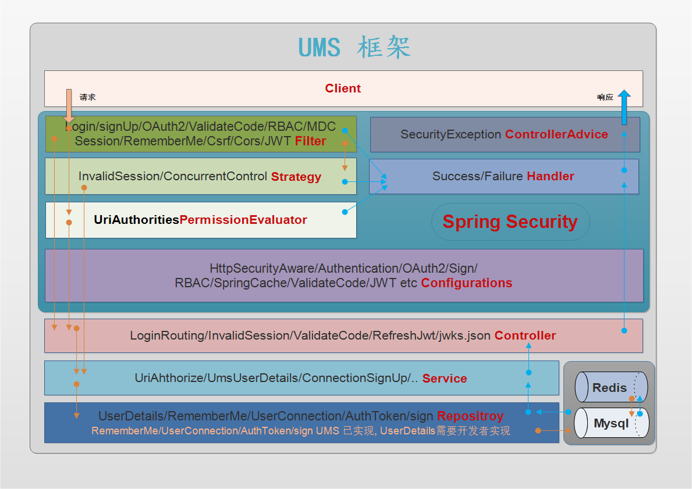

# UMS (user manage scaffolding) 用户管理脚手架: 


用户管理脚手架集成：用户密码登录、手机登录、支持 JustAuth 支持的所有第三方授权登录、验证码、基于 RBAC 的 uri 访问权限控制功能、签到等功能.
通过配置文件与实现 用户服务, 短信发送服务, 获取角色权限服务 三个 API 接口就可以实现上述功能，实现快速开发，只需要专注于业务逻辑.

User management scaffolding, integration: User password login, mobile login, Support all third-party authorized logins supported by JustAuth, 
validate code, RBAC-based uri access control function, sign etc... 


------
## 一、`UMS 功能列表(UMS feature list)`：

  - 验证码（图片，短信, 滑块）校验功能(validate code(image, SMS, slider) verification function).
  - 手机登录功能，登录后自动注册(Mobile login function, automatic registration after login).
  - 支持所有 JustAuth 支持的第三方授权登录，登录后自动注册 或 绑定 或 创建临时用户([TemporaryUser](https://github.com/ZeroOrInfinity/UMS/blob/master
  /src/main/java/top/dcenter/ums/security/core/oauth/userdetails/TemporaryUser.java))(OAuth2 login and auto signUp and auto binding).
      - 支持定时刷新 accessToken, 支持分布式定时任务(Support timing refresh accessToken, support distributed timing tasks).
      - 支持第三方授权登录的用户信息表与 token 信息表的缓存功能(Support the caching function of user table and token table by OAuth2 login).
      - 支持第三方绑定(binding)与解绑(unbinding)及查询接口(top.dcenter.ums.security.core.oauth.repository.UsersConnectionRepository).
  - 访问权限控制功能(Access control function).
  - 简化 session、remember me、csrf 等配置(Simplify session、remember me、csrf etc configuration).
  - 根据设置的响应方式（JSON 与 REDIRECT）返回 json 或 html 数据.
  - 签到功能(sign).
  - 支持基于 SLF4J MDC 机制的日志链路追踪功能.
  
### 模块功能 

  | **模块**   | **功能**                                                         |
  | ------ | ------------------------------------------------------------ |
  | [commons](https://github.com/ZeroOrInfinity/UMS/tree/master/commons)   | 通用组件模块 |
  | [core](https://github.com/ZeroOrInfinity/UMS/tree/master/core)   | 验证码/用户名密码登录/手机登录且自动注册/OAuth2 login by JustAuth/访问权限控制/签到/简化HttpSecurity(session、remember me、csrf 等)配置/session redis 缓存/可配置的响应方式(JSON 与 REDIRECT)返回 json 或 html 数据 |
  | [demo](https://github.com/ZeroOrInfinity/UMS/tree/master/demo)   | basic-example/basic-detail-example/permission-example/quickStart/session-detail-example/validate-codi-example/justAuth-security-oauth2-example |
### demo 演示功能  

  | **demo**                   | **演示功能**                                                     |
  | ---------------------- | ------------------------------------------------------------ |
  | [basic-example](https://github.com/ZeroOrInfinity/UMS/tree/master/demo/basic-example)         | core 模块基本功能: 最简单的配置                              |
  | [basic-detail-example](https://github.com/ZeroOrInfinity/UMS/tree/master/demo/basic-detail-example)   | core 模块基本功能详细的配置: 含anonymous/session简单配置/rememberMe/csrf/登录路由/签到, 不包含session详细配置/验证码/手机登录/权限. |
  | [permission-example](https://github.com/ZeroOrInfinity/UMS/tree/master/demo/permission-example)     | core 模块: 基于 RBAC 的权限功能设置                          |
  | [quickStart](https://github.com/ZeroOrInfinity/UMS/tree/master/demo/quickStart)             | 快速开始示例                                                 |
  | [justAuth-security-oauth2-example](https://github.com/ZeroOrInfinity/UMS/tree/master/demo/justAuth-security-oauth2-example)             | 第三方授权登录详细示例, MDC 日志链路追踪配置                                                |
  | [session-detail-example](https://github.com/ZeroOrInfinity/UMS/tree/master/demo/session-detail-example) | core 模块: session 与 session 缓存详细配置                   |
  | [validate-code-example](https://github.com/ZeroOrInfinity/UMS/tree/master/demo/validate-code-example)  | core 模块基本功能: 验证码(含自定义滑块验证码), 手机登录配置  |

### [Github 更新日志(UpdatedLog)](https://github.com/ZeroOrInfinity/UMS/blob/master/UpdatedLog.md) | [Gitee 更新日志](https://gitee.com/pcore/UMS/blob/master/UpdatedLog.md)

### [Github 文档地址](https://github.com/ZeroOrInfinity/UMS/wiki) | [Gitee 文档地址](https://gitee.com/pcore/UMS/wikis/pages)

微信群：UMS 添加微信(z56133)备注(UMS) 
------
## 二、`maven`：

```xml
<dependency>
    <groupId>top.dcenter</groupId>
    <artifactId>ums-core-spring-boot-starter</artifactId>
    <version>latest</version>
</dependency>
```
------
## 三、`TODO List`:

- 1. 准备基于 spring-security5.4 添加 JWT, OAuth2 authenticate server
- 2. 添加多租户权限控制
------
## 四、`快速开始(Quick Start)`：

- [Gitee 文档](https://gitee.com/pcore/UMS/wikis/pages?sort_id=2926257&doc_id=984605) | [Github 文档](https://github.com/ZeroOrInfinity/UMS/wiki/%E5%9B%9B%E3%80%81%E5%BF%AB%E9%80%9F%E5%BC%80%E5%A7%8B(Quick-Start))
- example: [quickStart](https://github.com/ZeroOrInfinity/UMS/tree/master/demo/quickStart)

------

## 五、接口使用说明(`Interface instructions`):

### 实现对应功能时需要实现的接口(The interface that needs to be implemented when the corresponding function is present)：  
  
1. 用户服务(user service): `必须实现(Must implemented)`
   - [UmsUserDetailsService](https://github.com/ZeroOrInfinity/UMS/blob/master/core/src/main/java/top/dcenter/ums/security/core/api/service/UmsUserDetailsService.java)    

2. 图片验证码(image validate code): 如果不实现就会使用默认图片验证码, 实时产生验证码图片, 没有缓存功能
    - [ImageCodeFactory](https://github.com/ZeroOrInfinity/UMS/blob/master/core/src/main/java/top/dcenter/ums/security/core/api/validate/code/image/ImageCodeFactory.java)

3. 短信验证码(SMS validate code): `默认空实现`
    - [SmsCodeSender](https://github.com/ZeroOrInfinity/UMS/blob/master/core/src/main/java/top/dcenter/ums/security/core/api/validate/code/sms/SmsCodeSender.java)

4. 滑块验证码(Slider validate code): 如果不实现就会使用默认滑块验证码, 实时产生验证码图片, 没有缓存功能
    - [SimpleSliderCodeFactory](https://github.com/ZeroOrInfinity/UMS/blob/master/core/src/main/java/top/dcenter/ums/security/core/api/validate/code/slider/SliderCodeFactory.java) 

5. 自定义验证码(customize validate code):
    - [AbstractValidateCodeProcessor](https://github.com/ZeroOrInfinity/UMS/blob/master/core/src/main/java/top/dcenter/ums/security/core/api/validate/code/AbstractValidateCodeProcessor.java)
    - [ValidateCodeGenerator](https://github.com/ZeroOrInfinity/UMS/blob/master/core/src/main/java/top/dcenter/ums/security/core/api/validate/code/ValidateCodeGenerator.java)

6. 访问权限控制功能(Access control function): 基于 RBAC 的访问权限控制, 增加了更加细粒度的权限控制, 支持 restfulApi; 如: 对菜单与按钮的权限控制
    - [AbstractUriAuthorizeService](https://github.com/ZeroOrInfinity/UMS/blob/master/core/src/main/java/top/dcenter/ums/security/core/api/permission/service/AbstractUriAuthorizeService.java):
        
        - `AbstractUriAuthorizeService` 类中的方法`getRolesAuthorities()`;
          `getRolesAuthorities()`返回值: Map<`role`, Map<`uri`, `UriResourcesDTO`>> 中`UriResourcesDTO`字段 `uri` 
          与 `permission` 必须有值. 
          
        - 默认实现了 `hasPermission(..)` 表达式, 实现 `AbstractUriAuthorizeService` 即生效,
          1. 默认启用 httpSecurity.authorizeRequests().anyRequest().access("hasPermission(request, authentication)"); 方式. 
          2. 如果开启注解方式( @UriAuthorize 或 @EnableGlobalMethodSecurity(prePostEnabled = true) ): 则通过注解 @PerAuthority
          ("hasPermission('/users/**', '/users/**:list')") 方式生效.

7. [Auth2StateCoder](https://github.com/ZeroOrInfinity/UMS/blob/master/src/main/java/top/dcenter/ums/security/core/api/oauth/state/service/Auth2StateCoder.java): `用户需要时实现`, 对第三方授权登录流程中的 state 进行自定义编解码. 可以传递必要的信息, 
     如: 第三方登录成功的跳转地址等 注意此接口的两个方法必须同时实现对应的编解码逻辑, 实现此接口后注入 IOC 容器即可, 如有前端向后端获取 authorizeUrl
     时向后端传递额外参数 且用作注册时的信息, 需配合 UmsUserDetailsService.registerUser(AuthUser, String, String, String) 方法实现.

8. [Auth2UserService](https://github.com/ZeroOrInfinity/UMS/blob/master/src/main/java/top/dcenter/ums/security/core/oauth/service/Auth2UserService.java): 获取第三方用户信息的接口, 一般**不需要用户实现**, 除非想自定义获取第三方用户信息的逻辑, 实现此接口注入 IOC 容器即可替代.

9. [UsersConnectionRepository](https://github.com/ZeroOrInfinity/UMS/blob/master/src/main/java/top/dcenter/ums/security/core/oauth/repository/UsersConnectionRepository.java): 第三方授权登录的第三方用户信息增删改查, 绑定与解绑及查询是否绑定与解绑接口, 一般**不需要用户实现**. 
     除非想自定义获取第三方用户信息的逻辑, 实现此接口注入 IOC 容器即可替代.

10. [UsersConnectionTokenRepository](https://github.com/ZeroOrInfinity/UMS/blob/master/src/main/java/top/dcenter/ums/security/core/oauth/repository/UsersConnectionTokenRepository.java): 第三方授权登录用户 accessToken 信息表增删改查接口, 一般**不需要用户实现**. 
      除非想自定义获取第三方用户信息的逻辑, 实现此接口注入 IOC 容器即可替代.

11. [ConnectionService](https://github.com/ZeroOrInfinity/UMS/blob/master/src/main/java/top/dcenter/ums/security/core/oauth/signup/ConnectionService.java): 第三方授权登录用户的注册, 绑定, 更新第三方用户信息与 accessToken 信息的接口, 一般**不需要用户实现**.
      除非想自定义获取第三方用户信息的逻辑, 实现此接口注入 IOC 容器即可替代.

------
## 六、Configurations:

| **功能(Features)**                                                     | **模块(model)**                                                 | **demo模块--简单配置(Simple Configuration)**                                       | **demo模块--详细配置(detail Configuration)**                                       |
| ------------------------------------------------------------ | -------------------------------------------------------- | ------------------------------------------------------------ | ------------------------------------------------------------ |
| 1. [基本功能](https://github.com/ZeroOrInfinity/UMS/wiki/%E5%85%AD-1%E3%80%81%E5%9F%BA%E6%9C%AC%E5%8A%9F%E8%83%BD%E9%85%8D%E7%BD%AE) | [core](https://github.com/ZeroOrInfinity/tree/master/core)     | [basic-example](https://github.com/ZeroOrInfinity/UMS/tree/master/demo/basic-example/src/main/resources/application.yml) |                                                              |
| 2. [登录路由功能](https://github.com/ZeroOrInfinity/UMS/wiki/%E5%85%AD-2%E3%80%81%E7%99%BB%E5%BD%95%E8%B7%AF%E7%94%B1%E5%8A%9F%E8%83%BD%E9%85%8D%E7%BD%AE) | [core](https://github.com/ZeroOrInfinity/tree/master/core)     |                                                              | [basic-detail-example](https://github.com/ZeroOrInfinity/UMS/tree/master/demo/basic-detail-example/src/main/resources/application.yml) |
| 3. [session](https://github.com/ZeroOrInfinity/UMS/wiki/%E5%85%AD-3%E3%80%81Session-%E9%85%8D%E7%BD%AE) | [core](https://github.com/ZeroOrInfinity/tree/master/core)     |                                                              | [session-detail-example](https://github.com/ZeroOrInfinity/UMS/tree/master/demo/session-detail-example/src/main/resources/application.yml) |
| 4. [remember-me](https://github.com/ZeroOrInfinity/UMS/wiki/%E5%85%AD-4%E3%80%81Remember-me-%E9%85%8D%E7%BD%AE) | [core](https://github.com/ZeroOrInfinity/tree/master/core)     |                                                              | [basic-detail-example](https://github.com/ZeroOrInfinity/UMS/tree/master/demo/basic-detail-example/src/main/resources/application.yml) |
| 5. [csrf](https://github.com/ZeroOrInfinity/UMS/wiki/%E5%85%AD-5%E3%80%81CSRF-%E9%85%8D%E7%BD%AE) | [core](https://github.com/ZeroOrInfinity/tree/master/core)     |                                                              | [basic-detail-example](https://github.com/ZeroOrInfinity/UMS/tree/master/demo/basic-detail-example/src/main/resources/application.yml) |
| 6. [anonymous](https://github.com/ZeroOrInfinity/UMS/wiki/%E5%85%AD-6%E3%80%81Anonymous-%E9%85%8D%E7%BD%AE) | [core](https://github.com/ZeroOrInfinity/tree/master/core)     |                                                              | [basic-detail-example](https://github.com/ZeroOrInfinity/UMS/tree/master/demo/basic-detail-example/src/main/resources/application.yml) |
| 7. [验证码](https://github.com/ZeroOrInfinity/UMS/wiki/%E5%85%AD-7%E3%80%81%E9%AA%8C%E8%AF%81%E7%A0%81%E5%8A%9F%E8%83%BD%E9%85%8D%E7%BD%AE) | [core](https://github.com/ZeroOrInfinity/tree/master/core)     |                                                              | [validate-code-example](https://github.com/ZeroOrInfinity/UMS/tree/master/demo/validate-code-example/src/main/resources/application.yml) |
| 8. [手机登录](https://github.com/ZeroOrInfinity/UMS/wiki/%E5%85%AD-8%E3%80%81%E6%89%8B%E6%9C%BA%E7%99%BB%E5%BD%95%E5%8A%9F%E8%83%BD%E9%85%8D%E7%BD%AE) | [core](https://github.com/ZeroOrInfinity/tree/master/core)     |                                                              | [basic-detail-example](https://github.com/ZeroOrInfinity/UMS/tree/master/demo/basic-detail-example/src/main/resources/application.yml) |
| 9. [第三方登录](https://github.com/ZeroOrInfinity/UMS/wiki/%E5%85%AD-9%E3%80%81%E7%AC%AC%E4%B8%89%E6%96%B9%E7%99%BB%E5%BD%95%E5%8A%9F%E8%83%BD%E9%85%8D%E7%BD%AE) | [core](https://github.com/ZeroOrInfinity/tree/master/core) |   | [basic-detail-example](https://github.com/ZeroOrInfinity/UMS/tree/master/demo/basic-detail-example/src/main/resources/application.yml) |
| 10. [给第三方登录时用的数据库表 user_connection 与 auth_token 添加 redis cache](https://github.com/ZeroOrInfinity/UMS/wiki/%E5%85%AD-10.-%E7%BB%99%E7%AC%AC%E4%B8%89%E6%96%B9%E7%99%BB%E5%BD%95%E6%97%B6%E7%94%A8%E7%9A%84%E6%95%B0%E6%8D%AE%E5%BA%93%E8%A1%A8-user_connection-%E4%B8%8E-auth_token-%E6%B7%BB%E5%8A%A0-redis-cache) | [core](https://github.com/ZeroOrInfinity/tree/master/core) |                                                              | [basic-detail-example](https://github.com/ZeroOrInfinity/UMS/tree/master/demo/basic-detail-example/src/main/resources/application.yml) |
| 11. [签到](https://github.com/ZeroOrInfinity/UMS/wiki/%E5%85%AD-11%E3%80%81%E7%AD%BE%E5%88%B0%E5%8A%9F%E8%83%BD%E9%85%8D%E7%BD%AE) | [core](https://github.com/ZeroOrInfinity/tree/master/core)     |                                                              | [basic-detail-example](https://github.com/ZeroOrInfinity/UMS/tree/master/demo/basic-detail-example/src/main/resources/application.yml) |
| 12. [基于 RBAC 的访问权限控制功能](https://github.com/ZeroOrInfinity/UMS/wiki/%E5%85%AD-13%E3%80%81%E5%9F%BA%E4%BA%8E-RBAC-%E7%9A%84%E8%AE%BF%E9%97%AE%E6%9D%83%E9%99%90%E6%8E%A7%E5%88%B6%E5%8A%9F%E8%83%BD%E5%8A%9F%E8%83%BD%E9%85%8D%E7%BD%AE) | [core](https://github.com/ZeroOrInfinity/tree/master/core)     |                                                              | [permission-example](https://github.com/ZeroOrInfinity/UMS/tree/master/demo/permission-example/src/main/resources/application.yml) |
| 13. [线程池配置](https://github.com/ZeroOrInfinity/UMS/wiki/%E5%85%AD-14%E3%80%81%E7%BA%BF%E7%A8%8B%E6%B1%A0%E9%85%8D%E7%BD%AE) | [core](https://gitee.com/pcore/UMS/tree/master/core)     |                                                              | [justAuth-security-oauth2-example](https://github.com/ZeroOrInfinity/UMS/tree/master/demo/justAuth-security-oauth2-example/src/main/resources/application.yml) |
| 14. [基于 SLF4J MDC 机制的日志链路追踪配置](https://github.com/ZeroOrInfinity/UMS/wiki/%E5%85%AD-15%E3%80%81%E5%9F%BA%E4%BA%8E-SLF4J-MDC-%E6%9C%BA%E5%88%B6%E7%9A%84%E6%97%A5%E5%BF%97%E9%93%BE%E8%B7%AF%E8%BF%BD%E8%B8%AA%E9%85%8D%E7%BD%AE%E5%B1%9E%E6%80%A7) | [core](https://gitee.com/pcore/UMS/tree/master/core)     |                                                              | [justAuth-security-oauth2-example](https://github.com/ZeroOrInfinity/UMS/tree/master/demo/justAuth-security-oauth2-example/src/main/resources/application.yml) |


------
## 七、[`注意事项(NOTE)`](https://github.com/ZeroOrInfinity/UMS/wiki/%E4%B8%83%E3%80%81%E6%B3%A8%E6%84%8F%E4%BA%8B%E9%A1%B9): 

### 1\. 基于 RBAC 的 uri 访问权限控制

- **修改与添加权限后更新一下角色的权限** [AbstractUriAuthorizeService](https://github.com/ZeroOrInfinity/blob/master/core/src/main/java/top/dcenter/ums/security/core/api/permission/service/AbstractUriAuthorizeService.java)`#updateRolesAuthorities()` 方法来**刷新权限**, 即可实时刷新角色权限.
    - **刷新权限**有两种方式：一种发布事件，另一种是直接调用服务；推荐用发布事件(异步执行).
      1. 推荐用发布事件(异步执行): `applicationContext.publishEvent(new UpdateRolesAuthoritiesEvent(true));`
      2. 直接调用服务: `abstractUriAuthorizeService.updateRolesAuthorities();`
      
### 2\. HttpSecurity 配置问题：UMS 中的 [HttpSecurityAware](https://github.com/ZeroOrInfinity/blob/master/core/src/main/java/top/dcenter/ums/security/core/api/config/HttpSecurityAware.java) 配置与应用中的 HttpSecurity 配置冲突问题：

1. 如果是新建应用添加 HttpSecurity 配置, 通过下面的接口即可: 
    - [HttpSecurityAware](https://github.com/ZeroOrInfinity/UMS/blob/master/core/src/main/java/top/dcenter/ums/security/core/api/config/HttpSecurityAware.java)
2. 如果是已存在的应用：
    - 添加 HttpSecurity 配置, 通过下面的接口即可: `HttpSecurityAware`
    - 已有的 HttpSecurity 配置, 让原有的 HttpSecurity 配置实现此接口进行配置: `top.dcenter.security.core.api.config.HttpSecurityAware`

### 3\. 在 ServletContext 中存储的属性: 

- 属性名称: SecurityConstants.SERVLET_CONTEXT_PERMIT_ALL_SET_KEY
- 属性值: Set<UriHttpMethodTuple>, 把权限类型为 PERMIT_ALL 的 Set 存储在 servletContext .
      
### 4\. servletContextPath 的值存储在 [MvcUtil](https://github.com/ZeroOrInfinity/blob/master/core/src/main/java/top/dcenter/ums/security/core/util/MvcUtil.java)`.servletContextPath` : 

- 通过静态方法获取 `MvcUtil.getServletContextPath()`
- `MvcUtil.servletContextPath` 的值是通过: [SecurityAutoConfiguration](https://github.com/ZeroOrInfinity/blob/master/core/src/main/java/top/dcenter/ums/security/core/config/SecurityAutoConfiguration.java)`#afterPropertiesSet()` 接口注入
    
### 5\. 验证码优先级(Verification code Priority): 

- 同一个 uri 由多种验证码同时配置, **优先级**如下:
  `SMS > CUSTOMIZE > SELECTION > TRACK > SLIDER > IMAGE`
  
### 6\. Jackson 序列化与反序列化

- 添加一些 Authentication 与 UserDetails 子类的反序列化器, 以解决 redis 缓存不能反序列化此类型的问题,
具体配置 redis 反序列器的配置请看 [RedisCacheAutoConfiguration.getJackson2JsonRedisSerializer()](https://github.com/ZeroOrInfinity/UMS/blob/master/src/main/java/top/dcenter/ums/security/core/oauth/config/RedisCacheAutoConfiguration.java) 方法.

```java
// 示例
Jackson2JsonRedisSerializer jackson2JsonRedisSerializer = new Jackson2JsonRedisSerializer(Object.class);
ObjectMapper objectMapper = new ObjectMapper();
// Auth2Jackson2Module 为此项目实现的反序列化配置     
objectMapper.registerModules(new CoreJackson2Module(), new WebJackson2Module(), new Auth2Jackson2Module());
jackson2JsonRedisSerializer.setObjectMapper(om);
```
- 注意: [UmsUserDetailsService](https://github.com/ZeroOrInfinity/UMS/blob/master/core/src/main/java/top/dcenter/ums/security/core/api/service/UmsUserDetailsService.java)
的注册用户方法返回的 `UserDetails` 的默认实现 `User` 已实现反序列化器, 如果是开发者**自定义的子类**, **需开发者自己实现反序列化器**.

------
## 八、[Properties Configurations](https://github.com/ZeroOrInfinity/UMS/wiki/%E5%85%AB%E3%80%81%E5%B1%9E%E6%80%A7%E9%85%8D%E7%BD%AE%E5%88%97%E8%A1%A8)

| **属性配置列表(Properties Configurations)**                                             |
| ------------------------------------------------------------ |
| [基本属性(Basic Properties)](https://github.com/ZeroOrInfinity/UMS/wiki/%E5%85%AB%E3%80%81%E5%B1%9E%E6%80%A7%E9%85%8D%E7%BD%AE%E5%88%97%E8%A1%A8) |
| [签到属性(Sign Properties)](https://github.com/ZeroOrInfinity/UMS/wiki/%E5%85%AB%E3%80%81%E5%B1%9E%E6%80%A7%E9%85%8D%E7%BD%AE%E5%88%97%E8%A1%A8) |
| [手机登录属性(Mobile login Properties)](https://github.com/ZeroOrInfinity/UMS/wiki/%E5%85%AB%E3%80%81%E5%B1%9E%E6%80%A7%E9%85%8D%E7%BD%AE%E5%88%97%E8%A1%A8) |
| [验证码属性(Validate Code Properties)](https://github.com/ZeroOrInfinity/UMS/wiki/%E5%85%AB%E3%80%81%E5%B1%9E%E6%80%A7%E9%85%8D%E7%BD%AE%E5%88%97%E8%A1%A8) |
| [第三方授权登录(OAuth2 JustAuth)](https://github.com/ZeroOrInfinity/UMS/wiki/%E5%85%AB%E3%80%81%E5%B1%9E%E6%80%A7%E9%85%8D%E7%BD%AE%E5%88%97%E8%A1%A8) |
| [线程池属性(ThreadPool Properties)](https://github.com/ZeroOrInfinity/UMS/wiki/%E5%85%AB%E3%80%81%E5%B1%9E%E6%80%A7%E9%85%8D%E7%BD%AE%E5%88%97%E8%A1%A8) |
| [基于 SLF4J MDC 机制的日志链路追踪属性](https://github.com/ZeroOrInfinity/UMS/wiki/%E5%85%AB%E3%80%81%E5%B1%9E%E6%80%A7%E9%85%8D%E7%BD%AE%E5%88%97%E8%A1%A8) |
| [第三方授权登录用户信息数据 redis 缓存配置(UserConnection Redis cache Properties)](https://github.com/ZeroOrInfinity/UMS/wiki/%E5%85%AB%E3%80%81%E5%B1%9E%E6%80%A7%E9%85%8D%E7%BD%AE%E5%88%97%E8%A1%A8) |
| [第三方授权登录用户信息表 user_connection sql 配置(UserConnection sql Properties)](https://github.com/ZeroOrInfinity/UMS/wiki/%E5%85%AB%E3%80%81%E5%B1%9E%E6%80%A7%E9%85%8D%E7%BD%AE%E5%88%97%E8%A1%A8) |
------
## 九、参与贡献(Participate in contribution)

1. Fork 本项目
2. 新建 Feat_xxx 分支
3. 提交代码
4. 新建 Pull Request
------
## 十、[流程图(Flow chart)](https://github.com/ZeroOrInfinity/UMS/wiki/%E5%8D%81%E3%80%81%E6%B5%81%E7%A8%8B%E5%9B%BE:-%E9%9A%8F%E7%9D%80%E7%89%88%E6%9C%AC%E8%BF%AD%E4%BB%A3%E4%BC%9A%E6%9C%89%E5%87%BA%E5%85%A5): 随着版本迭代会有出入

### 1. 滑块验证码(sliderValidateCode)


------
## 十一、[时序图(Sequence Diagram)](https://github.com/ZeroOrInfinity/UMS/wiki/%E5%8D%81%E4%B8%80%E3%80%81%E6%97%B6%E5%BA%8F%E5%9B%BE:-%E9%9A%8F%E7%9D%80%E7%89%88%E6%9C%AC%E8%BF%AD%E4%BB%A3%E4%BC%9A%E6%9C%89%E5%87%BA%E5%85%A5): 随着版本迭代会有出入

| **时序图**                                                   |
| ------------------------------------------------------------ |
| [csrf](doc/SequenceDiagram/crsf.png)                         |
| [获取验证码逻辑](doc/SequenceDiagram/getValidateCode.png)    |
| [图片验证码逻辑](doc/SequenceDiagram/ImageValidateCodeLogin.png) |
| [logout](doc/SequenceDiagram/logout.png)                     |
| [第三方授权登录](doc/SequenceDiagram/OAuth2Login-justAuth.png)        |
| [rememberMe](doc/SequenceDiagram/rememberMe.png)             |
| [核心配置逻辑](doc/SequenceDiagram/securityConfigurer.png)   |
| [登录路由](doc/SequenceDiagram/securityRouter.png)           |
| [session](doc/SequenceDiagram/session.png)                   |
| [手机登录](doc/SequenceDiagram/SmsCodeLogin.png)             |
| [权限控制](doc/SequenceDiagram/uriAuthorize.png)             |
| [过时:第三方绑定与解绑](doc/SequenceDiagram/OAuth2Banding.png)    |
| [过时:第三方授权登录](doc/SequenceDiagram/OAuth2Login.png)        |
| [过时:第三方授权登录注册](doc/SequenceDiagram/OAuth2SignUp.png)   |


## 十二、基于 SLF4J MDC 机制的日志链路追踪功能

- 使用此功能在日志配置文件中的 `pattern` 中添加 `%X{MDC_TRACE_ID}` 即可.
```xml
<!-- 控制台 -->
<appender name="STDOUT" class="ch.qos.logback.core.ConsoleAppender">
    <!-- 日志格式 -->
    <encoder>
        <pattern>%d{yyyy-MM-dd HH:mm:ss.SSS} %-5level ${PID:- } --- [%thread] %X{MDC_TRACE_ID} %logger[%L] - %msg%n</pattern>
        <charset>utf-8</charset>
    </encoder>
    <!--此日志appender是为开发使用，只配置最底级别，控制台输出的日志级别是大于或等于此级别的日志信息-->
    <filter class="ch.qos.logback.classic.filter.ThresholdFilter">
        <!-- 只有这个日志权限才能看，sql语句 -->
        <level>DEBUG</level>
    </filter>
</appender>
```
- 多线程使用问题: 父线程新建子线程之前调用 `MDC.getCopyOfContextMap()` 方法获取 `MDC context`, 子线程在执行操作前先调用 
`MDC.setContextMap(context)` 方法将父线程的 `MDC context` 设置到子线程中. ThreadPoolTaskExecutor 的配置请参考 [ScheduleAutoConfiguration](https://github.com/ZeroOrInfinity/UMS/blob/master/core/src/main/java/top/dcenter/ums/security/core/oauth/config/ScheduleAutoConfiguration.java).
- 多线程传递 MDC context 简单示例:  
```java
final Logger log = LoggerFactory.getLogger(this.getClass());
// 获取父线程 MDC 中的内容
final Map<String, String> context = MDC.getCopyOfContextMap();
final Runnable r = () -> {
    log.info("testMDC");
    System.out.println("...");
};
new Thread(() -> {
    // 将父线程的 MDC context 设置到子线程中
    MDC.setContextMap(context);
    r.run();
}, "testMDC").start();
```